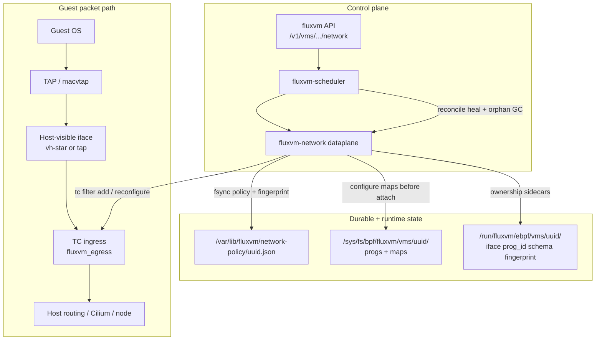
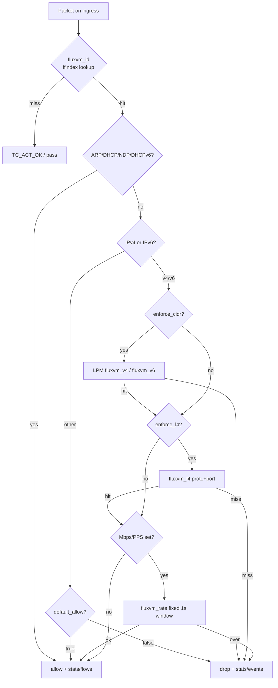
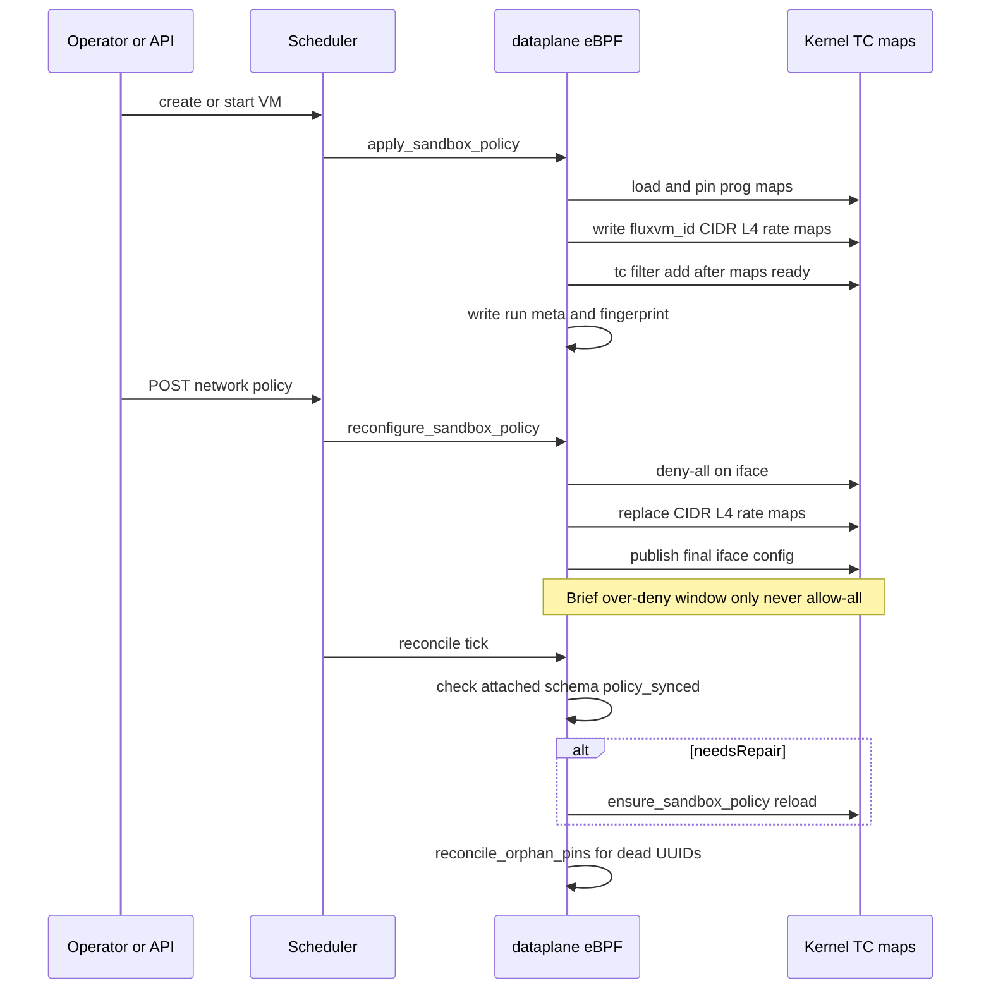
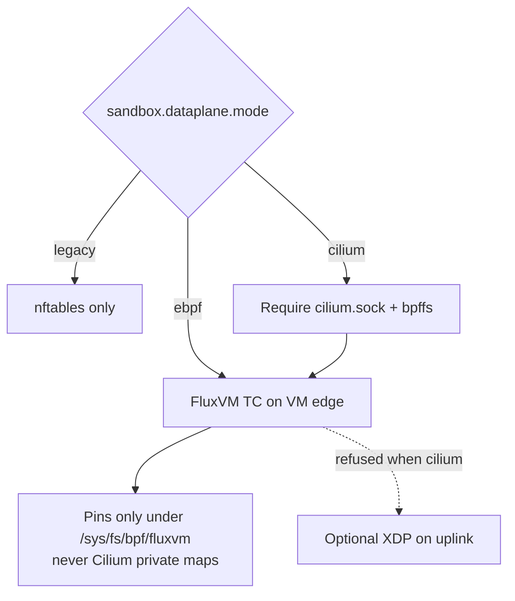

<div align="center">

# Zyvor FluxVM

### Disposable Compute Engine — secure, isolated, short-lived VMs via Firecracker, Cloud Hypervisor, QEMU/KVM, and FluxVM hypervisor

[](https://github.com/zyvorai/fluxvm/actions/workflows/ci.yml)
[](LICENSE)
[](https://github.com/zyvorai/fluxvm/releases)

[Quick start](#build) · [User path](#who-does-what-users) · [Use cases](docs/use-cases.md) · [zyvor.dev/docs](https://zyvor.dev/docs?utm_source=github&utm_medium=fluxvm) · [Blog](https://zyvor.dev/blog?utm_source=github&utm_medium=fluxvm)

</div>

---

**Disposable Compute Engine** — create secure, isolated, short-lived virtual machines using
Firecracker, Cloud Hypervisor, QEMU/KVM, and the in-tree FluxVM hypervisor from one Rust-native
control plane. Repository: [github.com/zyvorai/fluxvm](https://github.com/zyvorai/fluxvm).

- **QEMU/KVM** — broad guest/device compatibility, qcow2 CoW overlays, QMP socket.
- **Cloud Hypervisor** — Rust VMM for modern cloud workloads, direct-kernel or firmware boot.
- **Firecracker** — microVM backend using a Linux kernel + raw root filesystem.
- **FluxVM hypervisor** (`backend: "flux-vm"`, binary `fluxvm-hypervisor`) — agent-sandbox track:
  memory snapshots, `/v1/sandboxes`, guest HTTP proxy + AutoResume, L7 egress, AutoPause, `/console`,
  and optional native TC/eBPF dataplane (nftables default; see [eBPF / Cilium](#ebpf--cilium-sandbox-dataplane)).

It also contains a small **virt-builder-style image pipeline**: use a local/HTTP base image, verify SHA-256, convert/resize it, and customize it before first boot.

Beyond a single host: a `DisposableVm` Kubernetes CRD + node-local operator (`fluxvm-kube`), and a
non-Kubernetes distributed node-agent (`fluxvm-agent`) with a central fleet registry and load-aware
placement across multiple hosts — see "Kubernetes CRD/operator" and "Distributed node-agent" below.

> This repository is a complete MVP/control-plane skeleton, not a finished multi-tenant security boundary. Authentication/RBAC, the Firecracker jailer (chroot + uid/gid isolation), cgroup v2 resource control, and per-VM network namespaces are already implemented (see "Auth / RBAC", "Firecracker jailer", "Resource control (cgroup v2)", and "Network namespaces" below) — before exposing it to untrusted tenants, still add seccomp/AppArmor/SELinux policy, quotas, audit logging and stronger image provenance.

See [`docs/use-cases.md`](docs/use-cases.md) for concrete use cases — ephemeral CI runners, a golden-image pipeline, Kubernetes-native disposable workloads, multi-host fleets without Kubernetes, and sandboxed code execution — each grounded in what's actually implemented below. **Ragnarok product path:** [`docs/ragnarok.md`](docs/ragnarok.md).

## Who does what (users)

| You need… | Use |
|-----------|-----|
| Score / repair a disk **offline** (doctor, passport, fix plans) | **[GuestKit](https://github.com/zyvorai/guestkit)** |
| **Boot & manage** that qcow2 (network, SSH, TTL, pause/resume, fleets) | **This repo (FluxVM)** |
| Hypervisor → KVM convert + import | **[h2kvm](https://github.com/zyvorai/h2kvm)** |

**Certify with GuestKit → run & manage with FluxVM → convert/deploy with h2kvm.**

FluxVM already creates TAP/macvtap, optional per-VM **netns + DHCP** (known `guest_ip`),
cloud-init seeds, CoW overlays, and TTL reaping. GuestKit does **not** duplicate that —
hand off after the disk is certified.

### End-to-end: certify → run → manage

```bash
# ── 1. Certify (GuestKit on the same host or CI) ───────────────
guestkit doctor /path/to/disk.qcow2 --target kvm --explain
guestkit plan apply virtio.yaml --vm /path/to/disk.qcow2 --yes   # if needed
guestkit passport emit /path/to/disk.qcow2 --target kvm -o passport.json
guestkit gate --image /path/to/disk.qcow2 --fail-below 80

# ── 2. Prepare host once (FluxVM) ────────────────────────────
sudo ./scripts/bootstrap-host.sh          # bridge, dirs, deps
cargo build --release -p fluxvm-cli     # or install release binaries

# ── 3. Run the certified qcow2 ─────────────────────────────────
# Edit examples/qemu.json → set "image" to your disk and your SSH pubkey.
sudo ./target/release/fluxvm --config /etc/fluxvm.toml create \
  --spec examples/qemu.json

# Day-2
fluxvm list
fluxvm get <id>                 # includes guest_ip for netns mode
fluxvm exec <id> -- hostname
fluxvm pause <id> && fluxvm resume <id>
fluxvm delete <id>              # or wait for ttl_seconds
```

### Pick a network mode (FluxVM owns this)

| Mode | Spec sketch | Guest IP |
|------|-------------|----------|
| Lab / SSH | `"network": {"mode":"user","forwards":[{"host_port":2222,"guest_port":22}]}` | QEMU SLIRP DHCP; SSH via `localhost:2222` |
| LAN DHCP | `"network": {"mode":"tap","bridge":"vmbr0","mac":"06:…"}` | Your bridge’s DHCP |
| Known IP | `"network": {"mode":"tap","netns":true,"mac":"06:…"}` + optional `"cloud_init":{"static_network":true}` | FluxVM dnsmasq; see `fluxvm get` |
| L2 macvtap | `"network": {"mode":"macvtap","parent":"eth0","mac":"06:…"}` | Your L2 / static via cloud-init |

Full examples: [`examples/qemu.json`](examples/qemu.json) (user-mode lab),
[`examples/guestkit-handoff.json`](examples/guestkit-handoff.json) (post-GuestKit
netns + known IP), [`examples/macvtap.json`](examples/macvtap.json).
Networking tests: `sudo ./scripts/test-networking.sh --image /path/to/disk.qcow2`.

### Libvirt / virsh replacement (host-local)

FluxVM is the Zyvor **host-local** replacement for libvirt/virsh lifecycle and
networking. It is **not** a drop-in for KubeVirt/OpenShift (`virtctl` stays).

| virsh / libvirt | FluxVM |
|-----------------|----------|
| `virsh define` + `start` | `fluxvm create --spec …` (CoW overlay + boot) |
| `virsh list --all` | `fluxvm list` |
| `virsh dominfo` / guest IP | `fluxvm get <id>` (`guest_ip` when `netns: true`) |
| `virsh shutdown` / `destroy` | `fluxvm delete <id>` (or wait for `ttl_seconds`) |
| `virsh suspend` / `resume` | `fluxvm pause` / `fluxvm resume` |
| `virsh qemu-agent-command` | Prefer GuestKit `guestkit qga`, or `fluxvm exec` (vsock agent) |
| libvirt NAT (`virbr0`) | `network.mode=user`, or `tap` + existing bridge, or `tap`+`netns` |

Offline disk certify/repair stays in **[GuestKit](https://github.com/zyvorai/guestkit)**
(`doctor`, `passport`, `plan`). Lab-only smoke without FluxVM: `guestkit vm`
(user-mode only).

## Table of contents

- [Who does what (users)](#who-does-what-users)
- [Libvirt / virsh replacement (host-local)](#libvirt--virsh-replacement-host-local)
- [Architecture](#architecture)
- [Project layout](#project-layout)
- [What is implemented](#what-is-implemented)
- [Host requirements](#host-requirements)
- [Prepare host (one command)](#prepare-host-one-command)
- [Build](#build)
- [Deploy to a remote host](#deploy-to-a-remote-host)
- [Testing networking end-to-end](#testing-networking-end-to-end)
- [Network namespaces](#network-namespaces-real-per-vm-network-isolation)
- [eBPF / Cilium sandbox dataplane](#ebpf--cilium-sandbox-dataplane)
- [Why Network Fabric is faster](#why-network-fabric-is-faster-than-traditional-vm-networking)
- [Network Fabric architecture](#network-fabric-architecture-how-it-works)
- [Create a QEMU disposable VM](#create-a-qemu-disposable-vm)
- [Create a Cloud Hypervisor VM](#create-a-cloud-hypervisor-vm)
- [Create a Firecracker microVM](#create-a-firecracker-microvm)
- [Create a FluxVm agent sandbox](#create-a-fluxvm-agent-sandbox)
- [Firecracker jailer](#firecracker-jailer-chroot-uidgid-isolation-cgroups)
- [Auto backend selection](#auto-backend-selection)
- [Policy (admission limits)](#policy-admission-limits)
- [Pause, resume, and exec](#pause-resume-and-exec)
- [Resource control (cgroup v2)](#resource-control-cgroup-v2)
- [Warm VM pools](#warm-vm-pools)
- [Build an image like a small virt-builder](#build-an-image-like-a-small-virt-builder)
- [Image catalog & signing](#image-catalog--signing)
- [Storage backends](#storage-backends)
- [REST API](#rest-api)
- [VM JSON contract](#vm-json-contract)
- [Kubernetes CRD/operator](#kubernetes-crdoperator)
- [Using FluxVM through zyvor-fabric](#using-fluxvm-through-zyvor-fabric)
- [Using FluxVM through Ragnarok](#using-fluxvm-through-ragnarok)
- [Distributed node-agent](#distributed-node-agent)
- [State layout](#state-layout)
- [Production changes I would make next](#production-changes-i-would-make-next)
- [Important limitations in this MVP](#important-limitations-in-this-mvp)
- [AI-agent sandbox gaps](docs/agent-sandbox-gaps.md)
- [eBPF / Cilium dataplane](docs/ebpf-cilium.md)
- [Network Fabric v3](docs/network-fabric.md)
- [License](#license)

## Architecture

```text
                     +-------------------------+
 CLI / REST -------->| Rust VmManager          |
                     | state + TTL + sandboxes |
                     +------------+------------+
                                  |
     +-------------+--------------+--------------+--------------+
     |             |              |              |              |
 +---v---+   +-----v-----+  +-----v------+  +----v-------------+
 | QEMU  |   | Cloud     |  |Firecracker |  | FluxVM hypervisor|
 | qcow2 |   | Hypervisor|  | raw rootfs |  | (agent sandboxes)|
 +---+---+   +-----+-----+  +-----+------+  +----+-------------+
     |             |              |              |
     +------+------+--------------+--------------+
            |
     KVM + TAP/bridge + Linux host

Image path:
base image -> SHA256 -> qemu-img -> customize -> reusable template
                                      |
VM launch: template -> disposable clone -> cloud-init -> VMM -> TTL delete
```

## Project layout

The MVP is a Cargo workspace, structured to match Zyvor FluxVM's longer-term
multi-node architecture:

```text
crates/
├── fluxvm-core                 domain types, config, VmBackend trait
├── fluxvm-cgroup                cgroup v2 resource control (cpu/memory/io/freezer/pressure/cpuset)
├── fluxvm-storage               VM-record state persistence
├── fluxvm-network               TAP/bridge, netns, egress, nftables + TC/eBPF dataplane
│                                  (bpf/fluxvm_tc.bpf.c, Cilium coexistence)
├── fluxvm-image                 image build/clone + cloud-init seed + OCI→template
├── fluxvm-qemu                  QEMU/KVM backend
├── fluxvm-cloud-hypervisor      Cloud Hypervisor backend
├── fluxvm-firecracker           Firecracker backend
├── fluxvm-hypervisor            in-tree microVMM + `FluxVmBackend` (`fluxvm-hypervisor` binary)
├── fluxvm-guest-protocol        wire types shared by the guest agent and its host client
├── fluxvm-guest-agent           in-guest AF_VSOCK agent binary (ping/exec/shutdown)
├── fluxvm-vsock-client          host-side vsock dialing (native for QEMU, UDS proxy for CH/Firecracker)
├── fluxvm-scheduler             VmManager: VM lifecycle orchestration + TTL reaper
├── fluxvm-api                   REST API (axum)
├── fluxvm-cli                   `fluxvm` CLI binary (composition root)
├── fluxvm-agent                 fleet registry + per-host node-agent daemon (multi-node)
└── fluxvm-kube                  DisposableVm CRD + node-local Kubernetes operator
```

`fluxvm-agent` (a distinct concept from `fluxvm-guest-agent` above — this one is the
per-*host* node-agent for multi-node deployments) and `fluxvm-kube` are both implemented
and verified against real multi-host/cluster infrastructure — see "Distributed node-agent"
and "Kubernetes CRD/operator" below.

This project also depends on the sibling [`guestkit`](https://github.com/zyvorai/guestkit)
project (path dep from `fluxvm-image`) for offline image customization — see
"Build an image" below. For the **user certify → run** path, see
[Who does what](#who-does-what-users) above.

## What is implemented

- Common `VmBackend` Rust trait: launch, pause, resume, graceful shutdown.
- QEMU backend, pause/resume/shutdown via QMP.
- Cloud Hypervisor backend, pause/resume/shutdown via `ch-remote`.
- Firecracker backend using JSON `--config-file`, pause/resume via `PATCH /vm`, shutdown via `SendCtrlAltDel`.
- FluxVM hypervisor backend (`backend: "flux-vm"`) — in-tree control plane that boots real Linux guests via Firecracker as the KVM engine, with UDS pause/resume/shutdown/snapshot, sandbox REST (`/v1/sandboxes`), templates, AutoPause, L7 egress proxy, optional TC/eBPF Network Fabric dataplane, and `/console` UI (see [docs/agent-sandbox-gaps.md](docs/agent-sandbox-gaps.md), [docs/network-fabric.md](docs/network-fabric.md), and [docs/ebpf-cilium.md](docs/ebpf-cilium.md)).
- Vsock guest agent (`fluxvm exec <id> -- <command>`) — run a command inside the guest with no SSH and no network path at all; works over QEMU's native AF_VSOCK device and Cloud Hypervisor/Firecracker/FluxVm UDS vsock proxy.
- `stop` prefers a graceful VMM shutdown, falling back to force-kill only if the process doesn't exit within a grace period.
- QEMU qcow2 backing overlays for cheap disposable writes.
- Raw reflink copies for Firecracker / Cloud Hypervisor when the host filesystem supports reflinks.
- Raw conversion fallback through `qemu-img`.
- Optional disk growth.
- Pluggable storage backends beyond the qcow2/raw defaults above: LVM thin snapshots, NBD-exported disks, and Ceph RBD — all three verified booting real guests (Ceph RBD against a real Rook Ceph cluster); see "Storage backends" below.
- cloud-init NoCloud seed disk generation.
- TAP interface creation and optional Linux bridge attachment.
- macvtap networking (QEMU and Cloud Hypervisor) — a VM's own MAC directly on a parent link, no bridge.
- QEMU user-mode networking + host port forwarding.
- Static-IP network-namespace mode — the guest gets a real, deterministically-reserved DHCP-leased IP, not just host↔namespace NAT.
- **Sandbox dataplane / Network Fabric v3** — default **legacy nftables** per sandbox; optional **native TC/eBPF** (`ebpf`) and **Cilium coexistence** (`cilium`) with IPv4/IPv6 L3+L4 allowlists, Mbps/PPS limits, schema/fingerprint repair, per-VM policy/status/stats/flows API, optional XDP guard, and safe nftables fallback. See [eBPF / Cilium sandbox dataplane](#ebpf--cilium-sandbox-dataplane), [Network Fabric architecture](#network-fabric-architecture-how-it-works), [docs/network-fabric.md](docs/network-fabric.md), and [docs/ebpf-cilium.md](docs/ebpf-cilium.md).
- VNC for every QEMU-backed VM, over a unix socket — no port allocation.
- Interactive console/shell: `GET /v1/vms/{id}/console` (WebSocket) and a guest-agent `OpenShell` vsock op for a real PTY.
- File transfer over the guest agent: `PutFile`/`GetFile` vsock ops (`POST /v1/vms/{id}/agent/{put,get}-file`).
- virtiofs shared folders (QEMU backend).
- True suspend-to-disk resume (`-loadvm`) with a virtio-scsi controller.
- `GET /v1/vms/{id}/cpuset`.
- VM state persisted to JSON.
- REST API.
- CLI.
- TTL reaper that destroys expired VMs.
- Console log path per VM.
- Control sockets: QMP, Cloud Hypervisor API socket, Firecracker API socket.
- Image download/cache + SHA-256 verification.
- Image build customization via **guestkit only** (`qemu-nbd` + chroot — never libguestfs / virt-customize / guestfish): package install, hostname, arbitrary commands, SSH-key injection, `copy_in` for injecting files (e.g. the guest agent binary), and `enable_services` for enabling systemd units. Windows disks use a `windows{}` block (RDP/WinRM/firewall/scripts + Zyvor GuestKit agent inject) instead of the Linux chroot path.
- systemd units and one-command host bootstrap (installs QEMU tooling, Cloud Hypervisor, and Firecracker).
- SSH/rsync remote deploy script with full and quick profiles.
- End-to-end networking smoke test (QEMU user-mode NAT, TAP+bridge+DHCP, and macvtap, all SSH-verified).
- End-to-end lifecycle smoke test (vsock exec, pause/resume, graceful shutdown, and vsock-CID uniqueness under concurrent creates, all verified against real VMs).
- Kubernetes `DisposableVm` CRD + node-local operator (`fluxvm-kube`), verified against a real k3s cluster — see "Kubernetes CRD/operator" below.
- Distributed node-agent (`fluxvm-agent`): central fleet registry + per-host heartbeat client with load-aware placement, verified across two real physically separate hosts — see "Distributed node-agent" below.

## Host requirements

Linux x86_64 with virtualization enabled and `/dev/kvm` available.

Typical packages/tools:

```bash
qemu-system-x86_64
qemu-img
cloud-localds
ip
cp
nft                 # netns NAT + legacy sandbox dataplane
# Optional native eBPF dataplane (sandbox.dataplane.mode = ebpf|cilium):
clang llvm libbpf-dev bpftool   # build + load bpf/fluxvm_tc.bpf.c (+ optional fluxvm_xdp.bpf.c)
tc                              # iproute2 TC attach
```

Neither Cloud Hypervisor nor Firecracker is packaged by `apt`/`dnf`, so this repo ships installer
scripts that fetch the upstream release binary for your CPU architecture (x86_64 or aarch64) and
verify it against the SHA-256 digest GitHub records for that release asset before installing it.

For Firecracker, provide a compatible uncompressed guest kernel (`vmlinux`) and a Linux rootfs. For Cloud Hypervisor, use either direct kernel boot or firmware boot. The project's Rust Hypervisor Firmware (`hypervisor-fw`) is passed through the request's `kernel` field, matching the Cloud Hypervisor quick-start; `firmware` is reserved for firmware loaded through the VMM's `--firmware` option.

## Prepare host (one command)

On a fresh Linux box, this installs the system packages (`qemu-system-x86_64`, `qemu-img`,
`cloud-localds`), Cloud Hypervisor, Firecracker, and Rust Hypervisor Firmware, loads the `nbd`
kernel module (needed by `guestkit` for image customization), then creates the state directories
and an optional bridge:

```bash
sudo ./scripts/bootstrap-host.sh vmbr0
```

Skip pieces you don't want with `SKIP_CLOUD_HYPERVISOR=1`, `SKIP_FIRECRACKER=1`, or `SKIP_BRIDGE=1`.
If a VM needs outbound connectivity through a TAP bridge, configure bridge addressing/NAT/DHCP for
your environment yourself — the MVP intentionally does not mutate host firewall/NAT policy.

Run `./scripts/preflight.sh` afterward to confirm every tool is on `PATH`.

### Installing (or updating) a single VMM

```bash
./scripts/install-cloud-hypervisor.sh            # latest release, both cloud-hypervisor + hypervisor-fw
./scripts/install-cloud-hypervisor.sh v53.0       # pin a version
./scripts/install-cloud-hypervisor.sh --no-firmware

./scripts/install-firecracker.sh                  # latest release, firecracker + jailer
./scripts/install-firecracker.sh v1.16.1          # pin a version
```

Both scripts resolve the requested (or latest) GitHub release, download the arch-appropriate
binary, verify its SHA-256 digest, and `install` it to `/usr/local/bin` (override with
`INSTALL_DIR=...`). They are safe to re-run — an already-installed matching version is a no-op.

## Build

```bash
git clone https://github.com/zyvorai/fluxvm.git
cd fluxvm
```

`fluxvm-image` depends on a sibling [`guestkit`](https://github.com/zyvorai/guestkit) checkout
(path `../../../guestkit` from `crates/fluxvm-image` — i.e. clone `guestkit` next to `fluxvm`).

Use a current stable Rust toolchain. This is a Cargo workspace; `cargo build` builds every crate,
producing the `fluxvm` CLI at `target/release/fluxvm`:

```bash
cargo build --release
sudo install -m 0755 target/release/fluxvm /usr/local/bin/fluxvm
sudo install -m 0755 target/release/fluxvm-hypervisor /usr/local/bin/fluxvm-hypervisor
sudo install -m 0644 config.example.toml /etc/fluxvm.toml
```

`cargo build --release` also produces `target/release/fluxvm-kube` (the Kubernetes operator — see
"Kubernetes CRD/operator") and `target/release/fluxvm-agent` (the fleet registry/node-agent — see
"Distributed node-agent"); neither is installed by the two commands above, since not every deployment
needs either.

## Deploy to a remote host

`scripts/deploy-remote.sh` does the above end-to-end over SSH: rsync the source, install system
packages + Cloud Hypervisor/Firecracker, install a Rust toolchain if needed, build, and install the
binary, config, and systemd unit.

```bash
./scripts/deploy-remote.sh 10.0.0.5 deploy --key   # full deploy, SSH key auth
./scripts/deploy-remote.sh deploy@10.0.0.5 --quick  # rsync + build only, skip dep install
./scripts/deploy-remote.sh 10.0.0.5 deploy --verify-only
./scripts/deploy-remote.sh --help
```

## Testing networking end-to-end

`scripts/test-networking.sh` boots real VMs over each supported network mode and proves they're
actually reachable over SSH — not just that the process launched:

- **QEMU user-mode NAT** + host port forward (no host network changes required).
- **TAP + Linux bridge + DHCP** (against an existing bridge with a DHCP server on it, e.g.
  libvirt's `virbr0` or a bridge set up by `bootstrap-host.sh`). Skipped with a warning if the
  bridge doesn't exist.
- **macvtap**, against a throwaway `dummy0` parent by default so the test never touches a real
  physical NIC/switch (pass `--macvtap-parent eth0` to test against a real uplink instead). Since
  macvtap's `bridge` mode can't reach the parent/host directly, the test creates a second, host-side
  macvtap sibling on the same parent to reach the guest's statically-assigned IP.

All three also assert cleanup: the QEMU process and (for TAP/macvtap) the interface must actually be
gone after `fluxvm delete` — this is what caught a TAP-interface leak during development (fixed
by making VM shutdown wait for the process to actually exit before releasing its network resources).

```bash
sudo ./scripts/test-networking.sh                          # bridge defaults to vmbr0, macvtap uses dummy0
sudo ./scripts/test-networking.sh --bridge virbr0           # test TAP against libvirt's default network
sudo ./scripts/test-networking.sh --macvtap-parent eth0     # test macvtap against a real uplink
sudo ./scripts/test-networking.sh --image /path/to/base.qcow2   # skip auto-downloading a test image
```

It downloads an Ubuntu 24.04 cloud image on first run (cached under `<state_dir>/images/`) unless
`--image` is given, generates a throwaway SSH keypair, and prints a pass/fail/warn summary.

`scripts/test-lifecycle.sh` covers the rest of the VM lifecycle the same way: boots a QEMU VM with
the guest agent enabled and `network.mode=none`, proves `exec` round-trips real output over vsock
(no network path exists at all), forces a CPU-bound loop into the guest so pausing has something to
verify (an idle guest's VMM process shows ~flat CPU time whether it's paused or just idle — this
avoids that false signal), confirms the VMM's own CPU-time counter actually freezes while paused,
confirms `exec` works again after resume, confirms `stop` exits the VMM process, and confirms two
concurrently-created VMs get distinct vsock CIDs. QEMU only — Cloud Hypervisor and Firecracker were
validated manually (see "Pause, resume, and exec" below) since they need a Firecracker-compatible
uncompressed `vmlinux` / extracted whole-disk rootfs respectively, more setup than belongs in an
unattended script.

```bash
sudo ./scripts/test-lifecycle.sh
sudo ./scripts/test-lifecycle.sh --image /path/to/base.qcow2
```

## Network namespaces (real per-VM network isolation)

`"network": {"mode": "tap", "netns": true}` gives a VM its own network namespace instead of putting
its tap directly on a shared host bridge — a separate routing table, iptables, and interface list, not
just a shared L2 segment. `bridge` is ignored in this mode (there's no shared bridge to join). Built
from a veth pair NATed to the host, plus a small internal bridge inside the namespace joining the
veth's namespace end to the VM's own tap:

```text
  host default netns                    │  VM's own netns
  <vethh> 169.254.X.1/30 ──veth pair──►  <vethn> ── <br> ── <tap> ── guest
  nftables MASQUERADE                    │  default route via 169.254.X.1
```

(Optional FluxVm sandbox eBPF attaches on the **host** veth — see the next section.)
The VMM process itself is launched inside the namespace (`ip netns exec`) — it has to be, to even see
the tap device, which lives in a different network namespace than the VMM would otherwise be in. This
composes with the Firecracker jailer (`ip netns exec <ns> -- jailer ... -- firecracker ...`): network
namespace and mount/chroot isolation are independent kernel mechanisms and stack cleanly.

```json
{"name": "isolated-vm", "backend": "qemu", "image": "...", "network": {"mode": "tap", "netns": true}}
```

Verified on real hardware (`scripts/test-network-namespace.sh`, 10/10): the namespace/veth/bridge/tap
really exist (read directly from `ip netns exec ... ip link show`); the VMM process is confirmed to
really be running inside that namespace by comparing `/proc/<pid>/ns/net` against the namespace's own
inode (the only way to actually prove two things share a network namespace); a real ping across the
veth pair from inside the namespace proves the NAT path genuinely works end to end, not just that the
interfaces exist; deleting the VM tears down the whole namespace with no leftover host-side veth
interfaces (deleting a netns cascades to every interface inside it, including — since a veth is one
kernel object with two ends — the host-side peer).

```bash
sudo ./scripts/test-network-namespace.sh --image /path/to/base.qcow2
```

## eBPF / Cilium sandbox dataplane

**Network Fabric v3 is GA.** Upgrade-safe installs keep **nftables** (`mode =
legacy`) until you opt in with `sudo ./scripts/enable-network-fabric-ga.sh
--restart` (or `configs/network-fabric-ga.toml`). The native TC/eBPF path applies
on every backend when a host-visible VM edge exists.
How the pieces fit together: [Network Fabric architecture](#network-fabric-architecture-how-it-works).
Full operator detail: [docs/network-fabric.md](docs/network-fabric.md) and
[docs/ebpf-cilium.md](docs/ebpf-cilium.md).

### Modes

| `sandbox.dataplane.mode` | Meaning |
|--------------------------|---------|
| `legacy` (default) | Per-sandbox nftables SNAT + optional destination CIDR/port allowlist |
| `ebpf` | Load [`bpf/fluxvm_tc.bpf.c`](bpf/fluxvm_tc.bpf.c), pin under `/sys/fs/bpf/fluxvm`, attach TC to the host-visible VM iface |
| `cilium` | Same FluxVM eBPF attach **after** checking Cilium’s agent socket + bpffs; **never** mutates Cilium private BPF maps |

Backwards compatibility: configs without `[sandbox.dataplane]` keep `legacy` / nftables.

### What changes with `ebpf` / `cilium`

- Ships a real TC classifier (`bpf/fluxvm_tc.bpf.c`) plus optional XDP guard (`bpf/fluxvm_xdp.bpf.c`), built by `./scripts/build-ebpf.sh`
- Pins per-VM programs/maps under `/sys/fs/bpf/fluxvm/vms/<uuid>/`
- Stores detach metadata under `/run/fluxvm/ebpf/` (bpffs cannot hold regular files); XDP markers under `/run/fluxvm/xdp/`
- IPv4 **and IPv6** L3 (CIDR) + L4 (`tcp/443`, `udp/53`) allowlists; optional Mbps/PPS egress limits; ARP/DHCP/NDP/DHCPv6 bootstrap always allowed
- Allow/drop counters, family-aware LRU flows, drop/sampled-allow ring buffer (`sample_rate`; `0` = off)
- REST: `GET/POST /v1/vms/{id}/network/policy`, `GET …/status`, `GET …/stats`, `GET …/flows` (`POST` needs admin when auth is on)
- Live policy updates reconfigure maps in place (deny-all window; never allow-all gap); applies to **Running** and **Paused** VMs
- Schema version + policy fingerprint: reconcile heals missing/stale TC after daemon restart; orphan pins GC’d
- Attach: host veth for `netns: true`, else TAP/macvtap (native path does not require a known guest IP); maps configured **before** TC attach
- Tears BPF state down on VM network cleanup (only if TC/XDP program ID still matches FluxVM’s)
- Falls back to nftables unless `required = true` **and** a host-visible edge exists (user NAT / `mode=none` soft-skip; IPv6 / rate limits never silently downgrade)
- Container image installs both `.o` files; DaemonSet mounts bpffs + `/var/run/cilium`; systemd sets `LimitMEMLOCK=infinity`

### Why Cilium coexistence (not private-map integration)

FluxVM VM interfaces are not first-class Cilium endpoints. Writing Cilium’s internal
maps would couple FluxVM to Cilium release-specific layouts. Boundary: **Cilium** owns
Kubernetes/node networking; **FluxVM** owns the VM edge. A later launcher-pod/CNI change
can add native Cilium identities / Hubble without replacing this dataplane API.

### Host packages and build

```bash
sudo apt-get install clang llvm libbpf-dev linux-tools-common \
  "linux-tools-$(uname -r)" iproute2 nftables
./scripts/build-ebpf.sh
sudo install -D -m 0644 dist/bpf/fluxvm_tc.bpf.o \
  /usr/lib/fluxvm/bpf/fluxvm_tc.bpf.o
sudo install -D -m 0644 dist/bpf/fluxvm_xdp.bpf.o \
  /usr/lib/fluxvm/bpf/fluxvm_xdp.bpf.o
```

systemd allows writing pins (`ReadWritePaths=… /sys/fs/bpf /run/fluxvm`) and
raises memlock (`LimitMEMLOCK=infinity`).

### Config

```toml
[sandbox]
egress_allow_domains = ["api.openai.com", ".github.com"]

# GA profile (or: sudo ./scripts/enable-network-fabric-ga.sh --restart)
[sandbox.dataplane]
mode = "ebpf"                 # legacy | ebpf | cilium
bpf_object = "/usr/lib/fluxvm/bpf/fluxvm_tc.bpf.o"
pin_root = "/sys/fs/bpf/fluxvm"
required = true               # fail-closed when a host VM edge exists
default_allow = false
allow_cidrs = ["10.0.0.0/8", "172.16.0.0/12", "192.168.0.0/16"]
allow_ports = ["tcp/443", "tcp/80", "udp/53"]
max_egress_mbps = 250             # native only
max_egress_pps = 100000
sample_rate = 100             # 0 = off

# Optional node-ingress XDP (leave disabled with mode = "cilium")
# [sandbox.dataplane.xdp]
# enabled = true
# interface = "eno1"
# block_cidrs = ["198.51.100.0/24", "2001:db8:bad::/48"]
```

On a Cilium node, prefer `mode = "cilium"` and `required = true` once bpffs and
`/var/run/cilium` are mounted (DaemonSet does this — see `deploy/k8s/`).

### Validation

```bash
cargo test -p fluxvm-network
./scripts/build-ebpf.sh
./scripts/validate-network-fabric.sh
FLUXVM_PRIVILEGED_SMOKE=1 ./scripts/validate-network-fabric.sh
# or directly:
sudo -E ./scripts/test-network-fabric.sh
```

The smoke uses dual netns and one persistent `ip netns exec` session (bpffs mounts
under `/sys` do not survive separate netns execs on many hosts), and covers IPv4/IPv6,
L4, PPS limiting, and XDP. The e2e script also creates a real FluxVm and exercises
REST policy/status/stats/flows + live reconfigure.

## Why Network Fabric is faster than traditional VM networking

Traditional VM edge security usually means **userspace orchestration of
iptables/nftables chains**, a **shared bridge + host firewall**, or **user-mode
NAT** (QEMU SLIRP). Those paths work — until you need **per-VM L4 policy,
live rate limits, and telemetry at density**. Network Fabric v3 moves the hot
path into a **TC/eBPF classifier on the host-visible VM interface** so every
packet is decided in-kernel with **O(1) map lookups**, while policy updates
rewrite maps **without tearing the filter down**.

### At a glance

| | Traditional (libvirt / iptables / nft) | Shared bridge + host FW | QEMU user-mode NAT | **FluxVM Network Fabric v3 (eBPF)** |
|---|---|---|---|---|
| **Where each packet is decided** | Host netfilter chains (often linear / table walks) | Shared bridge + global rules | Userspace SLIRP / usernet | **TC classifier on the VM edge** (`vh*` / TAP) |
| **Rule scaling** | Cost grows with chain length and NAT helpers | Contention on one bridge/FW | Fine for one VM; poor under load | **Per-VM BPF maps** (LPM + L4 + rate) — constant-time lookups |
| **Live policy change** | Flush/reload chains; easy to open an allow-all gap | Host-wide blast radius | Restart or reconfigure usernet | **In-place map update** (deny-all window only — never allow-all) |
| **Policy API latency (lab)** | Seconds-class ops common when rebuilding large tables | Same | N/A (not a real edge FW) | **~100–120 ms p50** end-to-end `POST …/network/policy` on attached VMs¹ |
| **Mbps / PPS egress caps** | tc/htb or nft meters (separate plumbing) | Rarely per-VM | Soft / inaccurate | **First-class maps** (`max_egress_mbps` / `max_egress_pps`) |
| **IPv6 + L4** | Extra chains, easy to drift from IPv4 | Often IPv4-only in practice | Limited | **Dual-stack L3+L4** in one program |
| **Observability** | `conntrack` / `tcpdump` / log spam | Host-centric | Almost none | **Per-VM stats + LRU flows + optional ring samples** via REST |
| **Cilium / k8s nodes** | Fight over iptables; fragile | Same | Irrelevant | **Coexistence mode** — FluxVM owns the VM edge; Cilium keeps the node |
| **Fallback** | You are the fallback | — | — | **nftables** unless `required = true` |

¹ Measured on Zyvor lab hardware (`mode=ebpf`, QEMU TAP+netns, live reconfigure, n=45).
Numbers are **control-plane round-trips** (HTTP + map rewrite), not raw NIC Gbps.
Reproduce with `POST /v1/vms/{id}/network/policy` against an attached VM; see
[docs/network-fabric.md](docs/network-fabric.md).

### What “faster” means for users

| Need | Traditional pain | Fabric win |
|------|------------------|------------|
| **AI / CI sandboxes** spinning up by the dozen | Per-VM nft tables and NAT helpers pile up; policy edits get slower and riskier | Attach once; **policy is a map write** — same cost for VM #1 and VM #100 |
| **Stop a bad agent in seconds** | Rebuild firewall, hope nothing leaked during reload | **Live deny / rate-limit** while TC stays attached |
| **Prove what left the box** | Grep logs and conntrack | **`/network/stats` + `/network/flows`** without a packet capture tax |
| **Run next to Cilium** | Dual iptables owners | Explicit **cilium** mode — no private Cilium map writes |

### Architecture one-liner

```text
Guest → TAP/netns → host-visible iface → TC/eBPF (allow / L4 / Mbps·PPS / sample)
                                         └─ maps updated live via REST — no detach
```

Default remains **`legacy` nftables** for safe upgrades. Flip to `ebpf` (or
`cilium` on Cilium nodes) when you want the fast path above — packaging,
bpffs, and `LimitMEMLOCK` are already wired for compose/k8s/systemd.

## Network Fabric architecture (how it works)

This is the detailed picture for **Network Fabric v3**. Attach / teardown /
reconfigure / reconcile apply to **all backends** (QEMU, Cloud Hypervisor,
Firecracker, FluxVm) when a host-visible iface exists. Netns NAT
(`fluxvm_netns_*` nftables) is independent and always available for namespaced
networking; the fabric decides **egress allow / rate / telemetry** at the
host-visible VM edge.

### Big picture



### Namespaced TAP path (typical sandbox)


Direct TAP/macvtap skips the netns bridge: the classifier attaches on the
host-visible TAP/macvtap itself. The loader only needs that interface name;
legacy nftables still needs a known guest source CIDR.

### Packet decision inside the TC program



### Control-plane lifecycle



### Where state lives

| Location | Contents |
|----------|----------|
| `/sys/fs/bpf/fluxvm/vms/<uuid>/` | Pinned TC program + maps (`fluxvm_id`, `v4`, `v6`, `l4`, `rate`, `stats`, `flows`, `events`) |
| `/run/fluxvm/ebpf/vms/<uuid>/` | `iface`, `prog_id`, `schema_version`, `policy_fingerprint` (not on bpffs) |
| `/run/fluxvm/xdp/` | Optional XDP `iface` + `prog_id` |
| `/var/lib/fluxvm/network-policy/<uuid>.json` | Durable per-VM policy (fsync + rename) |

### Modes vs ownership



### REST surface

| Route | Role |
|-------|------|
| `GET/POST /v1/vms/{id}/network/policy` | Read / replace durable policy (+ live map update) |
| `GET /v1/vms/{id}/network/status` | mode, attached, schema_version, policy_synced, iface |
| `GET /v1/vms/{id}/network/stats` | allow/drop packet + byte counters |
| `GET /v1/vms/{id}/network/flows` | LRU flows with `family` 4/6 |

NDJSON export: `./scripts/export_network_flows.py <vm-uuid> --base http://127.0.0.1:7788`.

## Create a QEMU disposable VM

Edit `examples/qemu.json` to point at your base image and SSH public key.

```bash
sudo /usr/local/bin/fluxvm --config /etc/fluxvm.toml create \
  --spec examples/qemu.json
```

Example behavior:

- base image stays untouched;
- a qcow2 overlay is created for the instance;
- cloud-init seed disk is generated;
- TCP host port 2222 is forwarded to guest port 22;
- the VM automatically expires after 900 seconds.

## Create a Cloud Hypervisor VM

```bash
sudo /usr/local/bin/fluxvm --config /etc/fluxvm.toml create \
  --spec examples/cloud-hypervisor.json
```

The backend uses a raw per-instance disk. If the base image is already raw and the filesystem supports reflinks, the clone is copy-on-write at the filesystem level.

## Create a Firecracker microVM

```bash
sudo /usr/local/bin/fluxvm --config /etc/fluxvm.toml create \
  --spec examples/firecracker.json
```

Firecracker does not use BIOS/UEFI in this flow. The request supplies the Linux kernel and the manager supplies a raw block rootfs.

## Create a FluxVm agent sandbox

The FluxVm backend (`"backend": "flux-vm"`) is the AI-agent sandbox track. `fluxvm-hypervisor`
orchestrates a real Linux guest (Firecracker as the KVM engine today) and exposes pause/resume,
memory+disk snapshots, and sandbox-oriented REST on top of the normal VM lifecycle.

```bash
# Build installs fluxvm-hypervisor next to fluxvm (see Build above).
sudo /usr/local/bin/fluxvm --config /etc/fluxvm.toml create \
  --spec examples/fluxvm.json

# Or via the sandbox API (same backend; returns sandbox-oriented JSON):
curl -sS -X POST http://127.0.0.1:7788/v1/sandboxes \
  -H 'Content-Type: application/json' \
  -d @examples/fluxvm.json
```

Optional `[sandbox]` in `/etc/fluxvm.toml` (see `config.example.toml`):

```toml
[sandbox]
autopause_idle_secs = 300
autopause_scan_secs = 10
egress_allow_domains = ["api.openai.com", ".github.com"]
templates_dir = "/var/lib/fluxvm/templates"
egress_proxy_listen = "127.0.0.1:18080"
http_proxy_default_port = 8080

# Optional VM-edge dataplane (default is legacy nftables). See
# "eBPF / Cilium sandbox dataplane" and "Network Fabric architecture" above,
# docs/network-fabric.md, and docs/ebpf-cilium.md.
# [sandbox.dataplane]
# mode = "ebpf"                 # legacy | ebpf | cilium
# bpf_object = "/usr/lib/fluxvm/bpf/fluxvm_tc.bpf.o"
# pin_root = "/sys/fs/bpf/fluxvm"
# required = false
# default_allow = true
# allow_cidrs = ["10.0.0.0/8", "2001:db8:1234::/48"]
# allow_ports = ["tcp/443", "udp/53"]
# max_egress_mbps = 100
# max_egress_pps = 50000
# sample_rate = 100
```

Useful routes once `fluxvm serve` is up:

| Route | Purpose |
|-------|---------|
| `POST/GET /v1/sandboxes` | Create / list sandboxes |
| `POST /v1/sandboxes/{id}/snapshot` | Memory+disk snapshot |
| `POST /v1/sandboxes/{id}/fs/read` · `…/fs/write` | Guest filesystem |
| `POST /v1/sandboxes/{id}/process` | Run a process in the guest |
| `ANY /v1/sandboxes/{id}/http/{port}/{*path}` | Reverse-proxy into guest (AutoResume) |
| `ANY /sandbox/{id}/{*path}` | Same proxy, default guest port 8080 |
| `GET/POST /v1/vms/{id}/network/policy` | Per-VM dataplane policy (Network Fabric v3) |
| `GET /v1/vms/{id}/network/status` | Attachment, schema_version, policy_synced, effective policy |
| `GET /v1/vms/{id}/network/stats` · `…/flows` | eBPF counters / flow table (`family` 4/6) |
| `GET /console` | Lightweight ops UI |

For multi-node shared sandbox index, set `FLUXVM_SANDBOX_STATE_URL` (Redis). Capability matrix:
[docs/agent-sandbox-gaps.md](docs/agent-sandbox-gaps.md). Dataplane:
[docs/network-fabric.md](docs/network-fabric.md), [docs/ebpf-cilium.md](docs/ebpf-cilium.md).

## Firecracker jailer (chroot, uid/gid isolation, cgroups)

Opt-in, off by default, config-only (no per-VM flag) — every Firecracker VM either goes through
`jailer` or none do:

```toml
[jailer]
enabled = true
jailer_binary = "jailer"          # resolved via $PATH unless you give an absolute path
uid = 123                         # must be non-root; unique per tenant for a real isolation boundary
gid = 100
chroot_base_dir = "/srv/jailer"   # should be on the same filesystem as state_dir (see below)
```

`firecracker_binary` must be an absolute path when jailer is enabled — `jailer`'s `--exec-file` needs
a real path, not a bare command resolved via `$PATH`.

FluxVM hardlinks the kernel and rootfs into `jailer`'s chroot (`<chroot_base_dir>/<firecracker
basename>/<vm-id>/root/`) before invoking it — falling back to a real copy if `chroot_base_dir` is on
a different filesystem than the source files, which is why same-filesystem placement matters (a
multi-GB rootfs copy per VM otherwise). Every subsequent control-plane operation (pause/resume/stop,
vsock exec) is routed through the VM's *actual* recorded socket paths rather than a path reconstructed
from its workspace directory — necessary because jailing relocates both the Firecracker API socket and
the vsock proxy socket into the chroot, a genuinely different location than the non-jailed case.

Verified on real hardware (`scripts/test-firecracker-jailer.sh`): the resulting Firecracker process
really runs as the configured unprivileged uid/gid (confirmed via `ps`, not just "the command didn't
error"); the guest boots and answers `exec` over vsock through the relocated proxy socket;
pause/resume/stop all work against the relocated API socket; `delete` cleans up both the normal
workspace and the separate jail chroot tree, leaving no orphaned files or process.

## Auto backend selection

Set `"backend": "auto"` and the manager picks a concrete backend for you, resolved once at the very
start of `create` (the resolved value — never `"auto"` — is what's persisted and returned):

1. **Firecracker** if the request has a `kernel`, or `firecracker_kernel` is set in the config — the
   fastest microVM start when a direct-boot kernel is available.
2. otherwise **Cloud Hypervisor** if the request has a `kernel`/`firmware`, or
   `cloud_hypervisor_firmware` is set in the config.
3. otherwise **QEMU** — the only one of the three that boots from just a disk image, via its own
   BIOS/UEFI, with no kernel or firmware required.

`"backend": "flux-vm"` is never chosen by `auto` — set it explicitly for the agent-sandbox track.

```json
{ "name": "auto-example", "backend": "auto", "image": "/var/lib/fluxvm/images/ubuntu.qcow2", "...": "..." }
```

Verified on real hardware (`scripts/test-auto-backend.sh`): all three resolution paths actually boot
the chosen backend and answer over vsock, not just that `resolve_backend` returns the right enum
value in isolation.

## Policy (admission limits)

`[policy]` in the config file (see `config.example.toml`) lets an operator cap what a `create`
request is allowed to ask for. Every field is optional and defaults to unrestricted — an absent or
empty `[policy]` table behaves exactly like no policy at all:

```toml
[policy]
max_vcpus = 8
max_memory_mib = 16384
max_disk_gib = 100
max_ttl_seconds = 86400          # every request must set ttl_seconds <= this; unbounded VMs are rejected
allowed_backends = ["qemu", "firecracker"]
allowed_image_dirs = ["/var/lib/fluxvm/images"]
```

Checked once, right after `"auto"` resolves to a concrete backend and before any disk/network work
starts, so a rejected request fails fast with a specific reason (`request vcpus (4) exceeds policy
max_vcpus (2)`, `policy requires ttl_seconds to be set...`, `backend Firecracker is not permitted by
policy allowed_backends [Qemu]`, etc.) rather than a generic 400. `allowed_image_dirs` is a plain
path-prefix check — good enough to stop a tenant pointing `image` at an arbitrary host path, not a
symlink-resistant sandboxing boundary. Verified against a real config on real hardware: all five
cases (four rejections, one compliant create that actually boots) behave as documented.

## Pause, resume, and exec

```bash
sudo /usr/local/bin/fluxvm --config /etc/fluxvm.toml pause <id>
sudo /usr/local/bin/fluxvm --config /etc/fluxvm.toml resume <id>
sudo /usr/local/bin/fluxvm --config /etc/fluxvm.toml exec <id> -- echo hello
```

`exec` requires `agent.enabled: true` in the VM spec (see the JSON contract below) and the guest
image to have `fluxvm-guest-agent` installed and running — build it with `cargo build --release
-p fluxvm-guest-agent` and bake it into an image via `build-image`'s `copy_in`/`enable_services`
(see "Build an image" below, and `systemd/fluxvm-guest-agent.service`).

**Guest-agent auth:** every agent-enabled VM gets a random shared-secret token (or the one you set in
`agent.token`) burned into that VM's own disk — never the shared base image — before it boots, at
`/etc/fluxvm-guest-agent.token`. The agent checks it on every request; `eph exec`/the REST `/agent`
route supply it automatically from the VM's own record, so callers never handle it directly. This
stops a process on the host *other than fluxvm* from opening a raw vsock socket to the VM's CID and
running commands as root — it does not replace REST-layer auth (see below), which answers a different
question ("can this caller reach fluxvm's API at all"). A VM created before this existed, or with no
token file baked into its image for another reason, still runs the agent unauthenticated — check the
agent's own startup log line to be sure. Verified on real hardware
(`scripts/test-guest-agent-auth.sh`): a raw, tokenless (or wrong-token) vsock request is rejected,
the correct token succeeds, and `eph exec` keeps working unmodified.

`stop` always tries a graceful VMM-level shutdown first (QMP `system_powerdown` for QEMU, `ch-remote
shutdown` for Cloud Hypervisor, `SendCtrlAltDel` for Firecracker — x86_64 only, no ARM equivalent in
Firecracker's API today) and only force-kills the process if it doesn't exit within a grace period.

**Firecracker-specific note:** pause/resume were verified correct and fast against Firecracker's own
authoritative `GET /` state (not CPU-time heuristics — an idle guest and a paused one both show flat
CPU time, which is a false "it's paused" signal either way). `exec` over vsock works before a VM is
ever paused, but did not survive a pause/resume cycle in testing on this Firecracker version — a
Cloud Hypervisor VM's vsock connection *did* survive the identical pause/resume/exec sequence using
the same client code, so this looks like a Firecracker vsock characteristic rather than an fluxvm
bug, but it's not something this project has a fix for.

**Interactive console:** `GET /v1/vms/{id}/console?cols=&rows=` upgrades to a WebSocket relayed
end-to-end to a real PTY-backed `/bin/sh` in the guest over the same vsock agent connection as
`exec` (see `fluxvm_vsock_client::open_shell`) — real keystrokes, real job control, verified live
against a real QEMU VM (connect, `echo` a marker string, see it echoed back through the PTY).

**Fixed — process isolation, not a kernel-level root cause.** For a while, roughly 1-in-3 console
sessions left the guest agent's vsock listener unable to accept any further connections afterward
(`exec`/console/file-copy calls to the same VM would then fail with a raw `Connection reset by peer`),
with process/thread tracing showing the listener's `accept()` thread permanently parked in the
kernel's `vsock_accept`. Extensive live isolation ruled out every userspace trigger tried — whether
and from which thread `child.kill()`/`.wait()`/`.try_wait()` was called on the spawned shell made no
measurable difference, and a from-scratch reproducer mirroring the real PTY/fork/setsid/relay-thread
structure could not trigger it at all across 40+ trials while the real binary kept failing — pointing
at something below userspace, in the exact `AF_VSOCK`/`vhost_vsock` accept path, that was never
pinned down to a specific kernel commit or mechanism.

The actual fix doesn't require knowing that mechanism: `OpenShell` sessions are no longer handled in a
thread of the guest agent's own process at all. `spawn_open_shell_session()` double-forks — the
grandchild does the PTY/`setsid()`/shell/relay work fully detached from the agent's process tree (never
sharing a process, even via a thread, with the vsock listener), while the agent's original process
only reaps the fast-exiting intermediate child and returns straight to `accept()`. This is exactly how
OpenSSH's `sshd` and systemd isolate PTY/session-leader work from their own long-lived listeners — see
their `session.c`/`systemd-executor` fork-per-session model — for the same underlying reason: signal
disposition and `waitpid()` are process-wide, so a session leader's lifecycle can affect an unrelated
listener sharing its process in ways a separate process boundary cannot. Verified live: 20/20 console
sessions back-to-back left `exec` working afterward every time (statistically conclusive against the
prior ~1-in-3 failure rate), including through the real WebSocket console path end-to-end, not just a
raw vsock handshake. `zyvor-fabric`'s FluxVM driver can now safely request `agent.enabled: true` by
default — see its own `docs/guides/vm-drivers/fluxvm.md`.

## Resource control (cgroup v2)

Every VM (all three backends) is migrated into its own `fluxvm.slice/{id}.scope` cgroup right after
launch, giving real, kernel-enforced control independent of anything a VMM's own API exposes:

```bash
curl -sS -X POST http://127.0.0.1:7788/v1/vms/<uuid>/resources \
  -H 'content-type: application/json' \
  -d '{"cpu_quota_percent": 150, "memory_max_bytes": 536870912, "pids_max": 64}' | jq

curl -sS -X POST http://127.0.0.1:7788/v1/vms/<uuid>/freeze   # cgroup-level freeze — works even if the VMM's own API doesn't respond
curl -sS -X POST http://127.0.0.1:7788/v1/vms/<uuid>/thaw
curl -sS http://127.0.0.1:7788/v1/vms/<uuid>/frozen            # {"frozen": true|false}
curl -sS http://127.0.0.1:7788/v1/vms/<uuid>/stats              # CPU%, memory, disk I/O, read from the cgroup
curl -sS http://127.0.0.1:7788/v1/vms/<uuid>/pressure           # PSI: cpu/memory/io some+full, avg10/60/300 + total
```

`resources` (`ResourcePatch`) is a partial patch — only the fields you set are touched: `cpu_quota_percent`
(percentage of one core, e.g. `150` = 1.5 cores), `memory_max_bytes`, `io_weight` (1-10000), `pids_max`,
`cpuset_cpus` (pin to specific host cores). `freeze`/`thaw` act on the cgroup directly via
`cgroup.freeze`, independent of the VMM's own pause/resume API (see "Pause, resume, and exec" above) —
useful as a control path that still works if a VMM's control socket is unresponsive. Delegation
(`cgroup.subtree_control`) is set up once at `VmManager` startup; if that fails (e.g. no cgroup v2, or
insufficient privilege), resource control/metrics are unavailable for that run but VM creation/lifecycle
are otherwise unaffected — a warning is logged, not a hard failure.

Verified on real hardware (`scripts/test-cgroup-resources.sh`, all through the REST API against a
running `fluxvm serve`): a launched VM really lands in its own cgroup (confirmed by reading
`cgroup.procs` directly, not just trusting the recorded path); a memory limit set via `resources` is
really written to `memory.max` and reads back correctly; `freeze` really stops the VMM process (CPU
time frozen with a forced busy-loop running in the guest, same technique used to verify QMP-level
pause) and `thaw` really resumes it; `stats`/`pressure` return real nonzero, cgroup-derived numbers;
`delete` removes the VM's cgroup directory.

## Warm VM pools

A pool keeps `size` VMs booted from a template sitting `Paused`, ready to be handed out on `claim` in
a fraction of a full `create`'s time instead of a full boot:

```bash
sudo /usr/local/bin/fluxvm --config /etc/fluxvm.toml pool create --spec examples/pool.json
sudo /usr/local/bin/fluxvm --config /etc/fluxvm.toml pool list
sudo /usr/local/bin/fluxvm --config /etc/fluxvm.toml pool get my-pool
```

Pool spec (`template` is a normal `CreateVmRequest` — its `name`/`ttl_seconds` are ignored for pool
members, which must never expire on their own while sitting idle):

```json
{
  "name": "my-pool",
  "size": 4,
  "template": {
    "name": "ignored",
    "backend": "qemu",
    "image": "/var/lib/fluxvm/images/ubuntu-agent.qcow2",
    "vcpus": 2,
    "memory_mib": 2048,
    "network": {"mode": "none"},
    "agent": {"enabled": true, "port": 17777}
  }
}
```

Claim one through REST against a running `fluxvm serve` daemon — the recommended way, since a
claim's own backfill-the-pool-back-up work runs as a background task inside that long-lived process:

```bash
curl -sS -X POST http://127.0.0.1:7788/v1/pools/my-pool/claim \
  -H 'content-type: application/json' \
  -d '{"name": "job-123", "ttl_seconds": 900}' | jq
```

`fluxvm pool claim <name>` also exists on the CLI, but as a **one-shot process** it exits right
after printing the claimed VM — which can take its own backfill-replenishment task down with it
mid-flight before the process exits. `fluxvm pool create` avoids this by blocking until the pool is
genuinely full before its own process exits; `pool claim` deliberately doesn't, to keep a claim fast.
A separately-running `fluxvm serve` daemon's reaper independently tops up every pool on its own
schedule regardless of which process's claim under-filled it, so pool health converges either way —
but for a claim's *own* immediate replenishment to be reliable, use REST against a running daemon.

Every pool member is verified genuinely ready — not just "a process exists" — before being paused: a
real bug found on real hardware pausing a member immediately after `create()` returns (before the
guest had even finished booting, let alone started its guest-agent) meant a "warm" member was actually
frozen mid-boot, so resuming it on claim still had to finish booting before `exec` worked at all,
defeating the point. Backfill now waits for the guest agent to answer a ping before pausing.

Verified on real hardware (`scripts/test-warm-pool.sh`): a pool backfills to size on its own, a REST
claim is dramatically faster than a plain create (real numbers observed: ~0.2–0.5s vs. ~4–17s), the
claimed VM works immediately (`exec` succeeds right away), the pool tops itself back up unasked after
each claim, two claims in a row hand out two different VMs, and `pool delete` cleans up every member
it still owns with no leftover VMs or processes.

## Build an image like a small virt-builder

```bash
sudo /usr/local/bin/fluxvm --config /etc/fluxvm.toml build-image \
  --spec examples/build-image.json
```

The `source` can be a local path or an `http(s)` URL. You can add `sha256` to the request to pin the artifact.

Example request:

```json
{
  "source": "https://example.invalid/ubuntu-base.qcow2",
  "sha256": "PUT_REAL_SHA256_HERE",
  "output": "/var/lib/fluxvm/images/ubuntu-dev.qcow2",
  "format": "qcow2",
  "size_gib": 20,
  "hostname": "zyvor-template",
  "packages": ["curl", "jq", "qemu-guest-agent"],
  "commands": ["systemctl enable qemu-guest-agent"]
}
```

`copy_in` places files directly into the image and `enable_services` runs `systemctl enable` for
each named unit — both, like every other customization field, done via **guestkit**
(`qemu-nbd` + chroot). Do not use libguestfs / virt-customize / guestfish. Neither
`copy_in` nor `enable_services` needs outbound networking; the
`packages` field does — it runs the guest's own package manager (`apt`/`dnf`/`tdnf`/`yum`/`pacman`,
auto-detected) inside a chroot, temporarily staging the host's `/etc/resolv.conf` into the guest for
DNS resolution (a stock cloud image's own `/etc/resolv.conf` is normally a dangling symlink that
only resolves under a running systemd instance) and removing it again once installs finish.
This is how the guest agent gets baked into an image:

```json
{
  "source": "/var/lib/fluxvm/images/ubuntu.qcow2",
  "output": "/var/lib/fluxvm/images/ubuntu-agent.qcow2",
  "format": "qcow2",
  "copy_in": [
    {"src": "/path/to/target/release/fluxvm-guest-agent", "dest": "/usr/local/bin/fluxvm-guest-agent"},
    {"src": "systemd/fluxvm-guest-agent.service", "dest": "/etc/systemd/system/fluxvm-guest-agent.service"}
  ],
  "enable_services": ["fluxvm-guest-agent"]
}
```

`packages` installs through whichever package manager `install_packages` actually finds inside the
guest (`apt-get`/`tdnf`/`dnf`/`yum`/`pacman`, checked in that order) — see
[`docs/build-image-tutorials.md`](docs/build-image-tutorials.md) for a full, real-hardware-verified
walkthrough per distro family (Debian/Ubuntu, RHEL-family, Arch Linux), including the two things
Arch specifically needs (empty keyring, missing `/etc/mtab`) that `build-image` handles for you
automatically.

### Windows images (GuestKit offline + QGA live)

Linux fields (`packages`, `commands`, `enable_services`, `ssh_key`, top-level `hostname`) cannot be
combined with a `windows{}` block. Offline customize uses GuestKit registry plans +
`inject_windows_agent` (needs host `libhivex` / `hivex-devel`, and the sibling guestkit checkout
built with `registry-write` + `agent` — already enabled by `fluxvm-image`).

```bash
# Edit paths in examples/build-image-windows.json, then:
sudo fluxvm --config /etc/fluxvm.toml build-image --spec examples/build-image-windows.json

# Boot with QEMU virtio-serial QGA (Zyvor/GuestKit Windows agent):
sudo fluxvm --config /etc/fluxvm.toml create --spec examples/windows-qga.json

# Live PowerShell / firewall (after the guest agent is up):
fluxvm qga ping <id>
fluxvm qga powershell <id> -- 'Get-NetFirewallRule | Select-Object -First 5'
fluxvm qga firewall-open <id> --name ZyvorApp --port 8080 --protocol tcp
fluxvm qga firewall-close <id> --name ZyvorApp
```

REST mirrors the CLI: `POST /v1/vms/{id}/qga/ping|exec|firewall/open|firewall/close`.
Gated offline smoke: `WINDOWS_IMAGE=… sudo -E ./scripts/test-windows-customize.sh`.

## Image catalog & signing

Reference a named, checksummed image instead of a raw path or URL — resolved transparently by
`create` before policy/existence checks, so `allowed_image_dirs` still governs the real resolved file:

```json
{"name": "job-1", "backend": "qemu", "image": "ubuntu-24.04", "...": "..."}
```

Enable it with `[catalog]` in the config:

```toml
[catalog]
path = "/etc/fluxvm/catalog.json"
trusted_signers = []   # empty = signatures not required; non-empty = every entry MUST verify
```

An image reference that doesn't match any catalog entry's `name` is treated as a literal path/URL,
exactly like before this existed — the catalog is purely additive.

Signing is a self-contained Ed25519 scheme (not cosign/Sigstore, which need either a local `cosign`
binary or a live Fulcio/Rekor round trip — neither of which this project can verify end-to-end without
external network-dependent test infrastructure):

```bash
fluxvm catalog keygen
#   private key (keep secret, use with `catalog sign --key`): ...
#   public key (put in config.catalog.trusted_signers): ...

fluxvm catalog sign \
  --key <private-key> --name ubuntu-24.04 \
  --source https://cloud-images.ubuntu.com/releases/noble/release/ubuntu-24.04-server-cloudimg-amd64.img \
  --sha256 <sha256> --distro ubuntu --version 24.04 --arch x86_64 \
  --catalog-file /etc/fluxvm/catalog.json   # appends/updates in place; omit to just print the entry
```

With `trusted_signers` set, an unsigned (or wrongly-signed) catalog entry is rejected at `create` time
— fails closed, no silent fallback to "unsigned is fine." `GET /v1/images/catalog` lists every entry
with a computed `signature_valid` (read-only; signing stays a CLI/offline operation, so private keys
never touch the API surface).

**Catalog CRUD over REST** — add/remove/rename/clone/export entries without hand-editing
`catalog.json` or going through the CLI's offline sign flow (this is what zyvor-fabric's
`FluxVMDriver::ImageDriver` uses to replace machinectl's image-management verbs):

```bash
# Register a new entry — source can be a local path or an http(s) URL; sha256 is computed
# fresh from what actually lands on disk, not trusted from the caller.
curl -sS -X POST http://127.0.0.1:7788/v1/images/catalog \
  -H 'content-type: application/json' \
  -d '{"name": "ubuntu-24.04", "source": "/var/lib/fluxvm/images/ubuntu.qcow2", "format": "qcow2"}' | jq

curl -sS -X POST http://127.0.0.1:7788/v1/images/catalog/ubuntu-24.04/clone \
  -d '{"target_name": "ubuntu-24.04-staging"}' | jq
curl -sS -X POST http://127.0.0.1:7788/v1/images/catalog/ubuntu-24.04-staging/rename \
  -d '{"new_name": "ubuntu-24.04-qa"}' | jq
curl -sS -X POST http://127.0.0.1:7788/v1/images/catalog/ubuntu-24.04/export \
  -d '{"path": "/var/lib/fluxvm/exports/ubuntu-24.04.qcow2"}' | jq
curl -sS -X DELETE http://127.0.0.1:7788/v1/images/catalog/ubuntu-24.04-qa
```

A clone or rename drops any existing signature (a signature covers the entry's `name`, so it no
longer vouches for the new one). All five mutating operations are serialized against each other and
against a fresh `catalog.json` read on every call — no in-memory cache to go stale.

Verified on real hardware (`scripts/test-image-catalog.sh`, 10/10): `keygen`/`sign` produce a real
verifiable entry; creating a VM by catalog name actually resolves and boots the underlying image; with
`trusted_signers` configured, an unsigned entry is rejected while a validly signed one is accepted (both
confirmed by actually trying to boot); a plain literal path still works unchanged; `GET
/v1/images/catalog` correctly reports `signature_valid: true`/`false` for the two cases. The CRUD
endpoints above were verified live against a real deployed instance: full add → list → clone →
rename → export (byte-identical file at the destination) → delete round trip, plus the duplicate-name
and not-found error paths.

## Storage backends

By default a VM's disk is provisioned the same way it always has been: a
qcow2 copy-on-write overlay for QEMU, a reflinked-or-copied raw file for
Cloud Hypervisor/Firecracker (see "What is implemented" above). Setting
`storage` on a create request switches to one of three alternative
provisioning backends instead — `fluxvm_core::model::StorageBackend`,
implemented in `fluxvm_image::storage`:

- **`lvm-thin`** — `image` must be a `/dev/<vg>/<lv>` path to an existing
  LVM thin logical volume (in a thin pool). A fresh thin *snapshot* LV is
  created per VM (`lvcreate --snapshot`) and handed to the VMM directly as a
  raw block device — real copy-on-write at the block layer, and near-instant
  regardless of image size. Verified end to end on real hardware: create →
  a genuinely new `/dev/<vg>/eph-<id>` snapshot LV appears → the guest boots
  off it and answers `exec` → `delete` removes the snapshot LV, `stop` alone
  leaves it in place (same as the disk file is left in place for every other
  backend). Not supported under the Firecracker jailer, since its
  chroot/hardlink resource-placement model doesn't extend to a shared block
  device — use direct (non-jailed) Firecracker, QEMU, or Cloud Hypervisor.
  **Real bug found and fixed while testing this**: LVM sets a persistent
  "activation skip" flag on every new thin snapshot by default; without
  `--setactivationskip n` on the `lvcreate`, the following `lvchange -ay`
  exits 0 but silently activates nothing, and the VM fails to boot with a
  "device does not exist" error. There's also a real (if narrow) udev race —
  `lvchange -ay` returns as soon as the kernel dm target is live, before
  udev has necessarily finished creating the `/dev/<vg>/<lv>` symlink — so
  provisioning polls for that symlink for up to 5s rather than trusting the
  command's exit status alone.
- **`nbd`** — QEMU only (QEMU has a native `nbd:` block client; Cloud
  Hypervisor and Firecracker don't). The disk is the same disposable qcow2
  overlay as the default backend, but it's exported over NBD via a
  `qemu-nbd` subprocess this VM owns (over a UNIX socket, not a TCP port)
  instead of being opened directly as a local file — the same client/server
  split real remote/shared NBD storage uses, without needing a separate
  storage host to prove the mechanism end to end. Verified on real hardware:
  the exporting `qemu-nbd` process is a real, findable pid; the guest boots
  over the NBD attachment and answers `exec`; `delete` kills the export
  (`stop` alone leaves it running, so a later `start` can reattach). **Real
  bug found and fixed while testing this**: injecting the guest-agent token
  into the disk (via `guestkit`, which does its own independent qemu-nbd
  mount) after this VM's own `qemu-nbd --persistent` export was already
  running raced its write lock and failed with "Failed to get 'write' lock".
  Fixed by injecting the token before the export starts, not after.
- **`ceph-rbd`** — `rbd clone <pool>/<image>@fluxvm-base ...` and QEMU's
  native `rbd:` block driver (QEMU only; Cloud Hypervisor/Firecracker have
  no built-in Ceph client). Verified end to end against a real, live Rook
  Ceph cluster (the Atlas storage-control-plane project's lab: Rook v1.20.2
  + Ceph Squid v19.2.3, `rbd-nvme-prod` pool): imported a raw image as
  `rbd-nvme-prod/fluxvm-base`, protected an `fluxvm-base` snapshot on
  it, created a VM with `storage=ceph-rbd` — `rbd clone` produced a real
  `eph-<id>` clone, QEMU booted a real guest straight off
  `rbd:rbd-nvme-prod/eph-<id>:id=admin:conf=...` all the way to a login
  prompt, and `delete` reaped the clone (confirmed gone via `rbd ls`, no
  leak). Doesn't support automatic guest-agent token injection (`guestkit`
  needs a local file or block device to mount, not an arbitrary `rbd:`
  URI) — that combination fails fast with a clear error rather than
  attempting it.

`storage` defaults to unset (`Default`) on every create request — nothing
above changes any existing behavior unless a caller opts in.

See `scripts/test-storage-backends.sh` for the repeatable real-hardware
regression test covering `lvm-thin` and `nbd` (it also sets up a
loopback-backed thin pool from scratch if you don't already have one — see
the script's own `--help`). `ceph-rbd` isn't in that script — it was
verified manually against the specific external Rook Ceph lab above, which
this repo has no automated way to stand up or tear down; the recipe was:
`rbd import` a raw image into a pool, `rbd snap create` + `rbd snap
protect` an `fluxvm-base` snapshot on it, then create a VM with
`"storage":"ceph-rbd","image":"<pool>/<image>"`.

## REST API

Start the server:

```bash
sudo /usr/local/bin/fluxvm --config /etc/fluxvm.toml serve
```

Default bind address:

```text
127.0.0.1:7788
```

Endpoints:

```text
GET    /healthz
GET    /metrics
POST   /v1/vms
GET    /v1/vms
GET    /v1/vms/{uuid}
POST   /v1/vms/{uuid}/start
POST   /v1/vms/{uuid}/start-from-snapshot
POST   /v1/vms/{uuid}/snapshot
POST   /v1/vms/{uuid}/stop
POST   /v1/vms/{uuid}/pause
POST   /v1/vms/{uuid}/resume
POST   /v1/vms/{uuid}/resources
GET    /v1/vms/{uuid}/cpuset
POST   /v1/vms/{uuid}/freeze
POST   /v1/vms/{uuid}/thaw
GET    /v1/vms/{uuid}/frozen
GET    /v1/vms/{uuid}/stats
GET    /v1/vms/{uuid}/pressure
GET    /v1/vms/{uuid}/logs
GET    /v1/vms/{uuid}/console
POST   /v1/vms/{uuid}/agent
POST   /v1/vms/{uuid}/agent/put-file
POST   /v1/vms/{uuid}/agent/get-file
DELETE /v1/vms/{uuid}
POST   /v1/images/build
GET    /v1/images/catalog
POST   /v1/images/catalog
DELETE /v1/images/catalog/{name}
POST   /v1/images/catalog/{name}/rename
POST   /v1/images/catalog/{name}/clone
POST   /v1/images/catalog/{name}/export
POST   /v1/images/catalog/{name}/read-only
POST   /v1/images/catalog/clean
POST   /v1/pools
GET    /v1/pools
GET    /v1/pools/{name}
DELETE /v1/pools/{name}
POST   /v1/pools/{name}/claim
POST   /v1/sandboxes
GET    /v1/sandboxes
POST   /v1/sandboxes/{id}/snapshot
POST   /v1/sandboxes/{id}/fs/read
POST   /v1/sandboxes/{id}/fs/write
POST   /v1/sandboxes/{id}/process
ANY    /v1/sandboxes/{id}/http/{port}/{*path}
ANY    /sandbox/{id}/{*path}
GET    /console
```

Sandbox routes are the agent-sandbox surface on the FluxVm backend — see
[Create a FluxVm agent sandbox](#create-a-fluxvm-agent-sandbox).

`GET /v1/vms?name=<name>` exact-matches on `VmRecord.name` server-side. `POST /v1/vms/{uuid}/start`
relaunches a `Stopped` VM from its existing disk/seed, skipping the image-clone/cloud-init/token-inject
work `create` does — for a name-keyed register-then-start caller that already has a VM on disk it just
needs running again.

`GET /metrics` returns Prometheus text-exposition-format gauges: `fluxvm_vms_total{status="..."}`,
`fluxvm_vms_by_backend{backend="..."}`, and `fluxvm_vms_agent_enabled` — point a Prometheus
`scrape_config` at it directly, no exporter needed.

`GET /v1/vms/{uuid}/logs?lines=N&follow=true` streams the VM's captured console output (raw serial,
no per-line structure) as chunked plain text — `lines` (default 100) controls how much history to
send before either ending (default) or switching to a live tail (`follow=true`, polling the log file
every 300ms for new lines). Verified against a real booting VM: both the initial tail and the live
follow stream return real, growing boot output.

### Auth / RBAC

`[[auth.tokens]]` entries in the config (see `config.example.toml`) enable bearer-token auth on every
route except `GET /healthz`. Absent or empty `auth.tokens` (the default) leaves the API exactly as
open as the pre-auth MVP — every request is treated as `admin`. Two roles:

- `admin` — everything: create/stop/pause/resume/exec/delete/build-image/resources/freeze/thaw.
- `read-only` — any `GET` route (`/v1/vms`, `/v1/vms/{uuid}`, `/metrics`, `/frozen`, `/stats`,
  `/pressure`, pool list/get) only; any mutating route (including `resources`/`freeze`/`thaw`) returns 403.

```bash
curl -sS http://127.0.0.1:7788/v1/vms -H 'Authorization: Bearer <token>'
```

No token, or a token not in the config, gets 401. A `read-only` token on a mutating route gets 403.
Token comparison is constant-time. Verified on real hardware: 401 with no/wrong token, 200 for
`read-only` on `GET /v1/vms`, 403 for `read-only` on `POST /v1/vms`, 400 for `admin` on the same route
with an invalid body (proving auth let it through to the actual handler), 200 on `/healthz` with no
token at all even with auth enabled.

Create through REST:

```bash
curl -sS http://127.0.0.1:7788/v1/vms \
  -H 'content-type: application/json' \
  --data-binary @examples/qemu.json | jq
```

Exec through REST (`agent.enabled: true` required, see below):

```bash
curl -sS http://127.0.0.1:7788/v1/vms/<uuid>/agent \
  -H 'content-type: application/json' \
  -d '{"command": "echo hello", "timeout_seconds": 30}' | jq
```

## VM JSON contract

`backend` is one of `"qemu"`, `"cloud-hypervisor"`, `"firecracker"`, or `"auto"` (see "Auto backend
selection" above — the persisted/returned record always shows the resolved concrete backend, never
`"auto"`).

```json
{
  "name": "job-123",
  "backend": "qemu",
  "image": "/var/lib/fluxvm/images/ubuntu.qcow2",
  "vcpus": 2,
  "memory_mib": 2048,
  "disk_size_gib": 20,
  "network": {
    "mode": "user",
    "forwards": [
      {"host_port": 2222, "guest_port": 22, "protocol": "tcp"}
    ]
  },
  "cloud_init": {
    "hostname": "job-123",
    "user": "zyvor",
    "ssh_authorized_keys": ["ssh-ed25519 AAAA..."],
    "packages": ["curl"],
    "runcmd": ["echo hello > /tmp/hello"]
  },
  "agent": {"enabled": true, "port": 17777},
  "ttl_seconds": 600,
  "extra_args": [],
  "storage": "default"
}
```

`agent.enabled` turns on the vsock guest agent (`fluxvm exec`) for this VM — the guest image must
have `fluxvm-guest-agent` installed and enabled (see "Build an image" above). `agent.port` is the
AF_VSOCK port the guest listens on (not a host TCP port); it defaults to `17777` and rarely needs
changing, since each VM already gets its own host-unique vsock CID.

`storage` is one of `"default"` (the implicit default when the field is omitted entirely — qcow2/raw,
exactly as before this existed), `"lvm-thin"`, `"nbd"`, or `"ceph-rbd"` — see "Storage backends" above.

### Networking modes

`none`:

```json
{"mode":"none"}
```

QEMU user networking:

```json
{
  "mode":"user",
  "forwards":[{"host_port":2222,"guest_port":22,"protocol":"tcp"}]
}
```

TAP/bridge (all VMMs):

```json
{
  "mode":"tap",
  "bridge":"vmbr0",
  "mac":"06:00:AC:10:00:02"
}
```

When `tap_name` is omitted, the manager creates one from the VM UUID.

macvtap (QEMU and Cloud Hypervisor only — see below):

```json
{
  "mode": "macvtap",
  "parent": "eth0",
  "macvtap_mode": "bridge",
  "mac": "52:54:00:aa:bb:cc"
}
```

Gives the VM its own MAC directly on `parent`'s link — no host bridge involved. `macvtap_mode` is
the macvtap link mode: `bridge` (default — siblings on the same parent can reach each other, but
not the parent itself directly), `vepa`, `private`, or `passthru`. The manager creates a per-VM
macvtap device on `parent`, opens its `/dev/tapN` character device, and passes that file descriptor
directly to the VMM (`-netdev tap,fd=N` for QEMU, `--net fd=N` for Cloud Hypervisor) — there's no
persistent named tap the VMM opens itself, which is why **Firecracker doesn't support this mode**:
its API only accepts a host device name it opens via `/dev/net/tun`, with no fd-passing option.

## Kubernetes CRD/operator

`fluxvm-kube` is a `DisposableVm` custom resource plus a node-local operator that reconciles them
against a *local* `fluxvm serve` instance's REST API — there's no central scheduler placing VMs
across a fleet (that's the still-deferred "distributed node-agent" item below); each node's operator
instance only ever acts on `DisposableVm` objects whose `spec.node` matches the node name it was
started with (`NODE_NAME` env var), same shape as a real daemonset — see [`deploy/k8s/`](deploy/k8s/)
for the Dockerfile + CRD/RBAC/DaemonSet manifests that package it as exactly that.

Verified end to end against a real k3s cluster (`scripts/test-kube-operator.sh`, 9/9 passing):
generate the CRD straight from the Rust type and apply it, create a `DisposableVm`, watch it
reconcile into a real, running QEMU VM (confirmed via the local REST API, not just "the CR looks
fine"), delete the CR and confirm `kubectl delete` blocks on a finalizer until the real VM is
actually gone — no leaked QEMU process.

```bash
# Generate + install the CRD once.
fluxvm-kube --print-crd | kubectl apply -f -

# Run the operator on this node (typically one instance per node, alongside
# a local `fluxvm serve`).
NODE_NAME=$(hostname) FLUXVM_URL=http://127.0.0.1:7788 fluxvm-kube
```

```yaml
apiVersion: fluxvm.zyvor.io/v1
kind: DisposableVm
metadata:
  name: example
spec:
  node: worker-1          # must match some running operator's NODE_NAME
  backend: qemu
  image: /var/lib/fluxvm/images/ubuntu.qcow2
  vcpus: 2
  memoryMib: 2048
  networkMode: none        # "none" or "user" only — tap/macvtap need a device/bridge name this CRD doesn't expose yet
  storage: default          # default | lvm-thin | nbd | ceph-rbd — see "Storage backends" above
  ttlSeconds: 600
```

**Declarative, not one-shot** — a real, tested property, not just a design intention: if the
underlying VM disappears on its own (its `ttlSeconds` expired, or something deleted it via the REST
API directly) the operator notices on its next reconcile and creates a *new* VM to replace it — a
different id, a different pid — the same "keep this existing" semantics a `Deployment` has for Pods.
Confirmed by deleting a CR-owned VM out-of-band and watching a fresh one appear within two reconcile
ticks, with no action taken on the CR itself. Only deleting the `DisposableVm` object itself stops
this (see `DisposableVmStatus::phase`'s doc comment in `crates/fluxvm-kube/src/crd.rs`).

**Real bug found and fixed while testing this**: `fluxvm-api`'s `ApiError` maps *every* error to a
generic `400 Bad Request` — there's no distinct `404` anywhere in this API. The operator's initial
"is this VM still there" check assumed 404-on-missing (the REST-idiomatic assumption) and never
actually fired; a VM that vanished was reported as a transient error and endlessly retried instead of
triggering recreation. Fixed by checking the response body's error message instead of the status code.

**Packaging**: `Dockerfile` + [`deploy/k8s/`](deploy/k8s/) ship a DaemonSet (fluxvm serve +
fluxvm-kube per capable node). Apply with the order in `deploy/k8s/README.md`. CI builds the
image; publish to `ghcr.io/zyvorai/fluxvm` from release workflows.

**Networking**: `spec.networkMode` supports `none`, `user`, `tap`, and `macvtap` (tap/macvtap
need `bridge` / `parent` etc. on the CR — see the CRD OpenAPI).

**Placement**: set `spec.node` explicitly, or leave it empty and run one
`fluxvm-kube --enable-placement` instance to pin to the capable node with the fewest
`DisposableVm` objects. Node-local operators still only reconcile CRs targeting their node.

## Using FluxVM through zyvor-fabric

[zyvor-fabric](../zyvor-fabric) is the other primary consumer of FluxVM, and the older/more
direct of the two integrations: unlike Ragnarok's Kubernetes CRD approach (see below), zyvor-fabric
talks straight to a host's `fluxvm serve` REST API (`backend/crates/fluxvm-driver` +
`fluxvm-client` hand-mirror FluxVM's own DTOs rather than depending on this crate directly —
see zyvor-fabric's `docs/guides/vm-drivers/fluxvm.md`), the same API documented above under "REST
API". Set `driver = "fluxvm"` in zyvor-fabricd's config to opt into it (the default is still
`machinectl`/systemd-machined — CPU pinning, log streaming, and hotplug require `machinectl` until
FluxVM gains resource-control and log-streaming endpoints of its own; see the systemd-removal
migration plan).

**Getting zyvor-fabric**: zyvor-fabric's own repo is private, so its build is published here
instead, as a self-contained Linux (x86_64) tarball — no cargo/npm required on the target
machine — attached to this repo's
[`zyvor-fabric-vX.Y.Z`-tagged releases](https://github.com/zyvorai/fluxvm/releases). No
container image is published; install directly on the host:

```bash
curl -LO https://github.com/zyvorai/fluxvm/releases/download/zyvor-fabric-v0.1.0/zyvor-fabric-0.1.0-linux-x86_64.tar.gz
tar xzf zyvor-fabric-0.1.0-linux-x86_64.tar.gz
cd zyvor-fabric-0.1.0-linux-x86_64
sudo ./install.sh --start
```

The [release](https://github.com/zyvorai/fluxvm/releases/tag/zyvor-fabric-v0.1.0) also carries
an `INSTALL.md` with a full getting-started tutorial (first login, creating your first VM,
networking, verifying the install, upgrading). The tarball itself bundles
`zyvor-fabricd`/`zyvorctl`, a matching FluxVM build, guestkit's vendor agents, the web dashboard,
systemd units for both `zyvor-fabricd.service` and `fluxvm.service`, and default configs --
`install.sh` wires all of it up (see zyvor-fabric's own `scripts/build-dist.sh` for exactly what
goes into the package and `scripts/dist-install.sh` for what the installer does). This release
build carries a 30-day evaluation trial (existing VMs and read access stay available after it
lapses; new writes need a current trial or license -- check remaining days via `GET /api/license`
on the running daemon).

## Using FluxVM through Ragnarok

[Ragnarok](../ragnarok) is the primary product consumer of `fluxvm-kube` today — it never talks
to a host's `fluxvm serve` REST API directly; it only creates/reads/deletes `DisposableVm` CRs
and lets the per-node operator (see "Kubernetes CRD/operator" above) do the rest. From FluxVM's
side, Ragnarok is just another `DisposableVm` client with no special access — the same CRD/RBAC
setup in `deploy/k8s/` works for it or for `kubectl apply` directly.

**FluxVM is free (Apache-2.0). Ragnarok is proprietary** (signed `trial.token`
evaluation, then a renewed JWT from sales@zyvor.dev).

### Download Ragnarok binaries (published here)

Ragnarok's source repo is private, so **binary-only** trial packages are attached to this
FluxVM repository's GitHub Releases (same pattern as zyvor-fabric), tagged `ragnarok-vX.Y.Z`:

```bash
VER=0.5.2
curl -LO "https://github.com/zyvorai/fluxvm/releases/download/ragnarok-v${VER}/ragnarok-${VER}-linux-amd64.tar.gz"
curl -LO "https://github.com/zyvorai/fluxvm/releases/download/ragnarok-v${VER}/ragnarok-${VER}-linux-amd64.tar.gz.sha256"
sha256sum -c "ragnarok-${VER}-linux-amd64.tar.gz.sha256"
tar xzf "ragnarok-${VER}-linux-amd64.tar.gz"
cd "ragnarok-${VER}-linux-amd64"
ls -l trial.token                 # keep beside ./ragnarok (or set RAGNAROK_TRIAL_TOKEN)
./install.sh
# Edit ragnarok.env (kubeconfig, JWT_SECRET, DATABASE_URL), then:
set -a && source ragnarok.env && set +a && ./ragnarok
curl -s http://127.0.0.1:5010/health
curl -s http://127.0.0.1:5010/api/v1/license/status
```

Requires Linux x86_64, Kubernetes, and **KubeVirt**. After the token expires email
**sales@zyvor.dev** for a renewed signed JWT (see `LICENSING.md` / `AFTER-TRIAL.md`
in the tarball).

**User / install guide:** [docs/ragnarok.md](docs/ragnarok.md) — install order, manuals, SSO note.
Published manuals: [FluxVM](https://zyvor.dev/docs/fluxvm-manual) · [Ragnarok](https://zyvor.dev/docs/ragnarok-manual) · [suite](https://zyvor.dev/docs/user-manuals).

**Setup**, from FluxVM's side, is exactly "Deploy order" above — install the CRD/RBAC/DaemonSet,
label each capable node `ragnarok.io/fluxvm-capable=true`, stage images. Ragnarok has no separate
install step for FluxVM itself; it only detects what's already there (see below).

**SSO / identity** is entirely Ragnarok's job (local admin, LDAP, Keycloak OIDC with optional
in-cluster IdP proxy via Ragnarok `--with-oidc`). FluxVM does not terminate browser SSO.
**FluxVM is free (Apache-2.0); Ragnarok is proprietary** (signed `trial.token`,
then a renewed JWT from sales@zyvor.dev). Do not put Ragnarok trial signing tools
or private keys in this repository.

**What Ragnarok adds on top** (`ragnarok/backend/src/fluxvm/`, REST surface in
`routes/fluxvm.rs`, UI in the frontend's `FluxVMHub` page):

- `GET /api/v1/fluxvm/capability` — whether the `DisposableVm` CRD is actually registered on the
  connected cluster (a single `list` call, distinguishing "operator not installed" from "installed,
  zero VMs" — see `fluxvm::workload::disposable_vm_crd_available`'s doc comment for why that's not
  as simple as checking for an empty list). Ragnarok's FluxVM Hub page shows an "operator not
  detected" banner instead of a broken-looking empty page when this is false — see the root
  Ragnarok README's "What works in this beta" table.
- `GET /api/v1/fluxvm/nodes` — nodes labeled `ragnarok.io/fluxvm-capable=true`, for a node
  picker in the UI. FluxVM has no scheduler (see "Kubernetes CRD/operator" above); Ragnarok's
  create form is the thing choosing `spec.node`, the same way any other caller has to.
- `GET/POST /api/v1/fluxvm/vms`, `GET/DELETE /api/v1/fluxvm/vms/{namespace}/{name}` — thin
  CRUD wrappers around the CR, namespace-scoped to the calling user's RBAC (`enforce_namespace_access`).
  Ragnarok sets no fields on the CR beyond what a caller could set by hand — no Ragnarok-specific
  CRD fields or annotations exist today.

**Not done on the Ragnarok side**: `tap`/`macvtap` networking (blocked on the CRD itself not
supporting it yet — see "Known limitations" in `deploy/k8s/README.md`), and any cross-node
placement beyond letting the user pick a node from the capable-nodes list.

## Distributed node-agent

`fluxvm-agent` is the non-Kubernetes multi-host story — a caller talks to one central endpoint
instead of knowing which host a VM is on, distinct from `fluxvm-kube`'s per-node reconciliation
against a *local* fluxvm. One binary, two modes:

```bash
# Central fleet registry + create/list/delete proxy — one instance for the whole fleet.
fluxvm-agent central --listen 0.0.0.0:7799

# Per-host heartbeat client — one instance per hypervisor host, alongside a local `fluxvm serve`.
fluxvm-agent node --name worker-1 \
    --central http://fleet-registry:7799 \
    --fluxvm-url http://127.0.0.1:7788 \
    --advertise-url http://worker-1.internal:7788
```

Every `--interval-secs` (default 10), each node agent reports its name, real capacity (vCPUs off
`available_parallelism()`, RAM off `/proc/meminfo`), and current VM count (via its own local
`GET /v1/vms`) to the central registry. `POST /fleet/vms` with no `"node"` field picks the healthy
node with the fewest VMs and proxies the create there; with an explicit `"node"` it targets that node
directly. `GET /fleet/vms` aggregates every healthy node's VMs, tagged with which node each came from.
`DELETE /fleet/vms/{node}/{id}` proxies to that exact node.

Verified end to end across two real, physically separate hosts (`scripts/test-fleet-agent.sh`, 11/11
passing): both hosts register with real capacity; an unaddressed create picks the least-loaded host
and produces a real QEMU process confirmed on that exact physical host (and confirmed absent on the
other); a second create lands on the *other* host once the first host's load is known — real
load-aware placement, not round-robin; the fleet-wide list correctly aggregates and tags VMs from
both hosts; a fleet-proxied delete reaps the right VM on the right host and leaves the other alone.

**Real bugs found and fixed while testing this across two actual hosts** (bugs that are invisible
running everything on one machine, which is exactly why this got tested on two real, separate hosts
instead of just trusting the code): a node's heartbeat originally reported its own `--fluxvm-url`
(almost always a loopback address) straight to central — central's proxy calls for a *remote* node
would then silently hit whatever was listening on *central's own* localhost instead, with no error at
all. Fixed by splitting `--fluxvm-url` (what this agent uses to reach its own local fluxvm) from
`--advertise-url` (what a remote central should use to reach this same fluxvm — must be a real,
externally routable address). Separately, this test script's own cleanup function first tried
`sudo pkill -f "target/release/fluxvm --config ..."` over SSH — which matched **its own** command
line (the pattern string is a substring of the `pkill` invocation's own argv) and SIGTERMed itself
before it ever reached the real target process, leaving the actual `fluxvm serve` running every
time with no error surfaced. Fixed with the standard `[t]arget/...` bracket-escape idiom that keeps
`pgrep`/`pkill -f` from matching their own invocation.

**Auth / TLS / persistence / placement**: set `--token` / `FLUXVM_AGENT_TOKEN` on both
`central` and `node` (Bearer on all `/fleet/*` except `/healthz`). Optional
`--tls-cert`/`--tls-key` on central. Registry persists to
`--state-dir/fleet-nodes.json` (survives central restart until heartbeats refresh
`last_seen`). Unaddressed creates use residual CPU/memory capacity scoring (not
only fewest-VMs).

## State layout

```text
/var/lib/fluxvm/
  vms.json
  vms.lock
  downloads/
  images/
  kernels/
  templates/                 ([sandbox].templates_dir; OCI→template export)
  instances/
    <uuid>/
      root.qcow2 | root.raw
      seed.img
      user-data
      meta-data
      console.log
      qmp.sock | ch-api.sock | firecracker.sock | fluxvm.sock
      vsock.sock              (CH / Firecracker / FluxVm, when agent.enabled)
      firecracker.json
      snapshot/               (FluxVm memory+disk snapshots)
      nbd.sock | nbd.pid      (storage=nbd only — see "Storage backends")
```

`storage=lvm-thin` and `storage=ceph-rbd` disks live outside this tree entirely — a thin
snapshot LV (`/dev/<vg>/eph-<id>`) and an RBD clone (`rbd:<pool>/eph-<id>:...`) respectively,
both torn down by `delete` via `VmRecord.lvm_lv`/parsing the `rbd:` URI, not by deleting
anything under `instances/<uuid>/`.

`vms.lock` coordinates `vms.json` reads/writes across concurrent `fluxvm` processes (each CLI
invocation is a separate process, not just a separate task inside `serve`) via an OS-level `flock` —
without it, two VMs created at the same moment could silently lose one's record, or both get
assigned the same vsock CID.

## Production changes I would make next

1. **Firecracker jailer's own `--cgroup`/`--resource-limit` flags** — superseded: every VM already gets cgroup v2 resource control independent of the jailer (see "Resource control (cgroup v2)" above). Wiring jailer-native limits remains optional hardening only.
2. **Network namespace policy** — nftables NAT + real IPAM (`state_dir/ipam.json`) are implemented; optional FluxVm TC/eBPF Network Fabric **v3** (IPv4/IPv6 L3+L4, rate limits, policy/status/stats/flows, optional XDP, schema repair) is implemented (default remains nftables — see [eBPF / Cilium](#ebpf--cilium-sandbox-dataplane), [architecture](#network-fabric-architecture-how-it-works), and [docs/network-fabric.md](docs/network-fabric.md)). Follow-ups: DNS-TTL refresh for egress allowlists; Cilium-native VM endpoints.
3. **Snapshots on QEMU/CH** — QEMU `savevm` + `POST /v1/vms/{id}/snapshot` and Cloud Hypervisor `ch-remote snapshot` are implemented (pair with `POST /v1/vms/{id}/start-from-snapshot`). FluxVm memory+disk snapshots remain on the agent-sandbox track.
4. **Storage abstraction** — already implemented and fully verified (qcow2/raw, LVM thin, NBD, Ceph RBD). NVMe-local as a distinct backend remains unnecessary.
5. **Image catalog** — Ed25519 signing shipped; optional `catalog.cosign_identities` shells out to `cosign verify-blob`.
6. **Policy** — `allowed_network_modes` and `allow_extra_args` (default false) are enforced alongside existing vCPU/RAM/disk/TTL/backend/image-dir limits.
7. **Auth** — fail-closed off-loopback, JSON audit (`fluxvm_audit`), per-token quotas. Still open: mTLS/OIDC and first-class tenant IDs.
8. **Observability** — Prometheus `/metrics` now includes auth/egress deny counters and create/start latency; OpenTelemetry remains optional.
9. **Kubernetes CRD/operator** — DaemonSet packaging, tap/macvtap CR fields, and optional `--enable-placement` are implemented; see "Kubernetes CRD/operator" and `deploy/k8s/`.
10. **Distributed node-agent** — TLS/auth, persisted registry, and residual-capacity placement are implemented; see "Distributed node-agent".
11. **Scheduler placement** — `CreateVmRequest` accepts optional `numa_node`, `cpuset`, `hugepages`, and `vfio_devices` (QEMU backend only). Broader placement policies still open.
12. **Windows path** — Offline `windows{}` (incl. `unattend_path`/`sysprep`) and live QGA on QEMU are implemented; still missing: Cloud Hypervisor Windows + QGA.
13. **AI-agent sandbox hardening** (see [docs/agent-sandbox-gaps.md](docs/agent-sandbox-gaps.md)) — `fluxvm_engine=kvm`, multi-port proxy, native TC/eBPF + Cilium coexistence, benchmarks. Optional: Cilium-native identities / Hubble; published density numbers.

"auto" backend selection is already implemented — see "Auto backend selection" above.

## Important limitations in this MVP

- QEMU user networking is supported; Cloud Hypervisor and Firecracker require TAP, macvtap (Cloud Hypervisor only), or no networking.
- TAP and macvtap setup require host network privilege (CAP_NET_ADMIN).
- The bridge (for TAP) or parent link (for macvtap) must already exist and be configured for the network behavior you want.
- macvtap's `bridge` mode is asymmetric by design: sibling macvtap devices on the same parent can reach each other, but not the parent/host interface itself directly. Firecracker has no fd-passing option in its API, so macvtap isn't supported there.
- Firecracker image preparation is stricter than QEMU because it boots a kernel/rootfs directly.
- Guest disk partition/filesystem expansion after `qemu-img resize` is an image/guest concern. Use cloud-init growpart or your image pipeline.
- `extra_args` is intentionally an administrator escape hatch. Do not expose it to untrusted tenants.
- The API is localhost-only by default. Off-loopback binds fail closed without `[[auth.tokens]]`; set `auth.require = true` to always require tokens. Audit lines go to the `fluxvm_audit` tracing target.
- The vsock guest agent is authenticated by default for any VM created with `agent.enabled: true` (see "Pause, resume, and exec"), but this doesn't extend to mTLS/OIDC-style identity — it's one shared secret per VM, good enough to stop an unrelated host process, not a multi-tenant authorization model.
- `guestkit`'s `inspect_os()` (used by `copy_in`) only recognizes partitioned disks and LVM volumes as OS roots by default; support for a bare, unpartitioned whole-disk filesystem (the shape Firecracker rootfs images are typically built in) was added as part of this project's testing and needs to make it into a real guestkit release — until then, building against a `guestkit` checkout without that fix will fail `copy_in` on such images with "no operating system found in image".

## License

Apache License 2.0 — see [LICENSE](LICENSE) and [NOTICE](NOTICE). Copyright 2026 Zyvor.

Part of the Zyvor platform (see [zyvor-fabric](#using-fluxvm-through-zyvor-fabric) and [Ragnarok](#using-fluxvm-through-ragnarok) above). More at **[zyvor.dev](https://zyvor.dev?utm_source=github&utm_medium=fluxvm)**.
