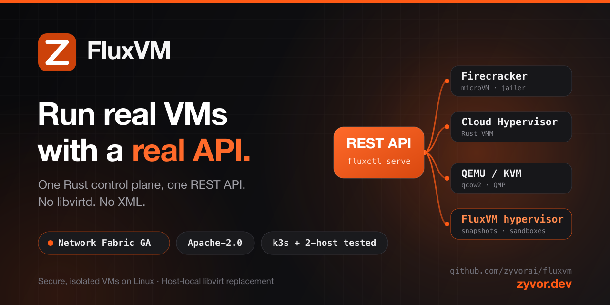

<div align="center">



# FluxVM

**Run real VMs with a real API.**

**One Rust control plane for Firecracker, Cloud Hypervisor, QEMU/KVM, and the in-tree FluxVM hypervisor.**<br>
No libvirtd. No XML. A REST API and a CLI that do the same thing on every backend.

[](https://github.com/zyvorai/fluxvm/actions/workflows/ci.yml)
[](https://github.com/zyvorai/fluxvm/actions/workflows/security-profiles.yml)
[](https://github.com/zyvorai/fluxvm/actions/workflows/devops-gates.yml)
[](LICENSE)
[](https://github.com/zyvorai/fluxvm/releases)
[](https://www.rust-lang.org)

[**Quick start**](#quick-start) · [**Proof & status**](#maturity-whats-real-today) · [**Docs**](#documentation-map) · [**Talk to Zyvor**](https://zyvor.dev?utm_source=github&utm_medium=fluxvm)

</div>

---

## Why FluxVM

**One API.** JSON specs and REST where you’d hand-write XML for `virsh`.

**Four backends.** QEMU, Cloud Hypervisor, Firecracker, and the FluxVM hypervisor — one contract.

**Grow later.** One Linux host today. Kubernetes or a multi-host fleet when you need them.

FluxVM is a complete control plane on its own — a host-local replacement for libvirt/virsh
([command mapping below](#vs-libvirtvirsh)) — and also the VM engine under other Zyvor products.
It is the same binary and the same REST API either way.

| You have today | With FluxVM |
|---|---|
| Hand-written XML and `virsh` scripts | A JSON VM spec and a **real REST API** (`fluxctl serve`), plus a CLI with the same verbs |
| A different toolchain per hypervisor | **Four backends behind one trait** — pick per VM, or let `"backend":"auto"` choose |
| SSH keys, bastions and open ports just to run a command | A **vsock guest agent**: `exec`, PTY console and file copy with no SSH and no network path |
| Orphaned VMs after a crashed job | Optional **`ttl_seconds`** cleanup and cheap qcow2 CoW clones |
| Firewall rules bolted on with nftables | **Network Fabric (GA)**: a TC/eBPF VM-edge dataplane with L3/L4 policy, rate limits and live reconfigure |
| A platform rewrite just to get a VM API | **One Linux host is enough.** Grow to multi-host fleets or Kubernetes when you need to |

## See it work

```bash
sudo fluxctl create --spec examples/qemu.json     # boot a VM from a JSON spec
fluxctl list                                      # every VM, every backend
fluxctl exec <id> -- hostname                     # run a command over vsock — no SSH
fluxctl pause <id> && fluxctl resume <id>         # park it instead of rebuilding it
fluxctl delete <id>                               # or set ttl_seconds and walk away
```

Ready to run it yourself? [Full Quick start](#quick-start).

---

<a id="maturity-whats-real-today"></a>

## Proof & status

We only claim what has been run. Every row links to how it was verified.

| Verified today | Evidence |
|---|---|
| **Kubernetes operator** reconciles real VMs, self-heals out-of-band deletes, and cleans up with no leaked QEMU | 9/9 checks on a real k3s cluster — [`scripts/test-kube-operator.sh`](scripts/test-kube-operator.sh) |
| **Multi-host fleet**: central registry with load-aware placement | Two real, physically separate hosts — [docs/operations.md](docs/operations.md#distributed-node-agent) |
| **Storage**: qcow2/raw, LVM thin, NBD, Ceph RBD | RBD verified against a real Rook Ceph cluster |
| **Networking**: user-mode NAT, TAP+bridge, netns+DHCP, macvtap | All four SSH-verified end to end in the regression tests |
| **Network Fabric** (TC/eBPF, schema v4) | **GA.** Default stays nftables; enable with `sudo ./scripts/enable-network-fabric-ga.sh --restart` — [docs/network-fabric.md](docs/network-fabric.md) |
| **Bridge-less direct datapath** cuts the forwarding path | Measured host forwarding cost vs the bridge chain with the same policy program: **−31% latency, +60% 64 B packet rate** (Pod case). A veth stand-in on a shared node, TCP deltas within noise, no real guest — [method and raw data](docs/direct-datapath.md#-measured-forwarding-cost) |

**Know before you commit.** These are the boundaries, stated up front so you can size the fit:

- **Multi-tenant controls are opt-in, not a public-cloud boundary.** Create-path quotas use an O(1) ledger, `policy.require_catalog_names` rejects unsigned images, QEMU/Cloud Hypervisor children can take a log-mode seccomp filter (`FLUXVM_VMM_SECCOMP`), and AppArmor/SELinux profiles ship under `deploy/`. Per-tenant Firecracker uids need `[jailer] uid_range_start` / `uid_range_len`. Pause, resume, and delete do not hash images or scan the fleet. See [docs/PRODUCTION.md](docs/PRODUCTION.md).
- **Secure Containers (containerd runtime-v2 shim) is GA**, not a Kata-equivalence claim. Allowlisted hostPath is a virtiofs export when `FLUXVM_HOSTPATH_ALLOW` is set at sandbox create (symlink escape fails closed). Multus on the direct datapath fails closed. The Pod-teardown hang from earlier labs is covered by `journal_after_task_delete` (CHANGELOG 0.4.0). Broader CNI conformance stays opt-in —
  [docs/secure-containers.md](docs/secure-containers.md).
- **Not KubeVirt-compatible, by design.** `kubectl-fluxvm` is the console/exec/pause/resume plugin and deletes the CR (the operator finalizes the VM). `GuestImage` HTTP sources are staged on the node and are not CDI DataVolumes; unsigned downloads are not promoted to a trusted catalog name. QEMU has a target receiver at `POST /v1/migration/receivers` (`-incoming defer`); Cloud Hypervisor stays fire-and-forget, and direct-datapath migration is refused. See [FAQ](#faq).
- **Boot and density numbers are a method plus a per-host record, not a sizing SLA.** `scripts/record-baseline.sh` writes `docs/benchmarks/evidence/`. `avg_create_ms` is control-plane create time. `warm_claim_ms` is pool claim time. Repeat on a second host before capacity planning
  ([docs/benchmarks/README.md](docs/benchmarks/README.md)).

---

<a id="vs-libvirtvirsh"></a>

## vs. libvirt/virsh

FluxVM is the Zyvor **host-local** replacement for libvirt/virsh VM lifecycle and networking. It is **not** a
drop-in for KubeVirt/OpenShift.

| libvirt/virsh | FluxVM | Same job? |
|---|---|---|
| `virsh define` + `virsh start` | `fluxctl create` | Yes |
| `virsh list` / `virsh dominfo` | `fluxctl list` / `fluxctl get` | Yes |
| `virsh suspend` / `virsh resume` | `fluxctl pause` / `fluxctl resume` | Yes |
| `virsh destroy` | `fluxctl delete` | Yes |
| XML domain definitions | JSON VM spec (`fluxctl create --spec vm.json`) | Different format, same purpose |
| No REST API | Full REST API (`fluxctl serve`) | FluxVM adds this |

No libvirtd and no XML: FluxVM speaks its own REST API and manages TAP/bridge/netns networking directly via netlink.

## Backends

| Backend | Best for |
|---|---|
| **QEMU/KVM** | Broad guest/device compatibility, qcow2 CoW overlays, QMP socket |
| **Cloud Hypervisor** | Modern cloud workloads on a Rust VMM; direct-kernel or firmware boot |
| **Firecracker** | MicroVMs from a Linux kernel + raw root filesystem, with the jailer |
| **FluxVM hypervisor** (`"backend":"flux-vm"`) | Agent sandboxes: memory snapshots, `/v1/sandboxes`, guest HTTP proxy + AutoResume, L7 egress, AutoPause, `/console` — [docs/agent-sandbox-gaps.md](docs/agent-sandbox-gaps.md) |

---

<a id="use-cases"></a>

## Use cases

Nine use cases map onto what is implemented today — nothing below is aspirational. Detail:
[docs/use-cases.md](docs/use-cases.md).

| Outcome you want | What it uses |
|---|---|
| **CI/CD runners that isolate every job** | VM-per-job over vsock `exec` (no SSH, no network path needed); `ttl_seconds` guarantees cleanup even if the job crashes |
| **A golden-image pipeline** | Build once (`fluxctl build-image`), reuse via qcow2 CoW overlays; SHA-256 plus an optional Ed25519-signed image catalog |
| **Kubernetes-native VM workloads without KubeVirt** | `DisposableVm` CRD + node-local `fluxvm-kube` operator, verified against a real k3s cluster |
| **OCI workloads with a per-Pod guest kernel** | `containerd-shim-fluxvm-v2` — **GA** (not Kata-equivalent; see GA boundaries in [docs/secure-containers.md](docs/secure-containers.md)) |
| **A multi-host fleet without Kubernetes** | `fluxvm-agent` central registry + load-aware placement, verified across two physically separate hosts |
| **Sandboxed / untrusted code execution** | Firecracker jailer + cgroup v2 + netns + vsock `exec` + TTL reaper — the same isolation *shape* as gVisor/Firecracker-based CI sandboxes |
| **Per-branch dev and test environments** | Cheap qcow2 CoW cloning, optional `ttl_seconds`, `pause`/`resume` to park instead of rebuild |
| **Your own storage backend** | LVM thin, NBD or Ceph RBD |
| **Networking that matches your environment** | User-mode NAT, TAP+bridge or macvtap, plus an opt-in bridge-less direct tap (eBPF redirect; [docs/direct-datapath.md](docs/direct-datapath.md)) |

---

## Is this for you?

**A strong fit when you…**

- want VM lifecycle without a systemd/libvirtd dependency — direct netlink networking, JSON specs, a real REST API;
- run CI runners, sandboxed execution or per-branch environments and want cleanup you don't have to remember;
- are looking for a Kubernetes-native VM path that isn't KubeVirt (`DisposableVm`, `fluxvm-microvm`);
- want to adopt it standalone — no Fabric, Ragnarok or other Zyvor product required.

**Look elsewhere (for now) when you…**

- need a finished multi-tenant security boundary today ([details](#maturity-whats-real-today));
- need full Kata / CDI / non-QEMU Secure Containers VMM parity (Secure Containers is GA with documented scope boundaries);
- need KubeVirt/OpenShift compatibility (`virtctl`, CDI, live-migration parity);
- need published performance numbers for capacity planning.

---

## Quick start

```bash
git clone https://github.com/zyvorai/fluxvm.git
cd fluxvm
```

`fluxvm-image` depends on a sibling [`guestkit`](https://github.com/zyvorai/guestkit) checkout
(clone it next to `fluxvm`, i.e. path `../../../guestkit` from `crates/fluxvm-image`).

```bash
# 1. Prepare the host once — packages, Cloud Hypervisor, Firecracker, a bridge.
sudo ./scripts/bootstrap-host.sh vmbr0
./scripts/preflight.sh                    # confirm every tool is on PATH

# 2. Build (current stable Rust toolchain) and install the CLI.
cargo build --release
sudo install -m 0755 target/release/fluxctl /usr/local/bin/fluxctl
sudo install -m 0755 target/release/fluxvm-hypervisor /usr/local/bin/fluxvm-hypervisor
sudo install -m 0644 config.example.toml /etc/fluxvm.toml

# 3. Run a VM — edit examples/qemu.json to point at your base image + SSH pubkey.
sudo fluxctl --config /etc/fluxvm.toml create --spec examples/qemu.json

# Day-2
fluxctl list
fluxctl get <id>                 # includes guest_ip for netns mode
fluxctl exec <id> -- hostname
fluxctl ping <id>                            # health-check the vsock guest agent
fluxctl copy-to <id> ./local.txt /etc/app.cfg
fluxctl copy-from <id> /etc/app.cfg ./local.txt
fluxctl migrate start <id> --destination tcp:10.0.0.9:49152   # QEMU/CH source-side live migration
fluxctl migrate status <id>      # QEMU only -- Cloud Hypervisor's send-migration is fire-and-forget
fluxctl pause <id> && fluxctl resume <id>
fluxctl freeze <id> && fluxctl frozen <id> && fluxctl thaw <id>  # cgroup-level, independent of the VMM's own API
fluxctl delete <id>              # or wait for ttl_seconds
```

`cargo build --release` also produces `fluxvm-kube`, `fluxvm-agent`, `containerd-shim-fluxvm-v2`,
and `fluxvm-container-agent` — see [Feature highlights](#feature-highlights) for what each is.

**Pick a network mode:**

| Mode | Spec sketch | Guest IP |
|------|-------------|----------|
| Lab / SSH | `"network": {"mode":"user","forwards":[{"host_port":2222,"guest_port":22}]}` | QEMU SLIRP DHCP; SSH via `localhost:2222` |
| LAN DHCP | `"network": {"mode":"tap","bridge":"vmbr0","mac":"06:…"}` | Your bridge's DHCP |
| Known IP | `"network": {"mode":"tap","netns":true,"mac":"06:…"}` | FluxVM dnsmasq; see `fluxctl get` |
| L2 macvtap | `"network": {"mode":"macvtap","parent":"eth0","mac":"06:…"}` | Your L2 / static via cloud-init |
| Bridge-less direct (opt-in) | `"network": {"mode":"tap","mac":"06:…","direct":{"outer":"eth0","mode":"l2-uplink","guest_ips":["…"]}}` | Your L2 / static; eBPF redirect instead of a bridge — [docs/direct-datapath.md](docs/direct-datapath.md) |

Full examples: [`examples/qemu.json`](examples/qemu.json) (user-mode lab),
[`examples/create-vm-prod.json`](examples/create-vm-prod.json) (tenant + tap/netns),
[`examples/guestkit-handoff.json`](examples/guestkit-handoff.json) (post-GuestKit netns + known IP),
[`examples/macvtap.json`](examples/macvtap.json). Full JSON contract:
[docs/api.md](docs/api.md#vm-json-contract). Verify your build end to end with
`sudo ./scripts/test-networking.sh` and `sudo ./scripts/test-lifecycle.sh` — see
[docs/operations.md](docs/operations.md#testing-networking-and-lifecycle-end-to-end). Deploying to a
remote host: [docs/operations.md](docs/operations.md#deploy-to-a-remote-host).

---

## Feature highlights

| Area | What's there | Docs |
|------|---------------|------|
| **Backends** | QEMU/KVM, Cloud Hypervisor, Firecracker and the in-tree FluxVM hypervisor behind one `VmBackend` trait; `"backend":"auto"`; vsock guest agent (`exec`, `ping`, PTY console with live resize, `copy-to`/`copy-from`) with no SSH | [docs/agent-sandbox-gaps.md](docs/agent-sandbox-gaps.md) · [docs/operations.md](docs/operations.md#auto-backend-selection) |
| **Networking & Network Fabric** | TAP/bridge, macvtap, user-mode NAT, per-VM netns. **Network Fabric is GA (schema v4):** TC/eBPF or Cilium-coexistence dataplane with IPv4/IPv6 L3+L4 policy, rate limits, security groups, CNP, live reconfigure and REST observability; nftables by default | [docs/network-fabric.md](docs/network-fabric.md) · [docs/ebpf-cilium.md](docs/ebpf-cilium.md) · [docs/network-policy.md](docs/network-policy.md) |
| **Service Fabric** | Node-local Maglev VIP load balancing: dual-stack NAT/DSR/SNAT, health-aware routing, per-service EDT, flow export | [docs/service-fabric.md](docs/service-fabric.md) |
| **Images** | virt-builder-style `build-image` (guestkit-based, never libguestfs), per-distro package install, Ed25519-signed catalog with REST CRUD, Windows golden-image customization | [docs/build-image-tutorials.md](docs/build-image-tutorials.md) · [docs/operations.md](docs/operations.md#image-catalog--signing) · [docs/windows-golden.md](docs/windows-golden.md) |
| **Operations** | cgroup v2 limits, freeze/thaw and PSI; warm VM pools; Firecracker jailer; LVM thin / NBD / Ceph RBD; admission limits; bearer-token auth/RBAC | [docs/operations.md](docs/operations.md) · [docs/api.md](docs/api.md#auth--rbac) |
| **Kubernetes & fleet** | `DisposableVm` CRD + node-local operator; `fluxvm-microvm` scheduler-native path (no KubeVirt); `fluxvm-agent` fleet registry with load-aware placement | [Kubernetes CRD/operator](#kubernetes-crdoperator) · [docs/microvm.md](docs/microvm.md) · [docs/operations.md](docs/operations.md#distributed-node-agent) |
| **Secure Containers** *(GA)* | containerd runtime-v2 shim mapping a Pod onto one QEMU FluxVM: CNI L2, cgroup-v2 stats, VSOCK stdio/TTY, device passthrough, guest AppArmor/SELinux/seccomp enforcement | [docs/secure-containers.md](docs/secure-containers.md) |
| **Security profiles (Phase 6)** | `standard` / `measured` / `confidential-snp` / `confidential-tdx`: measured software-test evidence on ordinary QEMU hosts; confidential control plane tested without claiming host-memory encryption until a hardware run | [docs/security-profiles.md](docs/security-profiles.md) · [howto / CI](docs/guides/security-profiles-howto.md) |
| **Sentinel observability** | eBPF host + guest runtime intelligence: per-VM syscall/page-fault telemetry, drop reasons, flight recorder, BPF-LSM VMM guard/QoS, XDP shield | [docs/runtime-intelligence.md](docs/runtime-intelligence.md) · [docs/flight-recorder.md](docs/flight-recorder.md) |

---

## FAQ

**Is FluxVM production-ready?** For the core VM-lifecycle primitives (auth/RBAC, jailer, cgroups, netns), yes — with the caveats in [Proof & status](#maturity-whats-real-today). Turn on `policy.require_catalog_names`, the quota ledger, `FLUXVM_VMM_SECCOMP`, and the AppArmor or SELinux profile before exposing it to untrusted tenants. Secure Containers is GA with documented scope boundaries (not Kata-equivalent).

**How is this different from libvirt?** No libvirtd, no XML domain definitions — its own REST API, with netlink for networking. See [vs. libvirt/virsh](#vs-libvirtvirsh).

**How is this different from KubeVirt?** A different model: FluxVM's `DisposableVm` and MicroVM paths run the VMM on the host under `fluxctl serve`, not inside a virt-launcher Pod. `kubectl-fluxvm` covers console, exec, pause, resume, and CR delete. `GuestImage` HTTP staging is not CDI. QEMU live migration has a target receiver; it is not KubeVirt migration parity. Full comparison: [docs/microvm.md](docs/microvm.md#vs-disposablevm-and-kubevirt).

**Do I need Fabric or Ragnarok?** No. Clone it, build it, run `fluxctl create`. Fabric and Ragnarok are separate products that use FluxVM as their VM engine — see [Ecosystem](#ecosystem).

**What storage backends are supported?** qcow2/raw, LVM thin, NBD and Ceph RBD — see [Bring-your-own storage backend](docs/use-cases.md#bring-your-own-storage-backend).

**Are there published boot-latency or density numbers?** The measurement method is `scripts/record-baseline.sh`. Each evidence file is one host, and `avg_create_ms` is API create time, not guest init. It is not a sizing SLA until the same script has been repeated on a second host. Don't treat Firecracker's 125 ms target as a FluxVM number.

**How do I test security profiles without SNP/TDX hardware?** Run `./scripts/test-security-profiles.sh` (same suite as [CI](.github/workflows/security-profiles.yml)). Measured evidence is always `software-test` — see [docs/guides/security-profiles-howto.md](docs/guides/security-profiles-howto.md).

**What license is this under?** Apache License 2.0 for the whole repository, no dual licensing — see [License](#license).

---

## Architecture at a glance

```text
                     +-------------------------+
 CLI / REST -------->| Rust VmManager          |
                     | state + TTL + sandboxes |
                     +------------+------------+
                                  |
     +-------------+--------------+--------------+--------------+
     |             |              |              |              |
 +---v---+   +-----v-----+  +-----v------+  +----v-------------+
 | QEMU  |   | Cloud     |  |Firecracker |  | FluxVM hypervisor|
 | qcow2 |   | Hypervisor|  | raw rootfs |  | (agent sandboxes)|
 +---+---+   +-----+-----+  +-----+------+  +----+-------------+
     |             |              |              |
     +------+------+--------------+--------------+
            |
     KVM + TAP/bridge + Linux host

Image path:
base image -> SHA256 -> qemu-img -> customize -> reusable template
                                      |
VM launch: template -> CoW clone -> cloud-init -> VMM -> optional TTL delete

Secure Containers (GA):
Kubernetes/ctr -> containerd -> containerd-shim-fluxvm-v2
  -> FluxVM REST -> QEMU + virtiofs Pod share (+ Pod-UID write-through volumes)
  -> fluxvm-guest-agent :17777 -> fluxvm-container-agent :17778 / stdio :17779
```

Network Fabric dataplane diagrams (packet decision and control-plane sequence):
[docs/network-fabric.md](docs/network-fabric.md#packet-decision-and-control-plane-diagrams).

## Project layout

A Cargo workspace of **23 crates**, structured for FluxVM's multi-node architecture.

<details>
<summary><b>Show the crate map</b></summary>

```text
crates/
├── fluxvm-core                 domain types, config, VmBackend trait
├── fluxvm-cgroup                cgroup v2 resource control (cpu/memory/io/freezer/pressure/cpuset)
├── fluxvm-storage               VM-record state persistence
├── fluxvm-network               TAP/bridge, netns, egress, nftables + TC/eBPF dataplane
│                                  (bpf/fluxvm_tc.bpf.c, Cilium coexistence)
├── fluxvm-image                 image build/clone + cloud-init seed + OCI→template
├── fluxvm-qemu                  QEMU/KVM backend
├── fluxvm-cloud-hypervisor      Cloud Hypervisor backend
├── fluxvm-firecracker           Firecracker backend
├── fluxvm-hypervisor            in-tree microVMM + `FluxVmBackend` (`fluxvm-hypervisor` binary)
├── fluxvm-guest-protocol        wire types shared by the guest agent and its host client
├── fluxvm-guest-agent           in-guest AF_VSOCK agent binary (ping/exec/shutdown)
├── fluxvm-vsock-client          host-side vsock dialing (native for QEMU, UDS proxy for CH/Firecracker)
├── fluxvm-scheduler             VmManager: VM lifecycle orchestration + TTL reaper
├── fluxvm-api                   REST API (axum)
├── fluxctl                      `fluxctl` CLI + `fluxctl serve` (composition root)
├── fluxvm-agent                 fleet registry + per-host node-agent daemon (multi-node)
├── fluxvm-kube                  DisposableVm CRD + node-local Kubernetes operator
├── fluxvm-microvm               MicroVM/Job/Pool/GuestImage, shadow-Pod scheduler, node agent
├── fluxvm-container-protocol    Secure Containers lifecycle wire types (VSOCK :17778)
├── fluxvm-container-agent       in-guest OCI process supervisor (`fluxvm-container-agent`)
├── fluxvm-container-client      host-side VSOCK client for the container agent
├── fluxvm-containerd-shim       containerd runtime-v2 shim (`containerd-shim-fluxvm-v2`)
└── fluxvm-intelligence          Sentinel: eBPF host+guest telemetry, drop-reason tracking, flight
                                   recorder, BPF-LSM VMM guard/QoS, XDP shield, topology steering
```

</details>

Deploy fragments for the containerd RuntimeClass path live under `deploy/containerd/`
(see [docs/secure-containers.md](docs/secure-containers.md)). `fluxvm-agent` (the per-*host* node-agent —
distinct from the in-guest `fluxvm-guest-agent`) and `fluxvm-kube` are both verified against real multi-host
and cluster infrastructure. `fluxvm-image` depends on the sibling
[`guestkit`](https://github.com/zyvorai/guestkit) project for offline image customization.

## Kubernetes CRD/operator

`fluxvm-kube` is a `DisposableVm` custom resource plus a node-local operator that reconciles them against a
*local* `fluxctl serve` instance — each node's operator only acts on objects whose `spec.node` matches the
node it was started with, the same shape as a real DaemonSet (see [`deploy/k8s/`](deploy/k8s/) for the
Dockerfile and CRD/RBAC/DaemonSet manifests). Verified end to end against a real k3s cluster (9/9 checks:
CRD acceptance, real VM reconciliation, out-of-band-delete self-healing, and finalizer-blocked cleanup with no
leaked QEMU process — see [`scripts/test-kube-operator.sh`](scripts/test-kube-operator.sh)):

```bash
fluxvm-kube --print-crd | kubectl apply -f -
NODE_NAME=$(hostname) FLUXVM_URL=http://127.0.0.1:7788 fluxvm-kube
```

**Declarative, not one-shot.** If the underlying VM disappears (TTL expired, or deleted through the REST API)
the operator notices on its next reconcile and creates a replacement — the same "keep this existing" semantics a
`Deployment` gives Pods. `spec.networkMode` supports `none`/`user`/`tap`/`macvtap`, plus opt-in `direct`
(bridge-less; `parent` = the uplink NIC — [docs/direct-datapath.md](docs/direct-datapath.md)). Placement: set
`spec.node`, or run one `fluxvm-kube --enable-placement` instance to pin to the least-loaded capable node.

Related but separate: [Secure Containers](docs/secure-containers.md) uses containerd RuntimeClass `fluxvm` for OCI
workloads and does not replace `DisposableVm`. The scheduler-native alternative to KubeVirt is `fluxvm-microvm` —
see [docs/microvm.md](docs/microvm.md).

---

## Ecosystem

FluxVM is complete and useful on its own. It is also the VM engine under two other Zyvor products, which add
orchestration and UX on the same REST API rather than forking FluxVM:

| Product | Role |
|---|---|
| **[zyvor-fabric](docs/zyvor-fabric.md)** | Private cloud control plane (CLI/Web/K8s operator/Terraform) — FluxVM runs the VMs, Fabric adds auth/RBAC, network policy and UX |
| **[Ragnarok](docs/ragnarok.md)** | AI-powered KubeVirt-style VM management — creates `DisposableVm` CRs through its FluxVM Hub with OIDC/SSO and RBAC |
| **[h2kvm](https://github.com/zyvorai/h2kvm)** | Hypervisor → KVM convert + import; hands a certified disk to FluxVM to run |
| **[GuestKit](https://github.com/zyvorai/guestkit)** | Offline disk scoring/repair — FluxVM boots and manages what GuestKit certifies |

**Certify with GuestKit → run and manage with FluxVM → convert/deploy with h2kvm.** Neither Fabric nor Ragnarok
is required to use FluxVM directly.

<a id="who-does-what-users"></a>

| You need… | Use |
|-----------|-----|
| Score / repair a disk **offline** (doctor, passport, fix plans) | **[GuestKit](https://github.com/zyvorai/guestkit)** |
| **Boot & manage** that qcow2 (network, SSH, TTL, pause/resume, fleets) | **This repo (FluxVM)** |
| Hypervisor → KVM convert + import | **[h2kvm](https://github.com/zyvorai/h2kvm)** |

### Evaluating FluxVM for your team?

FluxVM is Apache-2.0 — free to use, modify and ship commercially. If you are weighing build-vs-adopt for a
host-local VM layer, want a pilot, or need help scoping the [production checklist](docs/PRODUCTION.md) against your
threat model, **[talk to Zyvor](https://zyvor.dev?utm_source=github&utm_medium=fluxvm)**. Fabric and Ragnarok
(separate products with their own licensing) are the managed-experience path when you outgrow a CLI and an API.

---

## Documentation map

| Topic | Doc |
|-------|-----|
| Product positioning (who/why/when-not) | [docs/POSITIONING.md](docs/POSITIONING.md) |
| Product overview + metrics | [docs/PRODUCT_OVERVIEW.md](docs/PRODUCT_OVERVIEW.md) |
| Exhaustive feature checklist | [FEATURES.md](FEATURES.md) |
| Concrete use cases (CI runners, golden images, sandboxes, fleets) | [docs/use-cases.md](docs/use-cases.md) |
| Network Fabric (eBPF/Cilium dataplane, diagrams, why it's faster) | [docs/network-fabric.md](docs/network-fabric.md) |
| eBPF / Cilium coexistence detail | [docs/ebpf-cilium.md](docs/ebpf-cilium.md) |
| Cilium CNI (Secure Containers L2) | [docs/cilium-cni.md](docs/cilium-cni.md) |
| Direct (bridge-less) datapath, with measurements | [docs/direct-datapath.md](docs/direct-datapath.md) |
| Security groups & CNP network policy | [docs/network-groups.md](docs/network-groups.md) · [docs/network-policy.md](docs/network-policy.md) |
| REST API reference, auth/RBAC, VM JSON contract | [docs/api.md](docs/api.md) |
| Day-2 operations (jailer, cgroups, pools, catalog, storage, fleet, state layout) | [docs/operations.md](docs/operations.md) |
| Building custom images (per-distro + Windows) | [docs/build-image-tutorials.md](docs/build-image-tutorials.md) |
| Secure Containers (containerd runtime-v2) | [docs/secure-containers.md](docs/secure-containers.md) |
| Security profiles (Phase 6) — measured + confidential control plane | [docs/security-profiles.md](docs/security-profiles.md) · [howto + how to test](docs/guides/security-profiles-howto.md) · [CI](.github/workflows/security-profiles.yml) |
| MicroVM (Kubernetes without KubeVirt) | [docs/microvm.md](docs/microvm.md) |
| Whole-project production checklist | [docs/PRODUCTION.md](docs/PRODUCTION.md) |
| DevOps / CI / readiness probes | [docs/DEVOPS.md](docs/DEVOPS.md) |
| Using FluxVM through zyvor-fabric | [docs/zyvor-fabric.md](docs/zyvor-fabric.md) |
| Using FluxVM through Ragnarok | [docs/ragnarok.md](docs/ragnarok.md) |
| AI-agent sandbox capability gaps | [docs/agent-sandbox-gaps.md](docs/agent-sandbox-gaps.md) |
| Ranked backlog / next features | [docs/NEXT-FEATURES.md](docs/NEXT-FEATURES.md) |

Hands-on tutorials: [network policy](docs/tutorials/network-policy/README.md) ·
[production readiness](docs/tutorials/production/README.md) ·
[MicroVM](docs/tutorials/microvm/README.md).

## Contributing & community

- **Contributing:** build/test commands, PR expectations and repo layout — [CONTRIBUTING.md](CONTRIBUTING.md).
- **Security:** the current hardening bar and how to report a vulnerability — [SECURITY.md](SECURITY.md).
- **Changelog:** [CHANGELOG.md](CHANGELOG.md).

## License

Apache License 2.0 — see [LICENSE](LICENSE) and [NOTICE](NOTICE). Copyright 2026 Zyvor AI Labs. The
entire repository is under this one license; there is no dual-licensing or separately-licensed core
component.

Part of the Zyvor platform (see [Ecosystem](#ecosystem) above). More at
**[zyvor.dev](https://zyvor.dev?utm_source=github&utm_medium=fluxvm)**.
