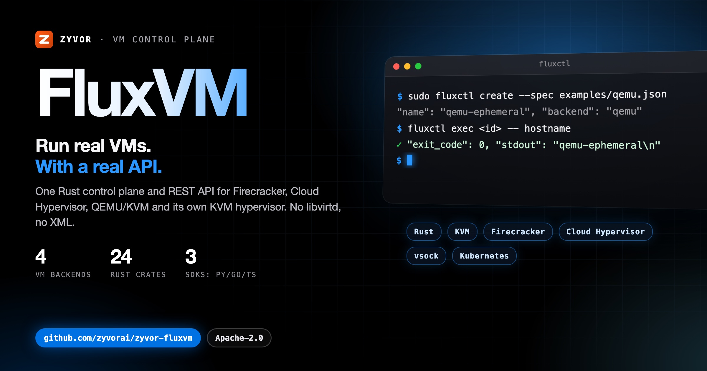
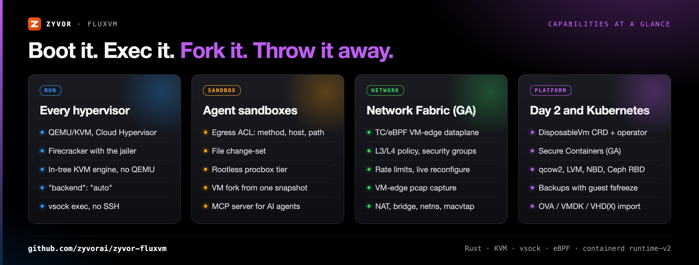
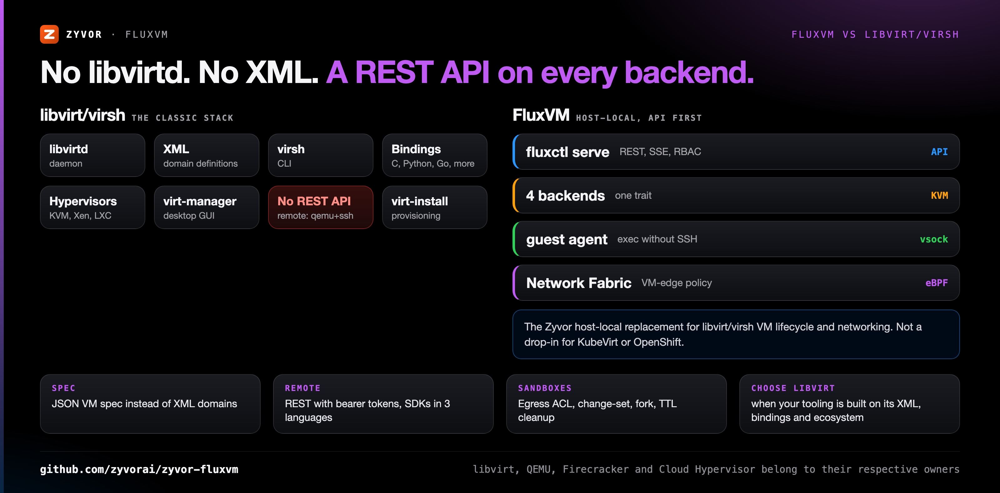
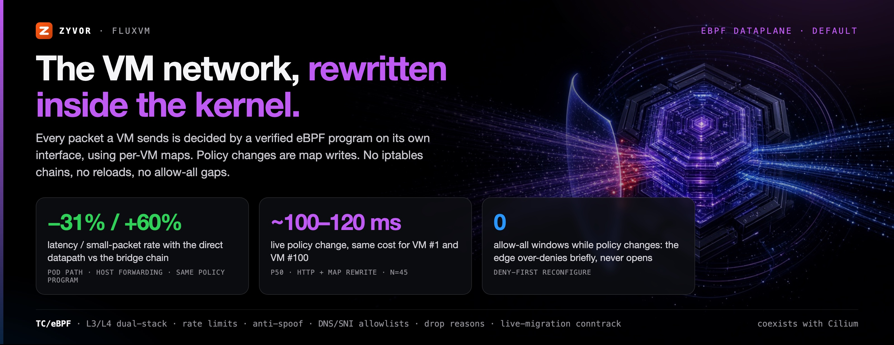
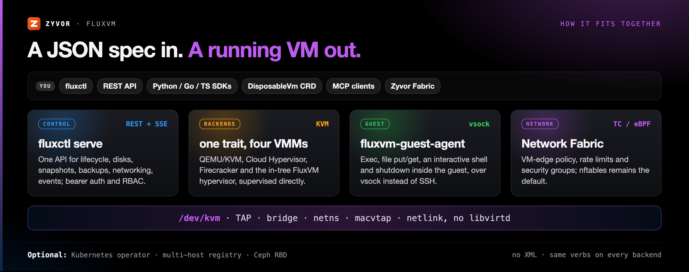
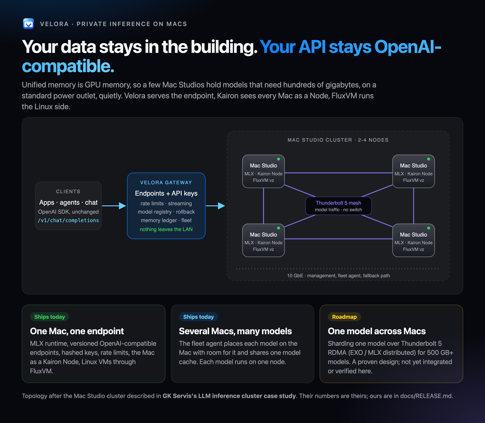

<div align="center">

# FluxVM

[](https://github.com/zyvorai/zyvor-fluxvm/actions/workflows/ci.yml)
[](https://github.com/zyvorai/zyvor-fluxvm/actions/workflows/security-profiles.yml)
[](https://github.com/zyvorai/zyvor-fluxvm/actions/workflows/devops-gates.yml)
[](LICENSE)
[](https://github.com/zyvorai/zyvor-fluxvm/commits/main)
[](https://www.rust-lang.org)

[](https://zyvor.dev/schedule?utm_source=github&utm_medium=fluxvm&utm_campaign=readme_hero)
[](https://zyvor.dev/poc?utm_source=github&utm_medium=fluxvm&utm_campaign=readme_hero)
[](#quickstart)



### Run real VMs with a real API.

**Primary networking: native eBPF.** VM edges require successful attachment by
default; nftables is an explicit compatibility mode. Before upgrading configs
that omit the dataplane mode, follow the [eBPF upgrade guide](docs/primary-ebpf.md).

**One Rust control plane for Firecracker, Cloud Hypervisor, QEMU/KVM and the in-tree FluxVM hypervisor.** No libvirtd. No XML. A REST API and a CLI that do the same thing on every backend, with a vsock guest agent instead of SSH.

**4 VM backends, one API** · **No libvirtd, no XML** · **Native KVM, no QEMU** · **SDKs: Python, Go, TypeScript** · **Operator verified on real k3s**

[**Quickstart**](#quickstart) · [**Proof**](#maturity-whats-real-today) · [**Docs**](docs/index.md) · [**API**](docs/api.md) · [**Talk to Zyvor**](https://zyvor.dev/?utm_source=github&utm_medium=fluxvm&utm_campaign=readme_hero)

</div>

---

## What's new

From the 0.4.0 (unreleased) section of the [CHANGELOG](CHANGELOG.md) and recent commits:

| Feature | What it does |
|---|---|
| **MCP server for AI agents** | `fluxctl mcp serve` speaks the Model Context Protocol over stdio; read tools by default, `--allow-write` adds power and capture ([docs/mcp.md](docs/mcp.md)) |
| **VM fork** | `POST /v1/vms/{id}/fork` / `fluxctl fork-vm`: snapshot a running FluxVM-engine VM once and restore N children with a shared read-only memory file and reflinked rootfs |
| **VM import** | `POST /v1/images/import` / `fluxctl import-image`: OVA/OVF/VMDK/VHD(X)/qcow2 to raw disks, with offline GuestKit repair of the boot disk for virtio |
| **Backups with quiesce** | Guest `fsfreeze` through QGA around the snapshot, plus list, delete and restore-backup |
| **GPUs for sandboxes** | `gpus: N` on `POST /v1/sandboxes` passes free VFIO-bound GPUs to a QEMU-backed sandbox; supported in all three SDKs |
| **Kairon VM edge, enforced** | Anti-spoof, learn-IP, DNS and SNI allow lists and an egress token bucket loaded into the VM's TC program |
| **VM-edge packet capture** | A bounded `tcpdump` on the VM's dataplane interface with pcap download |

## Why FluxVM

| When this happens… | FluxVM gives you… |
|---|---|
| Your automation has to template libvirt XML and talk to libvirtd | A JSON VM spec and a full REST API (`fluxctl serve`), the same on every backend |
| Each hypervisor needs its own tooling | QEMU/KVM, Cloud Hypervisor, Firecracker and the in-tree FluxVM hypervisor behind one trait; `"backend":"auto"` picks for you |
| Running a command in a guest means SSH keys and a network path | `fluxctl exec <id> -- …` over vsock through the guest agent |
| AI agents and CI jobs need a throwaway machine with guard rails | Agent sandboxes: egress ACL on method, host and path, a file change-set, a rootless procbox tier, VM fork and `ttl_seconds` cleanup |
| You want Linux VMs without installing QEMU | A pure in-tree KVM engine: SMP verified at 2, 4 and 8 vCPUs, pause and snapshot across every vCPU |
| You want VMs in Kubernetes without KubeVirt | A `DisposableVm` CRD and a node-local operator, 9/9 checks on a real k3s cluster |



## One API. Every hypervisor.

A JSON spec in, a running VM out. The same `fluxctl` verbs and the same REST API on every backend, with a vsock guest agent instead of SSH.

```bash
sudo fluxctl create --spec examples/qemu.json     # boot a VM from a JSON spec
fluxctl list                                      # every VM, every backend
fluxctl exec <id> -- hostname                     # run a command over vsock — no SSH
fluxctl pause <id> && fluxctl resume <id>         # park it instead of rebuilding it
fluxctl delete <id>                               # or set ttl_seconds and walk away
```

<table>
<tr>
<td valign="top" width="33%">
<b>Four backends</b><br>
QEMU/KVM, Cloud Hypervisor, Firecracker and the in-tree FluxVM hypervisor behind one trait. <code>"backend":"auto"</code> picks for you.<br>
<a href="docs/vs-libvirt.md#backends">Backends</a>
</td>
<td valign="top" width="33%">
<b>Native KVM, no QEMU</b><br>
A pure in-tree KVM engine: SMP verified at 2, 4 and 8 vCPUs, pause and snapshot across every vCPU, and a golden Cloud-init template.<br>
<a href="docs/native-kvm-no-qemu.md">Native KVM</a>
</td>
<td valign="top" width="33%">
<b>Agent sandboxes</b><br>
An egress ACL on method, host and path (HTTPS via opt-in interception), a file change-set, a rootless procbox tier, GPUs for QEMU sandboxes (`gpus: N`), and Python, Go and TypeScript SDKs.<br>
<a href="docs/agent-sandbox-gaps.md">Agent sandboxes</a>
</td>
</tr>
<tr>
<td valign="top" width="33%">
<b>Network Fabric <sub>GA</sub></b><br>
A TC/eBPF VM-edge dataplane with L3/L4 policy, rate limits, security groups and live reconfigure. Native eBPF is the default dataplane; nftables is an explicit compatibility mode.<br>
<a href="docs/ebpf.md">eBPF dataplane</a> · <a href="docs/network-fabric.md">Network Fabric</a>
</td>
<td valign="top" width="33%">
<b>Secure Containers <sub>GA</sub></b><br>
A Pod gets its own guest kernel through containerd runtime-v2, with Sentinel NetworkPolicy. Not a Kata-equivalence claim.<br>
<a href="docs/secure-containers.md">Secure Containers</a>
</td>
<td valign="top" width="33%">
<b>Kubernetes</b><br>
A <code>DisposableVm</code> CRD and a node-local operator, verified on a real k3s cluster, plus a scheduler-native path without KubeVirt.<br>
<a href="docs/kubernetes-operator.md">Operator</a>
</td>
</tr>
</table>

---

<a id="vs-libvirtvirsh"></a>

## FluxVM vs libvirt/virsh



FluxVM is the Zyvor **host-local** replacement for libvirt/virsh VM lifecycle and networking. It is **not** a drop-in for KubeVirt/OpenShift.

| libvirt/virsh | FluxVM |
|---|---|
| `virsh define` + `virsh start` | `fluxctl create` |
| `virsh list` / `virsh suspend` / `virsh resume` | `fluxctl list` / `pause` / `resume` |
| `virsh console` | `fluxctl serial` (websocket over REST too) |
| XML domain definitions | A JSON VM spec (`fluxctl create --spec vm.json`) |
| No REST API | A full REST API (`fluxctl serve`) |
| `virsh -c qemu+ssh://host` | `fluxctl --server` / `fluxctl context` (REST, bearer token) |
| `virsh event` | `fluxctl events -f` (SSE: `/v1/events/stream`) |
| libvirtd manages networks | TAP/bridge/netns networking managed directly via netlink |
| **Choose libvirt when** | Your tooling is built on its XML, language bindings and ecosystem (virt-manager, virt-install), or you need hypervisors beyond FluxVM's four |

The [full command mapping](docs/vs-libvirt.md) covers disks, snapshots, backups, clone and events.

---

## eBPF: the VM network, rewritten inside the kernel

[](docs/ebpf.md)

Every VM's packets are decided by a kernel-verified eBPF program on its own interface, using per-VM maps.
That's the default dataplane.

- **Policy is a map write.** Live changes take about 100-120 ms p50, cost the same for the first VM and the hundredth, and never open an allow-all window.
- **Fewer hops.** The direct datapath cuts the Pod path from 8 devices to 4: -31% latency and +60% small-packet rate in host-forwarding benchmarks.
- **Connections survive live migration.** Conntrack moves with the VM and is checked against the destination policy.
- **See why packets died.** Attributed drop reasons, flows, stats and on-demand pcaps over REST. It coexists with Cilium and never writes Cilium's maps.

[The eBPF dataplane →](docs/ebpf.md)

---

## How it fits together



- <a id="architecture-at-a-glance"></a>**Architecture:** the control plane, the four backends and the image path — [docs/architecture.md](docs/architecture.md).
- <a id="feature-highlights"></a>**Feature highlights:** every area in one table, with its docs — [docs/index.md](docs/index.md#feature-highlights).
- <a id="kubernetes-crdoperator"></a>**Kubernetes:** `DisposableVm` and the node-local operator — [docs/kubernetes-operator.md](docs/kubernetes-operator.md).
- <a id="faq"></a>**FAQ:** is it for you, and the questions people ask first — [docs/faq.md](docs/faq.md).
- <a id="ecosystem"></a><a id="who-does-what-users"></a>**Ecosystem:** how FluxVM relates to zyvor-fabric, Ragnarok, h2kvm and GuestKit — [docs/ecosystem.md](docs/ecosystem.md).
- <a id="using-fluxvm-through-ragnarok"></a>**Using FluxVM through Ragnarok:** [docs/ragnarok.md](docs/ragnarok.md), and [zyvor-fabric](docs/zyvor-fabric.md) for the private-cloud control plane.

---

<a id="quick-start"></a>

## Quickstart

Needs a Linux host with KVM, a Rust toolchain, and a sibling `guestkit` checkout.

```bash
git clone https://github.com/zyvorai/zyvor-fluxvm.git && cd fluxvm   # needs a sibling guestkit checkout
sudo ./scripts/bootstrap-host.sh vmbr0 && ./scripts/preflight.sh
cargo build --release
sudo install -m 0755 target/release/fluxctl /usr/local/bin/fluxctl
sudo install -m 0644 config.example.toml /etc/fluxvm.toml
sudo fluxctl --config /etc/fluxvm.toml create --spec examples/qemu.json
```

Day-2 verbs, network modes and remote daemons: [Getting started](docs/getting-started.md).

<a id="use-cases"></a>

## Use cases

Every one maps onto what is implemented today. [All eleven](docs/index.md#use-cases) and [docs/use-cases.md](docs/use-cases.md).

- **CI runners that isolate every job:** a VM per job over vsock `exec`, with `ttl_seconds` cleanup.
- **AI-agent sandboxes with guard rails:** a microVM or a rootless procbox, an egress ACL and a change-set.
- **Linux VMs with no QEMU installed:** the in-tree KVM engine and a golden template, `fluxctl vm-template create native-agent <name>`.
- **A golden-image pipeline:** build once with `fluxctl build-image`, reuse through CoW overlays and a signed catalog.
- **Kubernetes-native VMs without KubeVirt** and **OCI workloads with a per-Pod guest kernel.**

## Documentation map

| Topic | Doc |
|---|---|
| Every feature area and document | [docs/index.md](docs/index.md) |
| Positioning, overview and the exhaustive feature list | [docs/POSITIONING.md](docs/POSITIONING.md) · [docs/PRODUCT_OVERVIEW.md](docs/PRODUCT_OVERVIEW.md) · [FEATURES.md](FEATURES.md) |
| REST API, auth/RBAC and the VM JSON contract | [docs/api.md](docs/api.md) |
| Day-2 operations | [docs/operations.md](docs/operations.md) |
| Native KVM, no QEMU | [docs/native-kvm-no-qemu.md](docs/native-kvm-no-qemu.md) |
| Agent sandboxes, procbox and the SDKs | [docs/agent-sandbox-gaps.md](docs/agent-sandbox-gaps.md) · [python/](python/README.md) · [go/](go/README.md) · [typescript/](typescript/README.md) |
| Network Fabric and Service Fabric | [docs/network-fabric.md](docs/network-fabric.md) · [docs/service-fabric.md](docs/service-fabric.md) |
| Secure Containers and MicroVM | [docs/secure-containers.md](docs/secure-containers.md) · [docs/microvm.md](docs/microvm.md) |
| Production checklist and DevOps gates | [docs/PRODUCTION.md](docs/PRODUCTION.md) · [docs/DEVOPS.md](docs/DEVOPS.md) |
| Architecture, FAQ and ecosystem | [docs/architecture.md](docs/architecture.md) · [docs/faq.md](docs/faq.md) · [docs/ecosystem.md](docs/ecosystem.md) |
| Ranked backlog | [docs/NEXT-FEATURES.md](docs/NEXT-FEATURES.md) |

## Contributing & community

- **Contributing:** build and test commands, PR expectations and repo layout, in [CONTRIBUTING.md](CONTRIBUTING.md).
- **Security:** the current hardening bar and how to report a vulnerability, in [SECURITY.md](SECURITY.md).
- **Changelog:** [CHANGELOG.md](CHANGELOG.md).

---

<a id="maturity-whats-real-today"></a>

## Maturity

**Proof, not promises.** We only claim what has been run. Every line links to how it was verified.

- **Kubernetes operator:** 9/9 checks on a real k3s cluster, including self-healing and no leaked QEMU. [Details](docs/proof-and-status.md)
- **Multi-host fleet:** a central registry with load-aware placement across two physically separate hosts. [Details](docs/proof-and-status.md)
- **Storage and networking:** qcow2/raw, LVM thin, NBD and Ceph RBD (against a real Rook cluster); NAT, TAP+bridge, netns+DHCP and macvtap, SSH-verified end to end. [Details](docs/proof-and-status.md)
- **Bridge-less direct datapath:** measured −31% latency and +60% 64 B packet rate in the Pod case, on a veth stand-in with no real guest. [Method and data](docs/direct-datapath.md#-measured-forwarding-cost)
- **Native KVM:** 2, 4 and 8-vCPU guests boot, pause and snapshot across every vCPU, and a real `fluxctl create` passes the agent and NoCloud gate. [Details](docs/native-kvm-no-qemu.md)
- **The boundaries, up front:** multi-tenant controls are opt-in, not a public-cloud boundary, and boot numbers are a method, not a sizing SLA. [Read them](docs/proof-and-status.md)

| Status | Areas |
|---|---|
| **GA** | Network Fabric (TC/eBPF, the default dataplane; nftables via explicit `mode = "legacy"`) · Secure Containers (containerd runtime-v2, not a Kata-equivalence claim) |
| **Unreleased (0.4.0)** | MCP server, sandbox GPUs, enforced Kairon VM edge, VM-edge capture, VM fork, VM import, quiesced backups |
| **Not by design** | KubeVirt compatibility |

---

## Part of the Zyvor stack

FluxVM is complete and useful on its own. **Certify with GuestKit → run and manage with FluxVM → convert/deploy with h2kvm.**

| Product | Role next to FluxVM |
|---|---|
| **[Zyvor Fabric](https://github.com/zyvorai/zyvorai-fabric)** | Private cloud control plane on the same REST API — FluxVM runs the VMs, Fabric adds auth/RBAC, network policy and UX |
| **[GuestKit](https://github.com/zyvorai/zyvor-guestkit)** | Offline disk scoring/repair; FluxVM's VM import uses it to repair the boot disk |
| **[h2kvm](https://github.com/zyvorai/zyvor-h2kvm)** | Hypervisor → KVM convert + import; hands a certified disk to FluxVM to run |
| **[Kairon](https://github.com/zyvorai/zyvor-kairon)** | Posts the VM-edge spec FluxVM enforces in its TC dataplane |

→ [zyvor.dev](https://zyvor.dev)

---

## License and support

FluxVM is **free and open source** under the [Apache License 2.0](LICENSE) — see [NOTICE](NOTICE). Copyright 2026 Zyvor AI Labs. The entire repository is under this one license; there is no dual-licensing or separately-licensed core component.

**Zyvor Enterprise** adds what production teams ask for: supported releases, deployment and upgrade guidance, priority incident triage, a named technical contact and 24x7 critical intake. Plans and terms: [docs/SUBSCRIPTION-MODEL.md](docs/SUBSCRIPTION-MODEL.md) · [Pricing](https://zyvor.dev/pricing?utm_source=github&utm_medium=fluxvm&utm_campaign=readme_license) · [sales@zyvor.dev](mailto:sales@zyvor.dev).

Report vulnerabilities per [SECURITY.md](SECURITY.md).

---

<div align="center">

### Put a real API in front of your VMs

[](https://zyvor.dev/schedule?utm_source=github&utm_medium=fluxvm&utm_campaign=readme_footer)
[](https://zyvor.dev/poc?utm_source=github&utm_medium=fluxvm&utm_campaign=readme_footer)
[](https://zyvor.dev/pricing?utm_source=github&utm_medium=fluxvm&utm_campaign=readme_footer)
[](mailto:sales@zyvor.dev?subject=FluxVM)
[](https://github.com/zyvorai/zyvor-fluxvm)

</div>

## Native macOS (Apple silicon)

The daemon, API and `fluxctl` build and run natively on macOS, with a `vz` backend on Apple's Virtualization.framework for ARM64 Linux guests. See [docs/macos.md](docs/macos.md) for what is verified and what is not.


The same REST API and `fluxctl` now run on a [Mac mini](https://www.apple.com/in/mac-mini/) at home, a [Mac Studio](https://www.apple.com/in/mac-studio/) for a team or a [MacBook Pro](https://www.apple.com/in/macbook-pro/) on the road. Pair FluxVM with [Velora](https://github.com/zyvorai/zyvor-velora) (a private OpenAI-compatible LLM endpoint on MLX) and [Kairon](https://github.com/zyvorai/zyvor-kairon) (every Mac as a Kubernetes Node) and a few Macs become a quiet, low-power, on-premise inference cluster with real Linux VMs alongside.



**Verified** on an Apple M4, macOS 27.2: Debian 13 through the API (create, SSH, pause, resume, stop, start, delete). **Not yet verified:** multi-Mac clusters, Thunderbolt RDMA, macOS guests. Sizing, the cluster design (after GK Servis's [Mac Studio case study](https://www.gkservis.com/case-studies/llm-inference-cluster.html)) and the roadmap: [docs/macos-cluster.md](docs/macos-cluster.md).
