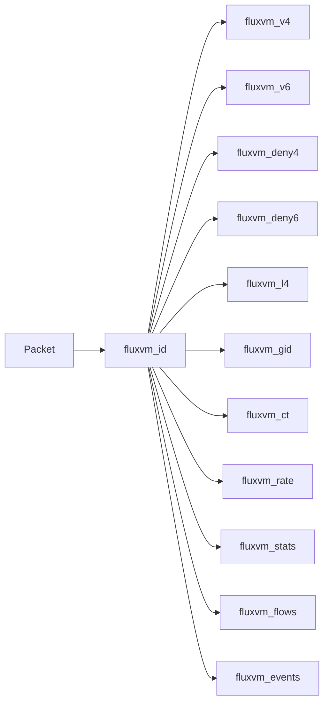

# FluxVM TC classifier / XDP objects

Network Fabric **v4** BPF sources for the optional `ebpf` / `cilium` sandbox
dataplane (v3 maps plus CT learn/hit, audit-mode bit on `sample_rate`,
`fluxvm_gid` group-identity writes).

| File | Role |
|------|------|
| `fluxvm_tc.bpf.c` | VM-edge TC classifier: IPv4/IPv6 L3 + L4 allow/deny, group identities, CT learn/hit, audit forward, ICMP, Mbps/PPS, stats, flows, events |
| `fluxvm_xdp.bpf.c` | Optional node-ingress XDP IPv4/IPv6 source-CIDR blocklist (disabled by default; refused in `cilium` mode) |
| `fluxvm_service.bpf.c` | Service Fabric v3 TC: Maglev VIP, NAT/DSR, SNAT, forward affinity (`fct*`) |
| `fluxvm_service_xdp.bpf.c` | Optional north-south XDP service acceleration (reuses TC service pinmaps) |

Service Fabric operator docs: [docs/service-fabric.md](../docs/service-fabric.md).

## Map layout (TC)



Build:

```bash
./scripts/build-ebpf.sh
# outputs: dist/bpf/fluxvm_tc.bpf.o  dist/bpf/fluxvm_xdp.bpf.o
```

Validate (syntax + optional build/tests/smoke):

```bash
../scripts/validate-network-fabric.sh
FLUXVM_PRIVILEGED_SMOKE=1 ../scripts/validate-network-fabric.sh
```

Docs: [docs/network-fabric.md](../docs/network-fabric.md),
[docs/service-fabric.md](../docs/service-fabric.md),
[docs/ebpf-cilium.md](../docs/ebpf-cilium.md),
[docs/network-policy.md](../docs/network-policy.md),
[docs/network-groups.md](../docs/network-groups.md),
[docs/production-dataplane.md](../docs/production-dataplane.md),
[README architecture](../README.md#network-fabric-architecture-how-it-works).
