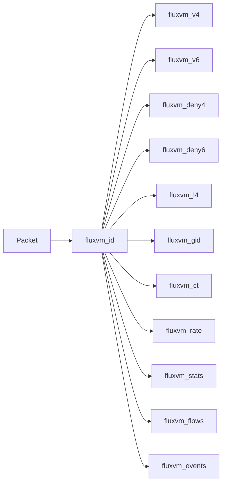

# FluxVM TC classifier / XDP objects

Network Fabric **v5** BPF sources for the optional `ebpf` / `cilium` sandbox
dataplane (v3 maps plus CT learn/hit, audit-mode bit on `sample_rate`,
`fluxvm_gid` group-identity writes; v5 adds Secure Containers Pod-scoped
policy, see below).

| File | Role |
|------|------|
| `fluxvm_tc.bpf.c` | VM-edge TC classifier: IPv4/IPv6 L3 + L4 allow/deny, group identities, CT learn/hit, audit forward, ICMP, Mbps/PPS, stats, flows, events, Pod-scoped policy (Set 6S) |
| `fluxvm_pod_policy.bpf.h` | Sentinel Set 6S: `fluxvm_pspol`/`fluxvm_pid4`/`fluxvm_pid6`/`fluxvm_ppstat` -- identity-aware Pod network policy, independent of Service Fabric's VIP policy maps below despite the similar shape |
| `fluxvm_xdp.bpf.c` | Optional node-ingress XDP IPv4/IPv6 source-CIDR blocklist (disabled by default; refused in `cilium` mode) |
| `fluxvm_service.bpf.c` | Service Fabric TC (BPF schema 4 / gen 8): Maglev VIP, NAT/DSR, SNAT, affinity, EDT, flows, identity/L7 policy, HA queue |
| `fluxvm_service_xdp.bpf.c` | Optional north-south XDP service acceleration (reuses TC service pinmaps) |
| `fluxvm_service_connect.bpf.c` | Opt-in cgroup/connect{4,6} VIP rewrite (shares host maps; affinity+Maglev; fail-open to TC/XDP) |
| `fluxvm_service_maps.bpf.h` | Compile-time map tier capacities (`-DFLUXVM_MAP_TIER=S\|M\|L`) |

Service Fabric operator docs: [docs/service-fabric.md](../docs/service-fabric.md).

## Map layout (TC)



Build:

```bash
./scripts/build-ebpf.sh
# outputs: dist/bpf/fluxvm_tc.bpf.o  dist/bpf/fluxvm_xdp.bpf.o
#          dist/bpf/fluxvm_service.bpf.o (+ _tier_{S,M,L} and xdp/connect variants)
```

Validate (syntax + optional build/tests/smoke):

```bash
../scripts/validate-network-fabric.sh
FLUXVM_PRIVILEGED_SMOKE=1 ../scripts/validate-network-fabric.sh
```

Docs: [docs/network-fabric.md](../docs/network-fabric.md),
[docs/service-fabric.md](../docs/service-fabric.md),
[docs/ebpf-cilium.md](../docs/ebpf-cilium.md),
[docs/network-policy.md](../docs/network-policy.md),
[docs/network-groups.md](../docs/network-groups.md),
[docs/production-dataplane.md](../docs/production-dataplane.md),
[README architecture](../README.md#network-fabric-architecture-how-it-works).
