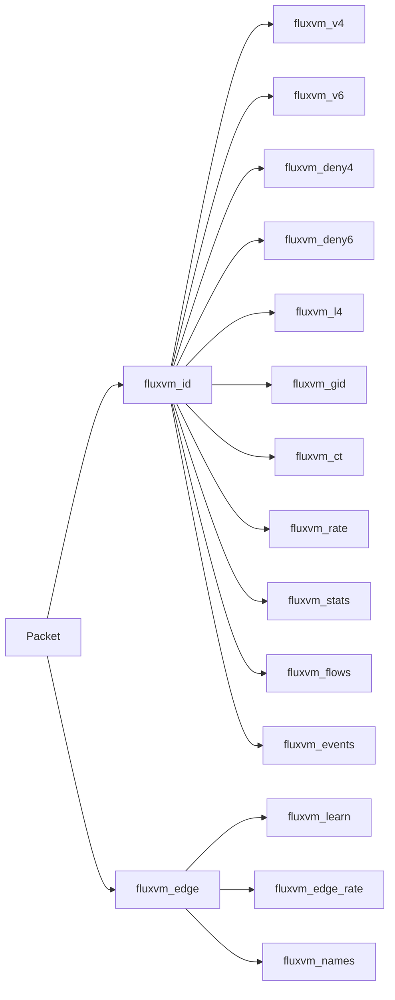

# FluxVM TC classifier / XDP objects

Network Fabric **v5** BPF sources for the optional `ebpf` / `cilium` sandbox
dataplane (v3 maps plus CT learn/hit, audit-mode bit on `sample_rate`,
`fluxvm_gid` group-identity writes; v5 adds Secure Containers Pod-scoped
policy, see below).

| File | Role |
|------|------|
| `fluxvm_tc.bpf.c` | VM-edge TC classifier: IPv4/IPv6 L3 + L4 allow/deny, group identities, CT learn/hit, audit forward, ICMP, Mbps/PPS, stats, flows, events, Pod-scoped policy (Set 6S), Kairon VM edge (schema 12: anti-spoof, learn-IP, DNS/SNI allow lists, egress token bucket) |
| `fluxvm_pod_policy.bpf.h` | Sentinel Set 6S: `fluxvm_pspol`/`fluxvm_pid4`/`fluxvm_pid6`/`fluxvm_ppstat` -- identity-aware Pod network policy, independent of Service Fabric's VIP policy maps below despite the similar shape |
| `fluxvm_qemu_device.bpf.c` | Sentinel Set 7S: per-VM `BPF_CGROUP_DEVICE` allowlist (kvm/vhost-vsock/net-tun/VFIO) attached to `fluxvm.slice/{id}.scope` |
| `fluxvm_qemu_egress.bpf.c` | Sentinel Set 7S: per-VM `cgroup_skb/egress` loopback-only outbound-IP filter, same cgroup as above |
| `fluxvm_guest_cgroup.bpf.c` | Sentinel Set 8S: in-guest per-container `cgroup_skb` ingress+egress network policy, compiled into `fluxvm-container-agent` and loaded with `aya` instead of bpftool -- see `scripts/build-ebpf-guest.sh` and `crates/fluxvm-container-agent/build.rs` |
| `fluxvm_xdp.bpf.c` | Optional node-ingress XDP IPv4/IPv6 source-CIDR blocklist (disabled by default; refused in `cilium` mode) |
| `fluxvm_service.bpf.c` | Service Fabric TC (BPF schema 4 / gen 8): Maglev VIP, NAT/DSR, SNAT, affinity, EDT, flows, identity/L7 policy, HA queue |
| `fluxvm_service_xdp.bpf.c` | Optional north-south XDP service acceleration (reuses TC service pinmaps) |
| `fluxvm_service_connect.bpf.c` | Opt-in cgroup/connect{4,6} VIP rewrite (shares host maps; affinity+Maglev; fail-open to TC/XDP) |
| `fluxvm_service_maps.bpf.h` | Compile-time map tier capacities (`-DFLUXVM_MAP_TIER=S\|M\|L`) |

Service Fabric operator docs: [docs/service-fabric.md](../docs/service-fabric.md).

## Map layout (TC)


```mermaid
flowchart LR
  Pkt[Packet] --> Id[fluxvm_id]
  Id --> V4[fluxvm_v4]
  Id --> V6[fluxvm_v6]
  Id --> Deny4[fluxvm_deny4]
  Id --> Deny6[fluxvm_deny6]
  Id --> L4[fluxvm_l4]
  Id --> Gid[fluxvm_gid]
  Id --> Ct[fluxvm_ct]
  Id --> Rate[fluxvm_rate]
  Id --> Stats[fluxvm_stats]
  Id --> Flows[fluxvm_flows]
  Id --> Ev[fluxvm_events]
  Pkt --> Edge[fluxvm_edge]
  Edge --> Learn[fluxvm_learn]
  Edge --> ERate[fluxvm_edge_rate]
  Edge --> Names[fluxvm_names]
```

The Kairon VM-edge maps (schema 12) are keyed by ifindex and checked
before the policy maps: `fluxvm_edge` holds the anti-spoof config,
flags and egress limits, `fluxvm_learn` the address learned from ARP or
IPv6 neighbor advertisements, `fluxvm_edge_rate` the token bucket, and
`fluxvm_names` the DNS and SNI allow lists as reversed FNV-1a hashes.
Layouts are in [docs/vm-edge-contract.md](../docs/vm-edge-contract.md#bpf-abi-dataplane-schema-12).
Verdict test: `sudo FLUXVM_BPF_DIR=dist/bpf python3 scripts/test-vm-edge-verdict.py`.

Build:

```bash
./scripts/build-ebpf.sh
# outputs: dist/bpf/fluxvm_tc.bpf.o  dist/bpf/fluxvm_xdp.bpf.o
#          dist/bpf/fluxvm_service.bpf.o (+ _tier_{S,M,L} and xdp/connect variants)
```

Validate (syntax + optional build/tests/smoke):

```bash
../scripts/validate-network-fabric.sh
FLUXVM_PRIVILEGED_SMOKE=1 ../scripts/validate-network-fabric.sh
```

Docs: [docs/network-fabric.md](../docs/network-fabric.md),
[docs/service-fabric.md](../docs/service-fabric.md),
[docs/ebpf-cilium.md](../docs/ebpf-cilium.md),
[docs/network-policy.md](../docs/network-policy.md),
[docs/network-groups.md](../docs/network-groups.md),
[docs/production-dataplane.md](../docs/production-dataplane.md),
[docs/network-fabric.md diagrams](../docs/network-fabric.md#packet-decision-and-control-plane-diagrams).
