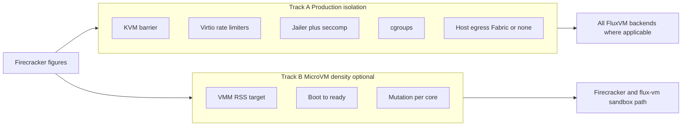

# Firecracker design figures → FluxVM (general control plane)

FluxVM is a **host-local VM control plane** ([POSITIONING.md](POSITIONING.md)), not a
disposable-only product. Firecracker’s design figures still matter — but as
**layered isolation and optional density targets**, not as the product category.

Sources: [design.md](https://github.com/firecracker-microvm/firecracker/blob/main/docs/design.md),
[SPECIFICATION.md](https://github.com/firecracker-microvm/firecracker/blob/main/SPECIFICATION.md),
[prod-host-setup.md](https://github.com/firecracker-microvm/firecracker/blob/main/docs/prod-host-setup.md).

## Two adoption tracks



| Track | Who cares | Adopt? |
|---|---|---|
| **A — Production isolation** | Every production host (long-lived or short-lived guests) | **Yes — default hardening** |
| **B — MicroVM density** | Sandbox / dense Firecracker packing / optional disposable use | **Yes — measure & publish; not product identity** |

Disposable / TTL workloads are a **use pattern** on top of Track A (+ Track B when dense).
Longer-lived guests use the same Track A barriers without claiming FC mutation rates.

---

## Track A — Production isolation (adopt for general CP)

Maps Firecracker’s host-integration and threat-containment figures onto FluxVM:

| Layer | Firecracker | FluxVM |
|---|---|---|
| KVM | Hardware virtualization boundary | All backends |
| Virtio I/O rate limiters | Token bucket at net/blk | Create fields `net_mbit_limit` / `net_pps_limit` / `blk_mbit_limit` / `blk_ops_limit` → Firecracker JSON **and** FluxVm/`fluxvm-hypervisor` boot config |
| Jailer + seccomp | Production-only jailer; auto seccomp | `[jailer] enabled` + `enforce`; stock FC seccomp; in-tree `seccomp.rs` for `fluxvm_engine=kvm` |
| Host egress filter | Required outside VMM | Network Fabric GA **or** `network.mode=none` |
| Cgroups | Per-microVM quota/cpuset | `fluxvm-cgroup` on every VM |
| Serial / logs | Disable 8250 in prod; bound stdout | Jailed FC default boot args; journald/logrotate checklist |

**Config profile:** [configs/production-hardening.toml](../configs/production-hardening.toml)
(merge with your listen/auth/dataplane settings). Checklist: [PRODUCTION.md](PRODUCTION.md).

---

## Track B — MicroVM density (optional; Firecracker SoT)

Lab measurement targets only — **not** FluxVM SLAs and **not** the product pitch.
Engine SoT: Firecracker (`fluxvm_engine` unset / `firecracker`). In-tree KVM is lab
comparison ([kvm-density.md](kvm-density.md)).

| Figure | Firecracker SPEC / design | FluxVM measurement |
|---|---|---|
| VMM RSS overhead | ≤ 5 MiB (1 vCPU / 128 MiB) | `bench-sandbox.sh` + `REPORT_RSS=1` |
| Boot to guest ready | ≤ 125 ms InstanceStart → init | `boot_to_ready_ms` (includes control plane) |
| Mutation rate | 5 microVMs / host-core / sec | `bench-density.sh` → `mutation_per_core_sec` |
| CPU oversubscription | Operator-controlled | cgroup v2 + warm pools + `[policy] default_cpu_quota_percent` / `memory_max_equals_guest` — [oversubscription.md](oversubscription.md) |
| IO Gbps / GiB/s | FC SPEC | **Not claimed** |

```bash
BENCH_N=5 REPORT_RSS=1 MEMORY_MIB=128 IMAGE=… KERNEL=… ./scripts/bench-sandbox.sh
BENCH_N=8 DENSITY_MEMORY_MIB=128 ./scripts/bench-density.sh
```

---

## Adopt / skip / next (post-repositioning)

| Item | Decision |
|---|---|
| Threat-containment layers (Track A) | **Adopted** — jailer enforce, rate limiters, egress checklist, serial-off when jailed |
| Rate limiters on plain FC + FluxVm hypervisor path | **Adopted** — request fields on both |
| Density figures (Track B) | **Adopted as optional benches** — do not lead marketing with them |
| MMDS | **Skip** — vsock guest-agent + seed/cloud-init |
| CPU templates | **Adopted (static)** — `cpu_template` on Firecracker + FluxVm firecracker-engine; rejected elsewhere |
| FC Gbps claims | **Defer** — need pinned emulation cores |
| Plain Firecracker + FluxVm `/v1/vms` snapshots | **Adopted** — FC `/snapshot/*`; FluxVm control SnapshotSave/Restore; CH/QEMU unchanged |
| Explicit oversubscription knobs | **Adopted** — policy defaults + [oversubscription.md](oversubscription.md) |
| Replace QEMU Secure Containers with FC device model | **Skip** — SC stays QEMU SoT |

Ranked follow-ups historically FC1–FC3 (now done): [NEXT-FEATURES.md](NEXT-FEATURES.md).

---

## Messaging (aligned with POSITIONING)

**Say:** “FluxVM adopts Firecracker’s isolation layering for production hosts; density figures are optional for the microVM/sandbox path.”

**Avoid:** Framing FluxVM as disposable-only because FC is serverless-oriented; citing unpublished Track B numbers as product guarantees.
