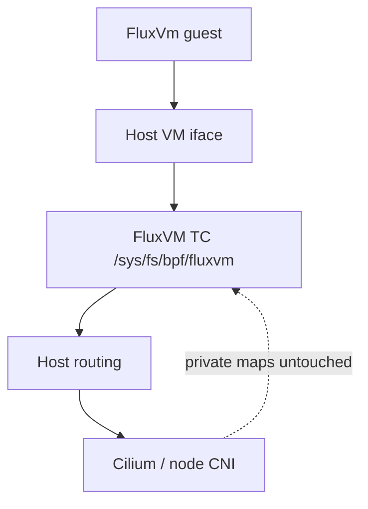

# FluxVM eBPF dataplane and Cilium coexistence

FluxVM ships a real TC/eBPF VM-edge dataplane (**Network Fabric v3**) while
keeping the existing nftables path as the **backwards-compatible default**.

Operator reference with full safety properties:
[network-fabric.md](network-fabric.md).
README diagrams:
[Network Fabric architecture](../README.md#network-fabric-architecture-how-it-works).

## Modes

| Mode | Behavior |
|------|----------|
| `legacy` (default) | Existing per-sandbox nftables SNAT + optional destination allowlist (CIDR + ports). Stats/flows API unavailable. |
| `ebpf` | Load FluxVM’s TC classifier (`bpf/fluxvm_tc.bpf.c`), pin programs/maps under `pin_root`, attach to the host-visible VM interface. |
| `cilium` | Same FluxVM VM-edge eBPF path, but only after verifying the Cilium agent socket and bpffs are visible. **Never** writes Cilium private BPF maps. |

Default remains `sandbox.dataplane.mode = "legacy"`. Existing configs that omit
`[sandbox.dataplane]` keep using nftables.

Dataplane attach / teardown / reconfigure / reconcile runs for **all** backends
(QEMU, Cloud Hypervisor, Firecracker, FluxVm) when a host-visible interface
exists. No host-visible iface (`network.mode=none` / user NAT) always
**soft-skips**, even when `required = true`. With an edge present,
`required = true` fail-closes on attach error (GA). IPv6 CIDRs and Mbps/PPS
limits are native-only and refuse silent nftables downgrade.

GA enable: `sudo ./scripts/enable-network-fabric-ga.sh --restart` or
`configs/network-fabric-ga.toml`.

## How coexistence fits



## What the eBPF path provides

- Actual TC classifier source: [`bpf/fluxvm_tc.bpf.c`](../bpf/fluxvm_tc.bpf.c)
- Optional XDP guard: [`bpf/fluxvm_xdp.bpf.c`](../bpf/fluxvm_xdp.bpf.c)
- Per-VM pins under `/sys/fs/bpf/fluxvm/vms/<uuid-simple>/` (`progs/`, `maps/`)
- Detach metadata under `/run/fluxvm/ebpf/vms/<uuid-simple>/`
  (`iface`, `prog_id`, `schema_version`, `policy_fingerprint`) — bpffs cannot
  store regular files
- XDP ownership markers under `/run/fluxvm/xdp/` when XDP is enabled (disabled /
  refused in `cilium` mode)
- Host ifindex → stable FluxVM VM identity map
- IPv4 **and IPv6** destination-CIDR (LPM) and TCP/UDP destination-port allowlists
- Optional Mbps/PPS fixed-window egress limits (`max_egress_mbps` /
  `max_egress_pps`; native-only)
- Per-CPU allow/drop counters, family-aware LRU flow table, drop/sampled-allow
  ring buffer
- Live fail-closed policy reconfigure (Running + Paused); schema/fingerprint
  heal on reconcile; orphan pin GC
- `GET /v1/vms/{id}/network/status`
- ARP/DHCP and IPv6 NDP/DHCPv6 always allowed so guests can bootstrap
- Attach without a known guest IP on direct TAP/macvtap (nftables still needs CIDR)
- Maps configured **before** TC attach (no initial allow window)
- Attach point:
  - namespaced TAP → host-side veth `vh<short-id>`
  - direct TAP/macvtap → that host-visible device
- Teardown on VM network cleanup only when program ID still matches FluxVM’s
- Container image builds/installs both `.o` files; DaemonSet mounts host bpffs
  and read-only `/var/run/cilium`; unit/container raise memlock
  (`LimitMEMLOCK=infinity` / `SYS_RESOURCE`)

## Why Cilium coexistence (not private-map integration)

FluxVM VM interfaces are **not** first-class Cilium endpoints today. Writing
Cilium’s internal maps would couple FluxVM to Cilium implementation details and
release-specific map layouts.

Ownership boundary:

1. **Cilium** owns Kubernetes/node CNI and its host datapath.
2. **FluxVM** owns the VM TAP/veth edge (pins under `/sys/fs/bpf/fluxvm` only).
3. Both may use bpffs; pin namespaces stay separate.
4. A later launcher-pod/CNI change can make each VM a native Cilium identity
   (Hubble-aware) without replacing the native FluxVM dataplane API.

## Traffic path

Namespaced VM:

```text
VM -> TAP -> bridge -> namespace veth -> host veth [FluxVM TC/eBPF]
  -> host routing -> Cilium/node dataplane
```

Non-namespaced TAP/macvtap: the classifier attaches directly to the host-visible
device.

## Build the BPF objects

Debian/Ubuntu:

```bash
sudo apt-get install clang llvm libbpf-dev linux-tools-common \
  "linux-tools-$(uname -r)" iproute2 nftables
./scripts/build-ebpf.sh
sudo install -D -m 0644 dist/bpf/fluxvm_tc.bpf.o \
  /usr/lib/fluxvm/bpf/fluxvm_tc.bpf.o
sudo install -D -m 0644 dist/bpf/fluxvm_xdp.bpf.o \
  /usr/lib/fluxvm/bpf/fluxvm_xdp.bpf.o
```

(`bpftool` often ships as `linux-tools-*` rather than a package named `bpftool`.)

The Dockerfile builder stage runs `./scripts/build-ebpf.sh` and installs both
objects under `/usr/lib/fluxvm/bpf/`. Runtime image includes `nftables` and
`bpftool`. systemd’s `ReadWritePaths` includes `/sys/fs/bpf` and `/run/fluxvm`;
`LimitMEMLOCK=infinity` is required for map load under `ProtectSystem=strict`.

## Configuration

```toml
# GA profile (see configs/network-fabric-ga.toml)
[sandbox.dataplane]
mode = "ebpf"                 # legacy | ebpf | cilium
bpf_object = "/usr/lib/fluxvm/bpf/fluxvm_tc.bpf.o"
pin_root = "/sys/fs/bpf/fluxvm"
required = true               # fail-closed when a host VM edge exists
default_allow = false
allow_cidrs = ["10.0.0.0/8", "172.16.0.0/12", "192.168.0.0/16"]
allow_ports = ["tcp/443", "tcp/80", "udp/53"]
max_egress_mbps = 250         # native only
max_egress_pps = 100000
sample_rate = 100             # 0 = off; N ≈ 1/N allowed-flow samples

# Optional node-ingress XDP blocklist (not with mode = "cilium")
# [sandbox.dataplane.xdp]
# enabled = true
# interface = "eno1"
# bpf_object = "/usr/lib/fluxvm/bpf/fluxvm_xdp.bpf.o"
# required = true
# block_cidrs = ["198.51.100.0/24", "2001:db8:bad::/48"]
```

Also merge allowlists from `sandbox.egress_allow_domains` (resolved to CIDRs) and
any CIDRs passed at apply time.

Kubernetes node with Cilium present:

```toml
[sandbox.dataplane]
mode = "cilium"
bpf_object = "/usr/lib/fluxvm/bpf/fluxvm_tc.bpf.o"
pin_root = "/sys/fs/bpf/fluxvm"
required = true
default_allow = true
```

The DaemonSet mounts host `/sys/fs/bpf` and read-only `/var/run/cilium` so FluxVM
can pin programs and see `cilium.sock` for coexistence checks. See
[`deploy/k8s/daemonset.yaml`](../deploy/k8s/daemonset.yaml).

## Policy semantics

- IPv4/IPv6 destination-CIDR egress policy (LPM) and optional L4 destination ports.
- When both CIDR and port lists are non-empty, **both** must match.
- ARP, DHCP, NDP, and DHCPv6 always allowed for bootstrap.
- IPv6 extension headers fail closed under L4 policy in v3.

Per-VM maps (pinned under each VM’s `maps/` directory):

| Map | Role |
|-----|------|
| `fluxvm_id` | ifindex → FluxVM identity + policy/rate flags |
| `fluxvm_v4` | LPM: identity + destination IPv4 prefix → allow |
| `fluxvm_v6` | LPM: identity + destination IPv6 prefix → allow |
| `fluxvm_l4` | identity + proto/port → allow |
| `fluxvm_rate` | identity → fixed-window Mbps/PPS state |
| `fluxvm_stats` | per-CPU allow/drop counters |
| `fluxvm_flows` | LRU flow table (`family` 4/6) |
| `fluxvm_events` | ring buffer for drop / sampled-allow events |
| `fluxvm_gid` | ifindex → up to eight shared group identities |
| `fluxvm_ct` | LRU established 5-tuple table |
| `fluxvm_deny4` / `fluxvm_deny6` | LPM destination deny lists |

REST (see [network-fabric.md](network-fabric.md)):

```http
GET  /v1/vms/{id}/network/policy
POST /v1/vms/{id}/network/policy   # admin role when auth is enabled
GET  /v1/vms/{id}/network/status
GET  /v1/vms/{id}/network/stats
GET  /v1/vms/{id}/network/flows?limit=100
```

## Validation

```bash
./scripts/validate-network-fabric.sh
FLUXVM_PRIVILEGED_SMOKE=1 ./scripts/validate-network-fabric.sh
sudo -E ./scripts/test-network-fabric.sh
sudo -E ./scripts/test-security-groups-e2e.sh   # groups + deny/ICMP maps
```

Security-group control plane: [network-groups.md](network-groups.md).

Privileged integration smoke (FluxVm + `NetworkSpec::Tap { netns: true }`):

1. Set `[sandbox.dataplane] mode = "ebpf"` (and install the `.o` files).
2. Create a FluxVm sandbox with netns networking.
3. Confirm `tc filter show dev vh<short-id> ingress` shows `fluxvm_egress`.
4. Inspect pins under `/sys/fs/bpf/fluxvm/vms/<uuid-simple>/` and meta under
   `/run/fluxvm/ebpf/vms/<uuid-simple>/`.
5. Exercise `GET …/network/status` (`schema_version=3`, `policy_synced`).
6. Delete the VM; pins, meta, and the TC filter should be gone.
7. With `required = false` and a missing `.o`, create should warn and fall back
   to nftables when fallback is safe.

Netns NAT tables (`fluxvm_netns_*`) remain independent of sandbox dataplane mode
and continue to use nftables helpers (`apply_subnet_masquerade`).
