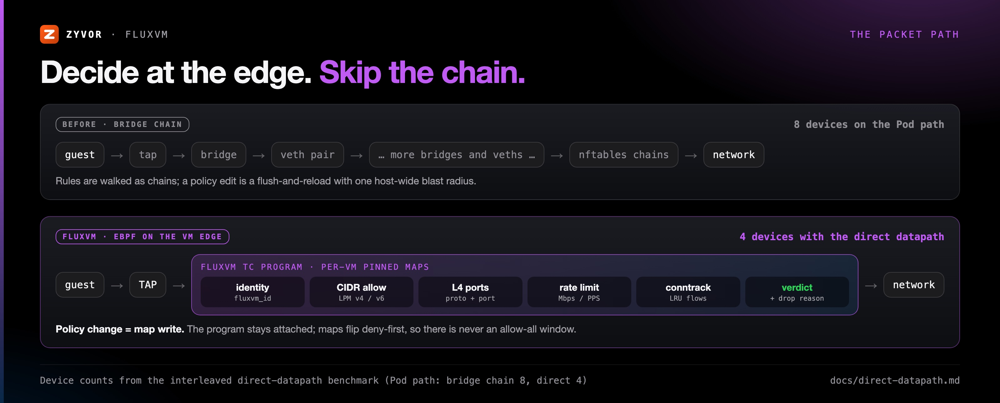
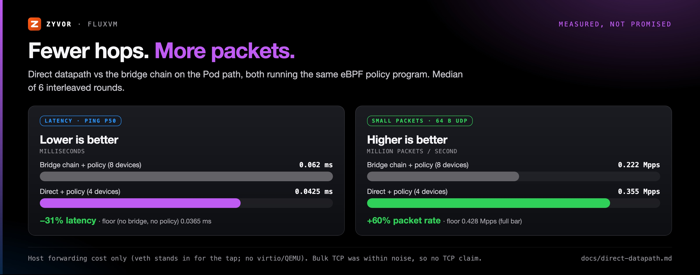
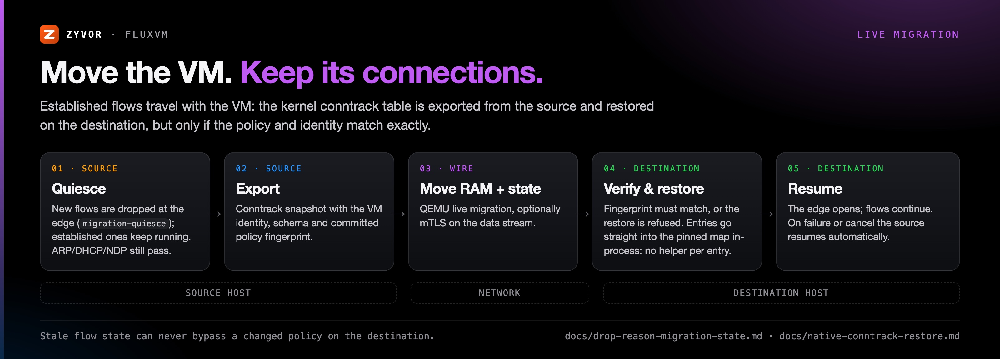

# eBPF: the VM network, rewritten inside the kernel


Most virtualization stacks still move VM traffic the way Linux did in 2005: through bridges, veth pairs
and long iptables or nftables chains that are rebuilt whenever a rule changes. FluxVM doesn't.

Every VM gets a small, **kernel-verified eBPF program** on its own network interface. That program reads
per-VM maps that hold the VM's identity, allowed networks, ports, rate limits and flow state, and it
decides every packet before the packet reaches the rest of the host. Changing policy means updating a
map. Nothing is reloaded, nothing detaches, and the edge never fails open.

**This is the default.** Since FluxVM 0.4 a host whose config doesn't say otherwise runs the native
eBPF dataplane in strict mode (`mode = "ebpf"`, `required = true`). nftables remains available only as an
explicit compatibility mode. See [primary-ebpf.md](primary-ebpf.md) for upgrade steps.

## Why this matters

| You want to... | The old way | With FluxVM eBPF |
|---|---|---|
| Spin up hundreds of VMs | Per-VM chains pile up, and each edit gets slower and riskier | Attach once. A policy change is a map write that costs the same for the first VM and the hundredth |
| Stop a misbehaving VM or agent now | Rebuild the firewall and hope nothing slipped through during the reload | Live deny or rate limit while the program stays attached |
| Prove what a VM talked to | grep logs, conntrack and tcpdump | Per-VM stats, flows and **attributed drop reasons** over REST |
| Move a VM without dropping its connections | Established TCP sessions break on cutover | Conntrack moves with the VM and is checked against the destination policy |
| Run next to Kubernetes networking | Two owners fighting over iptables | Coexists with Cilium: FluxVM owns the VM edge and never writes Cilium's maps |

## The packet path



A packet leaving the guest hits FluxVM's TC program on the VM's TAP (or its netns veth). In order, the
program:

1. **Looks up the VM's identity** (`fluxvm_id`). Bootstrap traffic (ARP, DHCP, NDP, DHCPv6) always passes.
2. **Checks the CIDR allowlist** with longest-prefix-match maps, one for IPv4 and one for IPv6.
3. **Checks L4 rules** (protocol and port).
4. **Enforces rate limits** in Mbps and packets per second.
5. **Tracks the flow** in an LRU conntrack map.
6. **Returns a verdict.** A drop is counted and attributed to a reason (`spoof_ip`, `rate_limit`,
   `dns_deny`, `migration-quiesce` and so on) so you can see why.

With the **direct datapath**, the program also redirects frames straight between the outer device and the
guest's TAP, which cuts the Pod path from 8 devices to 4. Cilium keeps every hook it has on its side.
See [direct-datapath.md](direct-datapath.md).

## What's in the program

- **Dual-stack L3/L4 policy.** IPv4 and IPv6 CIDR allowlists plus protocol/port rules in one program.
- **Security groups and Cloud Network Policy.** Shared groups and CNP objects compile down to the same
  per-VM maps ([network-groups.md](network-groups.md), [network-policy.md](network-policy.md)).
- **Rate limits.** `max_egress_mbps` and `max_egress_pps` as first-class map entries, with no separate
  tc/htb plumbing.
- **The VM edge** (used by Kairon). Anti-spoof for source IP and MAC, guest-IP learning from ARP, ND and
  DHCP, DNS and TLS SNI allowlists, a token-bucket egress limit and host-side ingress limits
  ([vm-edge-contract.md](vm-edge-contract.md)).
- **Optional XDP** source blocklists on the uplink, dropping before the kernel builds an skb.
- **Observability without a capture tax.** `GET /v1/vms/{id}/network/stats`, `/flows`, `/drops`,
  `/learned-ip`, Hubble-style flow views ([hubble-lite.md](hubble-lite.md)) and, when you do need packets,
  a bounded 1-30 s `tcpdump` capture you can download as a pcap.
- **Cilium coexistence.** `mode = "cilium"` checks that the Cilium agent is present and then attaches only
  FluxVM's own pinned programs under `/sys/fs/bpf/fluxvm` ([ebpf-cilium.md](ebpf-cilium.md)).

## Measured, not promised



| What | Result | Conditions |
|---|---|---|
| Direct datapath vs bridge chain, Pod path | **-31% latency, +60% 64-byte packet rate** | Same policy program on both. Median of 6 interleaved rounds. Host forwarding only (a veth stands in for the TAP, no virtio or QEMU). Bulk TCP was within noise, so no TCP claim ([evidence](benchmarks/evidence/direct-datapath-interleaved-20260919T191854Z.txt)) |
| Live policy change | **About 100-120 ms p50** end to end | `POST /v1/vms/{id}/network/policy` on attached VMs, n=45. Control-plane round trip (HTTP plus map rewrite), not NIC throughput ([network-fabric.md](network-fabric.md)) |
| Conntrack restore | **One map open, then direct kernel updates** | Previously one helper process per entry: 10,000 for a 10,000-entry table ([native-conntrack-restore.md](native-conntrack-restore.md)) |
| Verifier headroom | **`fluxvm_tc` about 17%** of the 1,000,000-instruction limit | Linux 7.0. `scripts/test-verifier-budget.sh` fails CI above 50%, so a kernel or compiler regression shows up early |

A real guest sees a smaller share of the forwarding gain once virtio and the VMM are included. To measure
your own hardware, run `BENCH_INTERLEAVE=1 ./scripts/bench-direct-datapath.sh` on a quiet host, or set
`BENCH_TARGET_IP` to measure a real guest.

## Live migration that keeps connections



When a VM with an attached dataplane migrates:

1. **Quiesce (source).** New flows are dropped at the edge with reason `migration-quiesce`. Bootstrap
   traffic still passes.
2. **Export (source).** The conntrack snapshot carries the VM's identity, the dataplane schema and the
   committed policy fingerprint. Export refuses an uncommitted policy generation.
3. **Move RAM and device state** with QEMU live migration.
4. **Verify and restore (destination).** The fingerprint, identity and schema must match exactly, or the
   restore is refused, so stale flow state can never slip past a changed policy. Entries are written
   straight into the pinned map.
5. **Resume.** If the migration fails or is cancelled, the source resumes automatically.

Details: [drop-reason-migration-state.md](drop-reason-migration-state.md).

## Safety by construction

- **The kernel verifies the program** before it runs. A program that could loop forever or read out of
  bounds never loads.
- **Changes fail closed.** A reconfigure denies everything first, swaps the maps, then publishes the new
  config. The only window is a brief over-deny, never an allow-all.
- **Strict attachment by default.** If the program can't attach to a VM's edge, the create or start fails
  with a readiness hint instead of silently running unprotected.
- **Ownership is explicit.** FluxVM pins only under `/sys/fs/bpf/fluxvm`, detaches only programs whose IDs
  it recorded, and never touches Cilium's private maps.
- **Reconcile and repair.** A reconcile loop checks schema and policy sync on every attached VM, reloads
  what drifted and removes pins left by deleted VMs.

## Turn it on

On a fresh host the default already selects eBPF. Confirm the host is ready:

```bash
./scripts/network-fabric-preflight.sh --require-bpf   # kernel, bpffs, loader tools, BPF permissions
curl -sf http://127.0.0.1:7788/readyz
fluxvm dataplane health                              # must report "ok": true
```

To also adopt the **deny-by-default** production policy (the new default keeps `default_allow = true`):

```bash
sudo ./scripts/enable-network-fabric-ga.sh --dry-run   # review the allowlist it will merge
sudo ./scripts/enable-network-fabric-ga.sh --restart
```

Then set policy per VM:

```bash
curl -X POST -H "Authorization: Bearer $TOKEN" http://127.0.0.1:7788/v1/vms/$ID/network/policy \
  -d '{"default_allow": false, "allow_cidrs": ["10.0.0.0/8"], "allow_ports": ["tcp/443"], "max_egress_mbps": 200}'
curl -H "Authorization: Bearer $TOKEN" http://127.0.0.1:7788/v1/vms/$ID/network/drops?limit=20
```

Hosts that can't load BPF set `mode = "legacy"` under `[sandbox.dataplane]`. Upgrading an existing host:
[operations.md](operations.md#upgrading-a-host-to-the-ebpf-default-release).

## Honest limits

- eBPF owns the **VM edge**. Host routing, namespace setup, some NAT rules, the virtio transport and the
  node CNI stay where they are.
- The host needs a kernel with TC eBPF support, bpffs mounted at `/sys/fs/bpf`, and BPF permissions for the service
  (`CAP_BPF`/`CAP_SYS_ADMIN`, enough `LimitMEMLOCK`). TCX attach needs Linux 6.6+; older kernels use
  clsact.
- The direct datapath needs Linux 5.10+ and a veth primary interface; Multus secondaries and netkit Pods
  use the bridge chain.
- Published numbers are host-forwarding and control-plane measurements. We make no raw guest throughput
  claim; measure on your hardware.

## FAQ

**Do I need Cilium?** No. `mode = "ebpf"` works on any modern Linux host. `mode = "cilium"` is for nodes
that already run Cilium.

**Will it fight my CNI?** No. FluxVM attaches only to VM interfaces and its own pins, and refuses XDP in
Cilium mode.

**What happens if the BPF objects are missing?** With the default `required = true`, VMs with a host
network edge fail to create or start, with a message pointing at the preflight. User-mode NAT and `none`
networking are unaffected.

**Can I go back to nftables?** Yes: `mode = "legacy"`. Native-only policy features (the VM edge, pod
policy) are refused there rather than silently downgraded.

## Related

[network-fabric.md](network-fabric.md) · [primary-ebpf.md](primary-ebpf.md) ·
[direct-datapath.md](direct-datapath.md) · [ebpf-cilium.md](ebpf-cilium.md) ·
[production-dataplane.md](production-dataplane.md) · [vm-edge-contract.md](vm-edge-contract.md) ·
[hubble-lite.md](hubble-lite.md)
