# Build a Mac cloud with FluxVM

A Mac cloud is a shelf of Mac minis and Mac Studios that answers as one VM API: macOS guests for Xcode CI, Linux VMs, agent
sandboxes and container VMs, each placed on the Mac that fits. Every Mac runs FluxVM's `vz` backend on Apple's
Virtualization.framework; one fleet registry places requests across them.



*Illustration. Everything marked verified on this page ran on one Apple M4 with macOS 27.2; a fleet of several real Macs has not
been run yet (see [Limits](#limits)).*

For one Mac, start with [macos.md](macos.md). For how the backend works inside, see [macos-architecture.md](macos-architecture.md);
for the private-inference cluster with Velora and Kairon, see [macos-cluster.md](macos-cluster.md).

## Pick the Macs

| Mac | Good for | Notes |
| --- | --- | --- |
| Mac mini (M6, up to 32 GB) | Agent sandboxes, small Linux VMs, a home lab | Quiet and always on. The estimate for 16 GB is 4 to 8 active tiny sandboxes ([agent-density.md](agent-density.md)) |
| Mac mini (M5 Pro, up to 64 GB) | Container VMs, CI runners, one macOS template | 10 GbE option; room for a macOS guest next to Linux work |
| Mac Studio (M5 Max, up to 128 GB) | Team CI, many sandboxes, macOS guests | 10 GbE and Thunderbolt 5; 25 to 40 active tiny sandboxes estimated at 64 GB or more |
| Mac Studio (M5 Ultra, up to 512 GB) | macOS guests next to large models | Unified memory is shared by macOS, models and every guest |

Capacity figures are estimates, not measurements. FluxVM does not cap guest memory on a Mac, so size for the sum of macOS, your
models and every guest. Apple allows **two macOS guests running at once per Mac**: add Macs to add macOS CI lanes.

## Network

- **10 GbE** for management, the fleet registry and VM traffic between Macs.
- **Thunderbolt 5** between Mac Studios is for model traffic when one model is sharded across Macs (roadmap, not a FluxVM feature).
- Guests sit behind each Mac's NAT. Reach them through TCP `forwards` on the Mac, or put them on the LAN with the `apple.bridge_interface`
  Mac Studio option (implemented, not yet verified on hardware; see [macos.md](macos.md#mac-studio-options)).

## Run it as a service

Warm slots and snapshot restore need an unlocked login session, so on a headless Mac the daemon runs as a **LaunchAgent** of a
logged-in user, not a system LaunchDaemon ([deploy/launchd-notes.md](https://github.com/zyvorai/zyvor-fluxvm/blob/main/deploy/launchd-notes.md)):

1. Create a dedicated user (for example `fluxvm`) and turn on automatic login for it.
2. Turn off the screen lock for that user and keep the display awake (or attach a display emulator). Screen Sharing works for
   maintenance.
3. As that user:

```bash
fluxctl --config ~/.config/fluxvm/fluxvm.toml service install   # writes and loads ~/Library/LaunchAgents/dev.zyvor.fluxvm.plist
fluxctl service status                                         # loaded? PID?
```

With the Homebrew package (built from each version tag; the tap is not published yet, see
[packaging/homebrew](https://github.com/zyvorai/zyvor-fluxvm/tree/main/packaging/homebrew)), `brew services start fluxvm` installs an equivalent LaunchAgent.

Keep VM templates and VM state on the same APFS volume so clones stay instant (`cp -c`); a clone across volumes is a full copy.

## Join the fleet

One registry for the whole fleet, on any Mac or Linux host:

```bash
fluxvm-agent central --listen 0.0.0.0:7799
```

On every Mac, next to `fluxctl serve`:

```bash
fluxvm-agent node --name studio-1 \
  --central http://fleet-registry:7799 \
  --advertise-url http://studio-1.local:7788 \
  --label chip=m5-max --label memory-gib=128
```

Every 10 s the node reports free CPU and memory, its VM count, its macOS guest count and the Mac's Virtualization.framework
capabilities (`fluxvm-vz-runner host-capabilities`: macOS version, nested virtualization, vmnet, custom Virtio, bridged interfaces).

Then ask the fleet, not a Mac:

```bash
curl -X POST http://fleet-registry:7799/fleet/vms -H 'Content-Type: application/json' \
  -d '{"name": "ci-1", "backend": "vz", "image": "debian-13", "vcpus": 2, "memory_mib": 2048}'
curl http://fleet-registry:7799/fleet/vms          # every VM on every Mac, tagged with its node
```

For `backend: vz` the registry uses the Apple scorer (`fluxvm_scheduler::apple_placement`): a Mac is skipped if it lacks the free
CPU or memory, a requested feature (nested virtualization, vmnet, custom Virtio, a named bridge), or already runs two macOS guests;
among the Macs that fit, the tightest fit wins, so small VMs pack onto busy Macs and big Macs stay free for big VMs. Stacks use the
same registry: `fluxctl up --fleet http://fleet-registry:7799` ([macos-stacks.md](macos-stacks.md)).

## What to run on it

| Workload | How | Docs |
| --- | --- | --- |
| Xcode CI on macOS guests | Prepare a macOS template once (FileVault off, Remote Login on, your key installed), clone it per job with APFS, run `xcodebuild` over SSH, delete it | [macos.md](macos.md#macos-guests) |
| Agent sandboxes | `POST /v1/sandboxes` or MCP (`fluxctl mcp serve --allow-write`): TTL, offline or allow-listed egress, changesets, warm pool (about 2 s) | [macos-sandboxes.md](macos-sandboxes.md) |
| Container VMs | `fluxctl sandbox run alpine:3.22 --rm -- echo hi`: one VM per container, read-only root, uid 65534; `linux/amd64` images run under Rosetta | [oci-sandboxes.md](oci-sandboxes.md) |
| Dev environments | A `fluxvm.toml` with a database, an app and a test runner; `fluxctl up --fleet` | [macos-stacks.md](macos-stacks.md) |
| GUI automation | Screenshots, keyboard and mouse for any `vz` guest (`fluxctl screenshot`, `fluxctl input`, MCP `vm_screenshot` / `vm_input`), with Keychain-stored sign-in (`fluxctl signin`) | [macos.md](macos.md#agent-screen-and-input) |

## Things Mac users will like

- **Rosetta in Linux guests:** `apple.rosetta: true` runs x86_64 Linux binaries in arm64 guests.
- **Shared folders:** `fluxctl run -v ~/src:/mnt/src` keeps your editor on macOS while builds run in Linux (virtiofs).
- **Keychain:** guest passwords for `fluxctl signin` live in your login Keychain, never in the API.
- **Retina displays:** guest displays up to 5120 x 2880 at 220 ppi, with audio.
- **APFS clones:** disks and snapshots are copy-on-write; a throwaway VM costs almost nothing until it writes.
- **launchd:** `fluxctl service install`, `status` and `uninstall`.

## Limits

- **Verified** on one Apple M4 with macOS 27.2: Linux VMs, agent and container sandboxes, snapshots, stacks, devices
  ([macos.md](macos.md#what-is-verified)).
- **Verified on loopback only:** `vz` placement in `fluxvm-agent central`, with one real Mac and simulated nodes. No second Mac has
  been used.
- **Verified by hand only:** installing a macOS guest from an IPSW, cloning it and reaching it over SSH.
- **Not verified:** multi-Mac fleets on real hardware, Thunderbolt RDMA, the shared vmnet broker, physical USB passthrough, Intel Macs.
- Snapshot restore fails while the Mac's screen is locked.

The hardware drawings are original illustrations for this project, not Apple artwork. Mac, Mac mini, Mac Studio and macOS are
trademarks of Apple Inc.
