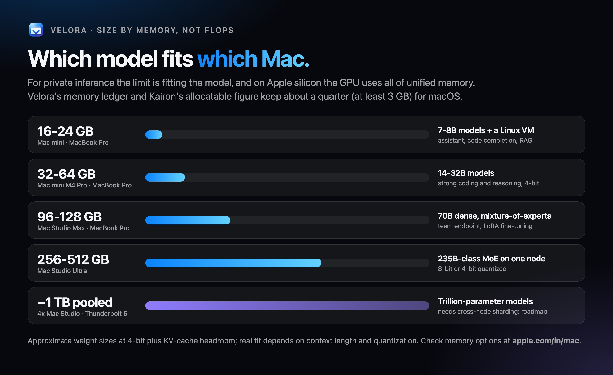

# FluxVM on Macs: Mac mini, Mac Studio, MacBook Pro and Mac clusters

FluxVM's control plane and its `vz` backend run natively on Apple silicon (see [macos.md](macos.md) for the backend itself).
This page is about where that fits: Linux VMs over a REST API on the Mac you already have, next to a private LLM endpoint
from [Velora](https://github.com/zyvorai/zyvor-velora), with [Kairon](https://github.com/zyvorai/zyvor-kairon) scheduling
across several Macs.


How the `vz` backend works inside, in detail: [macos-architecture.md](macos-architecture.md).

## Which Mac, for what

| Tier | Hardware | FluxVM's role |
| --- | --- | --- |
| Home, low cost | [Mac mini](https://www.apple.com/in/mac-mini/) | One or two Linux VMs (dev box, Home Assistant, CI) next to a private chat endpoint |
| Developer | [MacBook Pro](https://www.apple.com/in/macbook-pro/) | The same `fluxctl` and REST API you use on Linux hosts, for local VMs |
| Team | [Mac Studio](https://www.apple.com/in/mac-studio/) (M5 Max, 36 GB and up) | VMs for CI and sandboxes while most memory serves models |
| On-premise cluster | 2-4 Mac Studios | A Kairon Node per Mac; Kairon schedules `Machines`, FluxVM runs them with `backend: vz` |

Sizing a Mac Studio by use case:

| Use case | Memory | Notes |
| --- | --- | --- |
| CI and one or two Linux VMs | 36 GB and up | Comfortable with models running alongside |
| macOS guest templates | 64 GB and up | Two macOS VMs (Apple's limit), the host and models |
| Agent sandboxes | 36 GB and up | Prefer Linux guests and the `tiny` profile for density (see [agent-density.md](agent-density.md)) |

Use macOS guests when you need the real macOS userspace (Xcode, Apple frameworks, signing); keep the template on the same APFS
volume as the VMs so `cp -c` clones stay instant.

FluxVM does not enforce memory on a Mac; macOS memory pressure applies. Size VMs against what is left after the models:
plan one or two small VMs on a 16 GB Mac. Kairon's Mac Node reports allocatable memory as unified memory minus the larger of
3 GiB and a quarter, so the scheduler already keeps headroom for macOS.



## A Mac cluster for private inference


- **Each Mac:** Velora (MLX runtime, OpenAI-compatible endpoints), `fluxctl serve` (VMs with `backend: vz`) and `kairon-node`
  (registers the Mac as a Node with `kairon.zyvor.dev/backend.vz=true`). What each Mac reports for placement (memory pressure, warm slots) and how
  the built-in fleet registry uses it: [kairon-mac-scheduling.md](kairon-mac-scheduling.md).
- **Network:** 10 GbE for management and the fleet; a Thunderbolt 5 mesh for model traffic when one model is sharded across
  Macs (roadmap, see below).
- **What FluxVM adds:** real Linux VMs on the same hardware for the parts that are not models: gateways, vector databases,
  CI runners, agent sandboxes, k3s nodes.

The cluster design follows GK Servis's [Mac Studio LLM inference cluster](https://www.gkservis.com/case-studies/llm-inference-cluster.html)
(4x Mac Studio, Thunderbolt 5 RDMA, EXO + MLX, about 1 TB pooled, under 250 W). Their figures are theirs, not FluxVM measurements.


## Placing a VM on the right Mac

Macs in one cluster differ: macOS version (vmnet needs 26, custom Virtio devices 27), nested virtualization (M3 or later), which
bridged interfaces exist, and free CPU and memory. `fluxvm_scheduler::apple_placement` is a pure scorer for this. A host is described
by `AppleHostCaps`, a request is reduced from a `CreateVmRequest` by `ApplePlacementRequest::from_request`, and `pick` returns the
best host:

- A host is excluded if it lacks the free vCPUs or memory, the needed feature (nested, vmnet, custom Virtio, the named bridge
  interface), or, for a macOS guest, if it already runs two macOS guests (Apple's licence limit, `MAX_MACOS_GUESTS`).
- Among hosts that fit, the tightest fit wins, so small agent VMs pack onto busy hosts and the big Macs stay free for big VMs.

The fleet uses it. `fluxvm-agent node` sends the host's Apple capabilities (`fluxvm-vz-runner host-capabilities`) plus free CPU,
memory and its macOS guest count in every heartbeat, and `fluxvm-agent central` runs `apple_placement` for requests with `backend: vz`.
Nodes without Apple capabilities are excluded for those requests. This was checked only on loopback: one real M4 node and two fake
nodes registered by hand (see [macos.md](macos.md#what-is-verified)); there are no unit tests for the `vz` filtering in central yet,
and no second Mac has been used. A scheduler outside the registry, such as Kairon, can still call the scorer itself. Also note that
sandboxes restored from warm slots keep the address they had when the slot was built, so on one Mac a slot whose address is in use is
skipped and that sandbox cold-boots instead.

## Quick start on one Mac

```bash
xcode-select --install && brew install hivex
cargo build -p fluxctl
./scripts/macos-live-test.sh          # boots Debian 13 through the API, SSH, pause/resume, delete
fluxctl serve                         # API on 127.0.0.1:7788, state in ~/Library/Application Support/FluxVM
```


*A real capture on an Apple M4, macOS 27: a Debian 13 guest on Virtualization.framework, shown in Velora's app.*

Create a VM with `"backend": "vz"` (or `"auto"`, which resolves to `vz` on a Mac); see [macos.md](macos.md#quick-start).

## Verified and not verified

- **Verified** on an Apple M4, macOS 27.2: the core crates' unit tests, `fluxvm-apple` tests, and the live test (Debian 13: the VM
  lifecycle, forwards, shares, snapshots, `fluxctl run`, stacks and agent sandboxes; see [macos.md](macos.md)); a Kairon `vz` Machine
  scheduled to the Mac and run through FluxVM. Container sandboxes ([oci-sandboxes.md](oci-sandboxes.md)): `scripts/oci-live-test.sh` passes on the same Mac (exit codes, exec, offline
  and allow-listed network, a private network, `linux/amd64` under Rosetta, a warm-pool claim); `scripts/vz-devices-live-test.sh` passes (extra disks, USB hot-plug, console ports, display size). Published ports, volumes, health checks, stacks and `--fleet` placement are unit-tested only.
- **Verified by hand only:** a macOS 27 guest installed from an IPSW, cloned and reached over SSH ([macos.md](macos.md#macos-guests)). **Implemented, not verified on hardware:** installing macOS guests through the API (`apple.install`), first-boot keys, and snapshots of macOS guests. **Verified on loopback only:** `vz` placement in `fluxvm-agent central` (one real node plus fake nodes). **Not verified:** multi-Mac clusters on real hardware, Thunderbolt RDMA, the shared vmnet broker, physical USB passthrough, the other custom Virtio bulk operations (zero, copy, crc32), any throughput figure on this page.
- **Roadmap (not FluxVM's job, listed for the whole stack):** sharding one model across Macs (EXO or MLX distributed), a
  topology view of Thunderbolt links, per-node temperature and tok/s, and a benchmark command.

The hardware drawings are original illustrations for this project, not Apple artwork. Mac, Mac mini, Mac Studio and
MacBook Pro are trademarks of Apple Inc.
