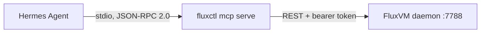

# AI agents over MCP (`fluxctl mcp serve`)

`fluxctl mcp serve` is a [Model Context Protocol](https://modelcontextprotocol.io)
server on stdin/stdout. An MCP client such as
[Hermes Agent](https://github.com/NousResearch/hermes-agent) starts it as a
subprocess and uses it to inspect, and optionally operate, the VMs of one
FluxVM daemon. It talks to the daemon over the REST API, the same way
`fluxctl --server` does; it never opens the state directory.

Kairon has a matching server, `kaironctl mcp serve`, for the cluster view of
Kairon Machines. Kairon's `docs/ai-agents.md` covers using both together:
scoped Kubernetes credentials, other MCP clients and example workflows.



The server starts when the agent starts it and exits when stdin closes. It
needs network access to the daemon only, not root or the state directory,
so it can run on a workstation against a remote host.

## Tools

Read tools are always offered:

| Tool | What it returns | API |
| --- | --- | --- |
| `list_vms` | VMs with id, name, status, backend, guest IP, vCPUs, memory, labels and error; `selector` filters by labels | `GET /v1/vms` |
| `get_vm` | One VM's full record | `GET /v1/vms/{id}` |
| `host_status` | `/readyz` (KVM, dataplane mode and BPF/Cilium health, secure containers) plus a count of VMs by status | `GET /readyz`, `GET /v1/vms` |
| `vm_network` | `kind` = `status`, `effective`, `stats`, `flows`, `drops`, `drop-reasons`, `learned-ip`, `conntrack` or `capture`; `limit` for flows and drops | `GET /v1/vms/{id}/network/{kind}` |
| `vm_logs` | The last `lines` (default 100, max 500) of the serial console log | `GET /v1/vms/{id}/logs` |
| `vm_screenshot` | The display of a running Apple VZ VM (Linux or macOS guest) as an image, scaled to `max_width` (default 1280), with a caption giving its size | `GET /v1/vms/{id}/screenshot` |

Write tools are offered only with `--allow-write`:

| Tool | Effect | API |
| --- | --- | --- |
| `vm_create` | Create a normal VM from a `CreateVmRequest` JSON object (`spec`; `backend: "vz"` with `apple.guest_os: "macos"` clones a prepared macOS template); optional `ready_exec` waits for command readiness | `POST /v1/vms[?ready=exec]` |
| `vm_clone` | Clone a stopped VM under a new name | `POST /v1/vms/{id}/clone` |
| `vm_exec` | Execute a command in a normal VM; VZ guests use the Apple SSH transport | `POST /v1/vms/{id}/agent` |
| `vm_snapshot` | Save a named snapshot | `POST /v1/vms/{id}/snapshot` |
| `vm_snapshot_restore` | Restore a named snapshot | `POST /v1/vms/{id}/restore` |
| `vm_snapshot_delete` | Delete a named snapshot | `DELETE /v1/vms/{id}/snapshots/{tag}` |
| `vm_delete` | Delete a VM | `DELETE /v1/vms/{id}` |
| `vm_input` | Keyboard and mouse input for a running Apple VZ VM's display: one `action` (`type`, `key`, `move`, `click`, `double_click`, `right_click`, `middle_click`, `down`, `up`, `drag`, `scroll`) or a list of `actions`; coordinates are `vm_screenshot` pixels with `screen_width` set to its width; `screenshot: true` returns the display afterwards | `POST /v1/vms/{id}/input` |
| `vm_sign_in` | Types the sign-in stored with `fluxctl signin set` into an Apple VZ VM's login screen (`mode`: `password`, `username`, `username_tab`; `submit`); the password never passes through the agent; `screenshot: true` returns the display afterwards | `POST /v1/vms/{id}/signin` |
| `vm_power` | `op` = `start`, `stop`, `pause`, `resume` or `restart` | `POST /v1/vms/{id}/{op}` |
| `vm_capture` | A 1-30 s tcpdump capture (optional `filter`). With `output`, waits and writes the pcap to that path on the machine running fluxctl; otherwise returns the token | `POST` / `GET /v1/vms/{id}/network/capture[/{token}]` |
| `vm_fork` | Fork a running flux-vm VM into `count` (1-32) running children sharing its memory snapshot | `POST /v1/vms/{id}/fork` |
| `image_import` | Import an OVA/OVF/VMDK from a server path as raw disks with offline virtio repair | `POST /v1/images/import` |
| `vm_backup` | Back up a VM (running: QEMU only; guest fsfreeze when the agent answers) | `POST /v1/vms/{id}/backup` |
| `backup_list` | Backups with source VM, size and quiesced flag | `GET /v1/backups` |
| `backup_restore` | Restore a backup into a stopped VM in place | `POST /v1/vms/{id}/restore-backup` |
| `pool_claim` | Claim a booted VM from a warm `pool` (optional `name`, `ttl_seconds`) | `POST /v1/pools/{name}/claim` |
| `sandbox_create` | Create an agent sandbox from a `template` (optional `name`, `ttl_seconds`, `offline`, `allow_hosts`), or on a Mac from a container image with `oci_image` (plus `oci_platform`, `oci_command`, `oci_env`, `oci_ports`); see [oci-sandboxes.md](oci-sandboxes.md) | `POST /v1/sandboxes` |
| `sandbox_exec` | Run `command` in a sandbox through the guest agent | `POST /v1/sandboxes/{id}/process` |
| `sandbox_write_file` | Write UTF-8 `content` to `path` in a sandbox | `POST /v1/sandboxes/{id}/fs/write` |

`vm_snapshot_list` (`GET /v1/vms/{id}/snapshots`),
`sandbox_read_file` (`POST /v1/sandboxes/{id}/fs/read`) and `sandbox_logs`
(`GET /v1/sandboxes/{id}/logs`: the console tail and, for a container sandbox,
the process's `exit_code` or `init_error`) are read-only and always offered.

Migrate, and edge or policy changes are not exposed.

`vm` accepts a VM name, a UUID or a unique UUID prefix. Unknown or missing
required arguments are rejected with an error the model can read.

For a VM that Kairon manages (named `kairon-<namespace>-<name>`), power
changes made here are reverted on Kairon's next reconcile; use Kairon's
`set_power_state` instead.

`vm_capture` posts a session with namespace `fluxvm` and the VM's UUID as
the machine name, and a random `mcp-…` token; it shows up in
`vm_network` `kind: capture` like any other capture. The capture limits
are FluxVM's (see [vm-edge-contract.md](vm-edge-contract.md)): one capture
per VM at a time, 20,000 packets, 1,600-byte frames.

## Configure Hermes

```yaml
mcp_servers:
  fluxvm:
    command: fluxctl
    args: ["mcp", "serve"]          # add "--allow-write" for vm_power and vm_capture
    env:
      FLUXVM_URL: "http://127.0.0.1:7788"
      FLUXVM_TOKEN: "..."           # when auth.require is on
    timeout: 120
```

Then `/reload-mcp` in Hermes. The tools appear as `mcp_fluxvm_list_vms` and
so on; `hermes mcp test fluxvm` shows what the server answered if not.
The same entry can be added with
`hermes mcp add fluxvm --command fluxctl --args mcp serve`.

For several hosts, add one entry per daemon (`fluxvm-a`, `fluxvm-b`, …)
with its own `FLUXVM_URL`, or point entries at named contexts with
`args: ["--context", "host-a", "mcp", "serve"]` after
`fluxctl context add`.

The daemon is chosen like any remote `fluxctl` command: `--server` or
`FLUXVM_URL`, then `--context` or the current context, and otherwise
`listen` from the config file (`--config` / `FLUXVM_CONFIG`). With
`auth.require` on, a `read-only` token covers the read tools except
`vm_network` with `conntrack` or `capture`, which need `admin`; the write
tools need `admin`.

## Other MCP clients

Claude Code (`.mcp.json`), Cursor (`.cursor/mcp.json`) and Claude Desktop
use this shape:

```json
{
  "mcpServers": {
    "fluxvm": {
      "command": "fluxctl",
      "args": ["mcp", "serve"],
      "env": {"FLUXVM_URL": "http://127.0.0.1:7788", "FLUXVM_TOKEN": "<token>"}
    }
  }
}
```

## Example workflows

**"Why did VM web fail to start?"** `get_vm` shows `status: failed` and the
`error` (for example `spawning qemu-system-x86_64: Permission denied`);
`vm_logs` shows the end of the console log.

**"Is the eBPF dataplane healthy?"** `host_status` reports the dataplane
mode and the BPF object, pin root, bpffs and Cilium socket checks;
`vm_network` with `kind: status` shows whether a VM is attached, on which
interface, and its schema version.

**"What is being dropped for this VM?"** `vm_network` with `kind: drops`
lists attributed drops (reason, policy, flow, packets); `kind: effective`
shows the merged policy that produced them.

**"Capture ICMP on web for five seconds."** (needs `--allow-write`)
`vm_capture` with `seconds: 5`, `filter: "icmp"` and
`output: "/tmp/web.pcap"`.

## Security

- The server has no listener and no identity of its own. It acts with the
  token it is given, so the token's role is the real limit.
- Writes are opt-in per server (`--allow-write`). Hermes can narrow the
  list further with `tools.include` / `tools.exclude`.
- Tool results include data a guest can influence (console log, flows,
  drops). An agent that reads them and also has write tools can be steered;
  keep agents that look at untrusted VMs read-only.
- `vm_capture` with `output` writes a file with the server process's
  permissions.
- Output is capped at 64 KB per call (with a truncation note). Calls time
  out after 30 s; power changes after 120 s; a capture after its length plus
  45 s.

## Troubleshooting

| Symptom | Cause and fix |
| --- | --- |
| Every tool fails with `connection refused` | Wrong `FLUXVM_URL`, or the daemon is down (`fluxctl readyz`). |
| `401` / `403` | `FLUXVM_TOKEN` missing, or its role is too low (`admin` for conntrack, capture and write tools). |
| `no VM named or prefixed "web"` | Use the full VM name (`kairon-<namespace>-<name>` for Kairon VMs) or the UUID. |
| `"web" matches 2 VMs` | Two VMs share the name; use the UUID. |
| `vm_capture` returns 400 `a capture is already running` | One capture per VM; wait for it. |
| A write tool says to start with `--allow-write` | Add it to `args`, then `/reload-mcp`. |

## Testing without Hermes

```bash
printf '%s\n' \
  '{"jsonrpc":"2.0","id":1,"method":"initialize","params":{"protocolVersion":"2025-06-18"}}' \
  '{"jsonrpc":"2.0","id":2,"method":"tools/list"}' \
  '{"jsonrpc":"2.0","id":3,"method":"tools/call","params":{"name":"host_status","arguments":{}}}' \
  | FLUXVM_URL=http://127.0.0.1:7788 fluxctl mcp serve
```

Logs go to stderr; stdout carries only protocol messages. The server
implements the tools capability only (no MCP resources or prompts) and
accepts protocol versions 2024-11-05, 2025-03-26 and 2025-06-18.

## For developers

The protocol and tools live in `crates/fluxctl/src/mcp.rs`: a small JSON-RPC
loop (`Server`), a registry of `Tool { name, description, schema, write,
call }`, and `tools()` with the FluxVM tools built on `remote::Remote`. To add
a tool, append to `tools()` with a description written for the model and a
JSON Schema for its arguments, set `write: true` if it changes anything, and
extend `mcp::tests` (an in-process axum server stands in for the daemon).
