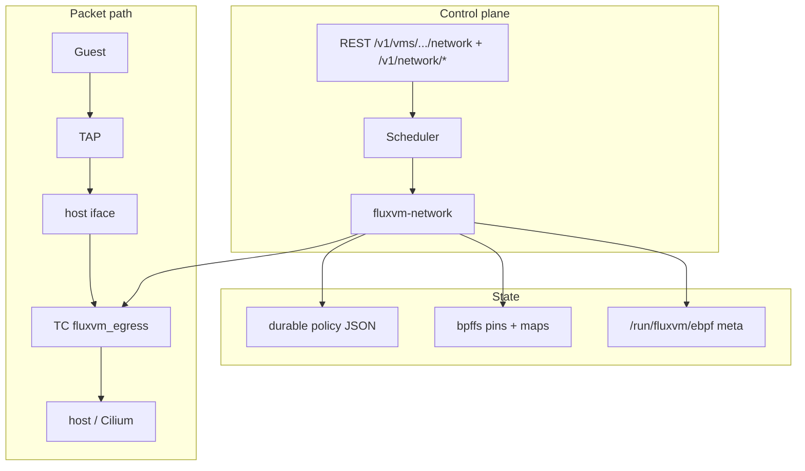
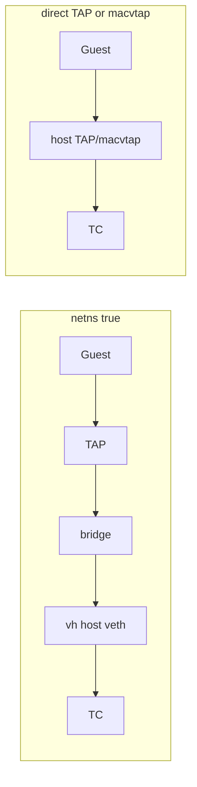
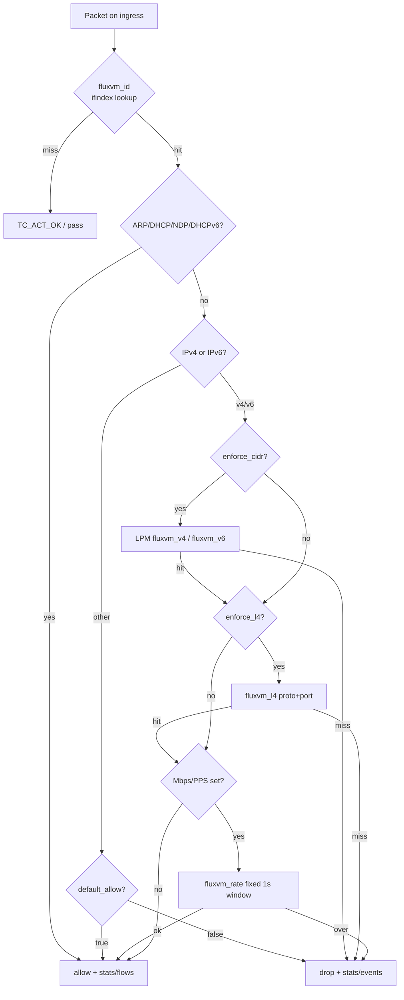
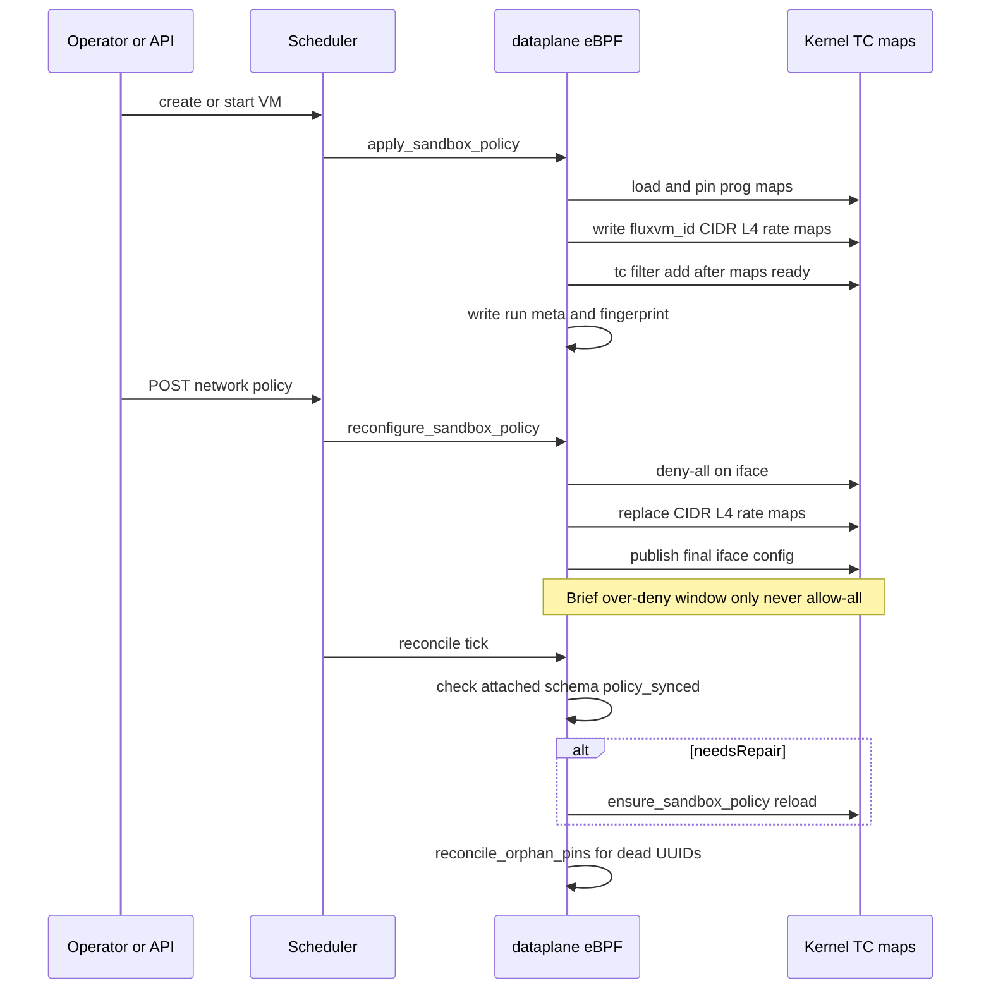
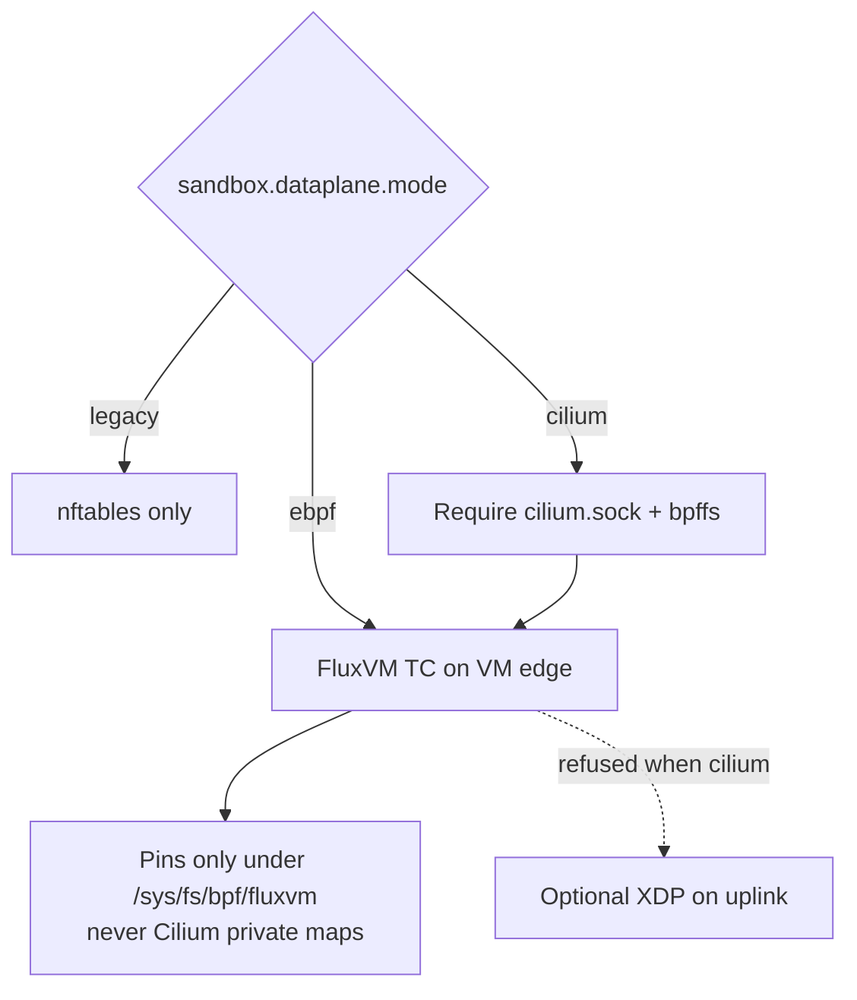

# FluxVM Network Fabric (GA; dataplane schema v4)

**Status: GA.** The Network Fabric **v3 GA path** freezes the core VM-edge
dataplane ABI (TC/eBPF policy, status/stats/flows, schema fingerprints,
ownership, reconcile). The live BPF schema is **v4** (groups, deny CIDRs,
conntrack, CNP-shaped policy). Upgrade-safe installs keep `mode = "legacy"`
until you opt into the GA profile:

```bash
sudo ./scripts/enable-network-fabric-ga.sh --restart
# or merge configs/network-fabric-ga.toml into /etc/fluxvm.toml
```

Production profile (FQDN resolve, ipcache, health, refresh-dns):
[`configs/network-fabric-prod.toml`](../configs/network-fabric-prod.toml) —
see [production-dataplane.md](production-dataplane.md). Policy:
[network-policy.md](network-policy.md), [network-groups.md](network-groups.md),
[tutorials/network-policy/](tutorials/network-policy/README.md).

`required = true` fail-closes when a host-visible VM edge exists but attach
fails; `network.mode=none` / user NAT still soft-skip (no edge). Service load
balancing, BGP, WireGuard, and first-class Cilium endpoint identity belong in
separate projects rather than expanding this blast radius.

For the control-plane/packet-decision diagrams, see
[Packet-decision and control-plane diagrams](#packet-decision-and-control-plane-diagrams) below.
For a **user-facing speed comparison** vs traditional VM firewalls / bridges /
user-mode NAT (plus lab policy-update numbers), see
[Why Network Fabric is faster](#why-network-fabric-is-faster-than-traditional-vm-networking) below.

When operated through [Zyvor Fabric](https://github.com/zyvorai/fabric), the same
APIs are proxied name-keyed as `/api/vms/{name}/dataplane/*`, with a **Dataplane**
Web tab and `zyvorctl dataplane` — see Fabric’s
[fluxvm-dataplane.md](https://github.com/zyvorai/fabric/blob/main/docs/guides/vm-drivers/fluxvm-dataplane.md).

## Architecture (how it works)



### Namespaced vs direct attach



## What v3 adds over the merged v1

- IPv4 **and IPv6** destination-CIDR policy.
- IPv4/IPv6 flow records from the same LRU map/API.
- IPv4/IPv6 XDP source blocklists.
- TCP/UDP destination-port policy retained for both families.
- Optional per-VM `max_egress_mbps` and `max_egress_pps` fixed-window limits.
- Fail-closed map replacement for live TC policy updates.
- Direct TAP/macvtap native enforcement even when FluxVM does not know the
  guest IP.
- TC program-ID ownership tracking: cleanup never deletes a BPF filter merely
  because it happens to use FluxVM's preference/handle.
- XDP program-ID ownership tracking and fail-closed blocklist updates.
- Durable policy JSON plus a committed-policy fingerprint and automatic
  TC/schema/policy repair after control-plane restart, interrupted live update,
  or package upgrade while the VMM stays alive.
- Orphan bpffs/meta-state garbage collection keyed by VM UUID records.
- `GET /v1/vms/<uuid>/network/status`.
- Dependency-free NDJSON flow exporter (`scripts/export_network_flows.py`).
- Expanded unit/static tests and a real privileged IPv4/IPv6/L4/rate/XDP
  kernel smoke test.

## Modes and compatibility

```toml
[sandbox.dataplane]
mode = "legacy" # legacy | ebpf | cilium
```

`legacy` remains the default, so an upgrade does not unexpectedly load BPF.
`ebpf` uses FluxVM-owned TC programs/maps. `cilium` keeps Cilium as the
Kubernetes/node dataplane while FluxVM owns only its VM-edge TC program and
private pin tree. FluxVM never writes Cilium's private maps.

IPv6 CIDRs and rate limits are native-only. FluxVM refuses silent fallback to
legacy nftables when policy semantics cannot be preserved.

## VM-edge attachment

See the architecture diagrams above. In short:

Namespaced TAP:

```text
VM -> TAP -> bridge -> namespace veth -> host veth [TC ingress] -> host/Cilium
```

Direct TAP/macvtap:

```text
VM -> host TAP/macvtap [TC ingress] -> bridge/routing
```

The eBPF loader only needs the host-visible interface. Legacy nftables policy
still needs a known guest source CIDR.

### Network namespaces (real per-VM network isolation)

`"network": {"mode": "tap", "netns": true}` gives a VM its own network namespace instead of putting
its tap directly on a shared host bridge — a separate routing table, iptables, and interface list, not
just a shared L2 segment. `bridge` is ignored in this mode (there's no shared bridge to join). Built
from a veth pair NATed to the host, plus a small internal bridge inside the namespace joining the
veth's namespace end to the VM's own tap:

```text
  host default netns                    │  VM's own netns
  <vethh> 169.254.X.1/30 ──veth pair──►  <vethn> ── <br> ── <tap> ── guest
  nftables MASQUERADE                    │  default route via 169.254.X.1
```

(Optional FluxVm sandbox eBPF attaches on the **host** veth — see the Network Fabric sections above.)
The VMM process itself is launched inside the namespace (`ip netns exec`) — it has to be, to even see
the tap device, which lives in a different network namespace than the VMM would otherwise be in. This
composes with the Firecracker jailer (`ip netns exec <ns> -- jailer ... -- firecracker ...`): network
namespace and mount/chroot isolation are independent kernel mechanisms and stack cleanly.

```json
{"name": "isolated-vm", "backend": "qemu", "image": "...", "network": {"mode": "tap", "netns": true}}
```

Verified on real hardware (`scripts/test-network-namespace.sh`, 10/10): the namespace/veth/bridge/tap
really exist (read directly from `ip netns exec ... ip link show`); the VMM process is confirmed to
really be running inside that namespace by comparing `/proc/<pid>/ns/net` against the namespace's own
inode (the only way to actually prove two things share a network namespace); a real ping across the
veth pair from inside the namespace proves the NAT path genuinely works end to end, not just that the
interfaces exist; deleting the VM tears down the whole namespace with no leftover host-side veth
interfaces (deleting a netns cascades to every interface inside it, including — since a veth is one
kernel object with two ends — the host-side peer).

```bash
sudo ./scripts/test-network-namespace.sh --image /path/to/base.qcow2
```

### Named netns and orphan edges

Per-VM netns sandboxes use IPAM-backed `169.254.{third}.{base}/28` blocks on the
host veth (`169.254.{third}.{base+1}/28`) and bridge side. After a crash or a
dead named-netns bind (`/var/run/netns/eph-*` → `EINVAL` on `ip netns exec`),
QEMU may still hold the live namespace. On VM start FluxVM remounts the named
handle from the QEMU pid (`repair_named_netns`).

Cleanup always deletes the host veth by name even when `ip netns del` fails, so
orphan edges cannot collide on the same `/28` on the next VM. `prepare` also
clears leftover veth/netns handles before create.

## Policy

```json
{
  "default_allow": false,
  "allow_cidrs": ["10.20.0.0/16", "2001:db8:20::/48"],
  "allow_ports": ["tcp/443", "udp/53"],
  "max_egress_mbps": 250,
  "max_egress_pps": 100000,
  "sample_rate": 100
}
```

If CIDR and L4 allowlists are both present, both dimensions must match.
IPv4 DHCP and ARP are allowed for bootstrap. IPv6 NDP/router discovery and
DHCPv6 are allowed for bootstrap. IPv4 fragments fail closed with an L4
policy. For IPv6, direct TCP/UDP after the base header is parsed; extension
headers intentionally fail closed under L4 policy in v3 rather than attempting
verifier-sensitive variable header walking.

### Rate limiting

The TC program uses a one-second fixed window. `max_egress_mbps` is converted
to bytes/sec and `max_egress_pps` is packets/sec. State is protected with
`bpf_spin_lock`. The BPF program lazily initializes the spin-locked state so
userspace does not need special spin-lock map update flags.

## Live-update safety

Native policy POSTs do **not** detach TC and apply to both running and paused
VMs (a paused VM still has a live VMM and attached TC hook). The update sequence is:

1. publish deny-all for the VM interface;
2. replace CIDR/L4 maps;
3. publish the final policy/rate configuration.

This may briefly over-deny on failure, never allow traffic that the old or new
policy would reject. The scheduler restores the previous persisted policy if
a live update fails.

XDP updates similarly add the new block keys before deleting stale ones, so an
update can briefly over-block but never exposes a clear blocklist window.

## Attachment ownership

TC and XDP cleanup use actual BPF program IDs. FluxVM only detaches when the
program currently attached to the hook matches the program ID FluxVM loaded.
A preference/handle collision or a program later replaced by another agent is
left untouched. Metadata lives on normal runtime storage (`/run/fluxvm/...`),
not as regular files under bpffs.

## Restart/schema recovery

Policy is durably fsync+renamed in:

```text
/var/lib/fluxvm/network-policy/<vm-uuid>.json
```

BPF objects are pinned under the configured `pin_root`; interface/program ID
and schema/program/policy-generation metadata is under
`/run/fluxvm/ebpf/vms/<uuid>/`. The policy-generation marker is invalidated
before an in-place map update and committed only after the final kernel config
is published. A daemon crash halfway through an update is therefore detectable.

During scheduler reconciliation, running/paused FluxVM records are checked. If
the TC program is missing, points at the wrong schema, has a policy-generation
mismatch, or was lost while the
VMM survived a control-plane restart, FluxVM reloads the current schema and
reapplies the durable policy without restarting the guest. Pin directories
whose UUID no longer has any VM record are garbage-collected.

## API

```http
GET  /v1/vms/<uuid>/network/policy
POST /v1/vms/<uuid>/network/policy
GET  /v1/vms/<uuid>/network/status
GET  /v1/vms/<uuid>/network/stats
GET  /v1/vms/<uuid>/network/flows?limit=100
```

Status includes mode, fail-closed requirement, attachment/interface, stable
identity, pin directory, BPF schema version/compatibility, policy-sync status,
and effective policy.

Flow records contain `identity`, `family` (`4` or `6`), source/destination
strings, ports, protocol, verdict, packets, bytes and `last_seen_ns`.

### Attachment backends

The scheduler applies dataplane attach / teardown / reconfigure / reconcile for
**all** VMM backends (QEMU, Cloud Hypervisor, Firecracker, FluxVm) whenever a
host-visible interface is present. Create with `network.mode=none` or user NAT
and no iface soft-skips when `required = false`.

### Fabric control plane (optional)

| Fabric | FluxVM |
|--------|--------|
| `GET/POST /api/vms/{name}/dataplane/policy` | `…/network/policy` |
| `GET /api/vms/{name}/dataplane/status` | `…/network/status` |
| `GET /api/vms/{name}/dataplane/stats` | `…/network/stats` |
| `GET /api/vms/{name}/dataplane/flows` | `…/network/flows` |

Web: VM → **Dataplane**. CLI: `zyvorctl dataplane` (`ZYVOR_FABRIC_URL` +
`ZYVOR_FABRIC_TOKEN` for HTTPS). Capability card: `GET /api/capabilities` →
`vm_dataplane`.

Ports in policy **must** be `tcp/PORT` or `udp/PORT`.

For a dependency-free NDJSON stream suitable for piping into Vector, Fluent
Bit, Kafka producers or another collector:

```bash
./scripts/export_network_flows.py <vm-uuid> \
  --base http://127.0.0.1:7788 \
  --interval 1
```

Use `--token` when REST auth is enabled. The exporter emits a flow when first
seen or when counters/last-seen advance, so restarting the exporter recovers
from the persistent LRU flow state instead of depending on ring-buffer history.

## Observability maps

Per VM:

- `fluxvm_id` — ifindex -> stable identity + policy/rate configuration.
- `fluxvm_v4` — identity + IPv4 destination LPM policy.
- `fluxvm_v6` — identity + IPv6 destination LPM policy.
- `fluxvm_l4` — identity + protocol + destination-port policy.
- `fluxvm_rate` — cross-CPU fixed-window limiter state.
- `fluxvm_stats` — per-CPU allow/drop packet and byte counters.
- `fluxvm_flows` — family-neutral LRU flow state.
- `fluxvm_events` — kernel ring buffer for drops and sampled allows.
- `fluxvm_gid` — ifindex → up to eight shared group identities (schema v4).
- `fluxvm_ct` — LRU established 5-tuple table.
- `fluxvm_deny4` / `fluxvm_deny6` — LPM destination deny lists (before allow).

The REST/export path deliberately uses the durable LRU map. A future dedicated
libbpf process can consume the ring buffer for sub-second event streaming
without changing enforcement ABI.

## XDP guard

```toml
[sandbox.dataplane.xdp]
enabled = true
interface = "eno1"
required = true
block_cidrs = ["198.51.100.0/24", "2001:db8:bad::/48"]
```

Standalone only. `mode = "cilium"` rejects FluxVM XDP so it cannot replace
Cilium acceleration. Existing third-party XDP is never replaced.

## Recommended production configuration (GA)

Ship files:

- GA enable: [`configs/network-fabric-ga.toml`](../configs/network-fabric-ga.toml)
- Production dataplane: [`configs/network-fabric-prod.toml`](../configs/network-fabric-prod.toml)
  — [production-dataplane.md](production-dataplane.md)

One-shot: `sudo ./scripts/enable-network-fabric-ga.sh --restart`
(use `--cilium` on Cilium nodes).

```toml
[sandbox.dataplane]
mode = "ebpf"
bpf_object = "/usr/lib/fluxvm/bpf/fluxvm_tc.bpf.o"
pin_root = "/sys/fs/bpf/fluxvm"
required = true
default_allow = false
allow_cidrs = ["10.0.0.0/8", "172.16.0.0/12", "192.168.0.0/16"]
allow_ports = ["tcp/443", "tcp/80", "udp/53"]
max_egress_mbps = 250
max_egress_pps = 100000
sample_rate = 100
```

GA semantics: fail-closed on the VM edge when an edge exists; soft-skip when
there is no host-visible iface.

## Validation

Dependency-light checks:

```bash
./scripts/validate-network-fabric.sh
```

Real kernel test (root/CAP_BPF+NET_ADMIN environment):

```bash
sudo -E env FLUXVM_PRIVILEGED_SMOKE=1 ./scripts/validate-network-fabric.sh
```

Full FluxVm + REST e2e (also invoked by the privileged validator):

```bash
sudo -E ./scripts/test-network-fabric.sh
```

Network policy tutorials (groups, CNP, identities, observe):

- [docs/tutorials/network-policy/](tutorials/network-policy/README.md)

Security groups (label identities, deny CIDRs, effective merge, deny/L4 maps):

```bash
sudo -E ./scripts/test-security-groups-e2e.sh
```

Network policy (CNP / identity / audit) and production dataplane:

```bash
python3 scripts/test-network-policy.py
python3 scripts/test-production-dataplane.py
sudo -E ./scripts/test-production-dataplane-e2e.sh
```

See [network-groups.md](network-groups.md), [network-policy.md](network-policy.md),
and [production-dataplane.md](production-dataplane.md).

The kernel smoke covers:

- map configuration before TC attach;
- IPv4 + IPv6 default allow/deny;
- IPv4 + IPv6 LPM allowlists;
- TCP L4 allow/deny while both ports are actually listening;
- one-packet-per-second limiter window/reset;
- stats and flow map population;
- IPv4 + IPv6 XDP source blocking and removal.

The GitHub workflow additionally builds the full Rust workspace, runs all Rust
unit tests, builds both BPF objects with real libbpf headers, and executes the
privileged smoke test.

### Lab regression notes (operator)

On the Zyvor lab host, official Network Fabric e2e (`test-network-fabric.sh`)
and Fabric HTTPS dataplane paths are green when `mode=ebpf` and VMs use
TAP+netns. Known independent lab gaps (not dataplane ABI regressions):

- Netns guest→host veth ping can fail under some eBPF↔NAT combinations.
- Orphan host veths on the same `169.254.x.1/28` break east-west Maglev VIP
  smokes — see [service-fabric.md](service-fabric.md) and named-netns repair above.
- Cgroup freeze/stats may fail if cgroup setup was skipped at launch.
- Warm-pool second `serve` can clash with systemd-bound FluxVM port.

Fabric console UX (Status / Policy save / Stats / Flows + dashboard capability)
has been verified end-to-end against attached schema v4 VMs.

## Why Network Fabric is faster than traditional VM networking

Traditional VM edge security usually means **userspace orchestration of
iptables/nftables chains**, a **shared bridge + host firewall**, or **user-mode
NAT** (QEMU SLIRP). Those paths work — until you need **per-VM L4 policy,
live rate limits, and telemetry at density**. Network Fabric moves the hot
path into a **TC/eBPF classifier on the host-visible VM interface** so every
packet is decided in-kernel with **O(1) map lookups**, while policy updates
rewrite maps **without tearing the filter down**.

### At a glance

| | Traditional (libvirt / iptables / nft) | Shared bridge + host FW | QEMU user-mode NAT | **FluxVM Network Fabric (eBPF, schema v4)** |
|---|---|---|---|---|
| **Where each packet is decided** | Host netfilter chains (often linear / table walks) | Shared bridge + global rules | Userspace SLIRP / usernet | **TC classifier on the VM edge** (`vh*` / TAP) |
| **Rule scaling** | Cost grows with chain length and NAT helpers | Contention on one bridge/FW | Fine for one VM; poor under load | **Per-VM BPF maps** (LPM + L4 + rate) — constant-time lookups |
| **Live policy change** | Flush/reload chains; easy to open an allow-all gap | Host-wide blast radius | Restart or reconfigure usernet | **In-place map update** (deny-all window only — never allow-all) |
| **Policy API latency (lab)** | Seconds-class ops common when rebuilding large tables | Same | N/A (not a real edge FW) | **~100–120 ms p50** end-to-end `POST …/network/policy` on attached VMs¹ |
| **Mbps / PPS egress caps** | tc/htb or nft meters (separate plumbing) | Rarely per-VM | Soft / inaccurate | **First-class maps** (`max_egress_mbps` / `max_egress_pps`) |
| **IPv6 + L4** | Extra chains, easy to drift from IPv4 | Often IPv4-only in practice | Limited | **Dual-stack L3+L4** in one program |
| **Observability** | `conntrack` / `tcpdump` / log spam | Host-centric | Almost none | **Per-VM stats + LRU flows + optional ring samples** via REST |
| **Cilium / k8s nodes** | Fight over iptables; fragile | Same | Irrelevant | **Coexistence mode** — FluxVM owns the VM edge; Cilium keeps the node |
| **Fallback** | You are the fallback | — | — | **nftables** unless `required = true` |

¹ Measured on Zyvor lab hardware (`mode=ebpf`, QEMU TAP+netns, live reconfigure, n=45).
Numbers are **control-plane round-trips** (HTTP + map rewrite), not raw NIC Gbps.
Reproduce with `POST /v1/vms/{id}/network/policy` against an attached VM.

### What "faster" means for users

| Need | Traditional pain | Fabric win |
|------|------------------|------------|
| **AI / CI sandboxes** spinning up by the dozen | Per-VM nft tables and NAT helpers pile up; policy edits get slower and riskier | Attach once; **policy is a map write** — same cost for VM #1 and VM #100 |
| **Stop a bad agent in seconds** | Rebuild firewall, hope nothing leaked during reload | **Live deny / rate-limit** while TC stays attached |
| **Prove what left the box** | Grep logs and conntrack | **`/network/stats` + `/network/flows`** without a packet capture tax |
| **Run next to Cilium** | Dual iptables owners | Explicit **cilium** mode — no private Cilium map writes |

```text
Guest → TAP/netns → host-visible iface → TC/eBPF (allow / L4 / Mbps·PPS / sample)
                                         └─ maps updated live via REST — no detach
```

## Packet-decision and control-plane diagrams

### Packet decision inside the TC program



### Control-plane lifecycle



### Modes vs ownership



### Where BPF state lives

| Location | Contents |
|----------|----------|
| `/sys/fs/bpf/fluxvm/vms/<uuid>/` | Pinned TC program + maps (`fluxvm_id`, `v4`, `v6`, `l4`, `deny4`, `deny6`, `gid`, `ct`, `rate`, `stats`, `flows`, `events`) |
| `/run/fluxvm/ebpf/vms/<uuid>/` | `iface`, `prog_id`, `schema_version` (v4), `policy_fingerprint` (not on bpffs) |
| `/run/fluxvm/xdp/` | Optional XDP `iface` + `prog_id` |
| `/var/lib/fluxvm/network-policy/<uuid>.json` | Durable per-VM policy (fsync + rename) |
| `/var/lib/fluxvm/network-groups/` | Security groups, CNP store, ipcache JSON |

## Related planes after Network Fabric v4

Network Fabric **schema v4** (per-VM TC/eBPF policy) is GA. Adjacent work lives
in independent docs/PRs:

1. **Service Fabric v6 (BPF schema 4 / program generation 6)** — Maglev VIP LB,
   dual-stack NAT/DSR/SNAT, forward conntrack, health/drain, VIP ads, HA deltas,
   per-service EDT, FluxScope flows/OTLP, optional host-routing, **identity/L7
   policy maps**, Envoy redirect contract, HA mutation queue —
   [service-fabric.md](service-fabric.md) · [phase 5](service-fabric-phase5.md) ·
   [phase 6](service-fabric-phase6.md).
2. **BGP speaker** — Fabric FRR/BIRD/File adapters consume FluxVM ads; not embedded
   in FluxVM ([service-fabric-phase4.md](service-fabric-phase4.md)).
3. WireGuard host-to-host VM encryption.
4. First-class Cilium CNI/launcher identities and Hubble attribution.
5. Migration transfer of connection/NAT state (service maps via conntrack
   export/import, v5 streaming HA deltas, and v6 mutation queue —
   [phase 5](service-fabric-phase5.md) · [phase 6](service-fabric-phase6.md)).
6. Dedicated libbpf ring-buffer/SSE streaming daemon if sub-second events are
   required at scale.
