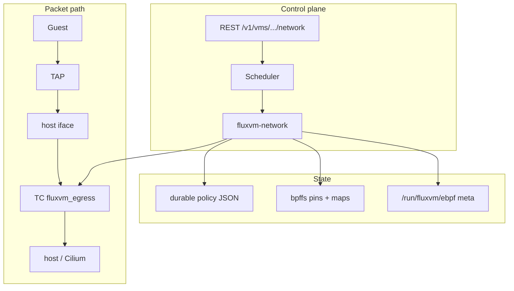
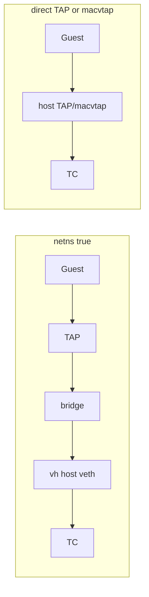

# FluxVM Network Fabric v3 GA

**Status: GA.** v3 freezes the **core VM-edge dataplane** ABI (TC/eBPF policy,
status/stats/flows, schema fingerprints, ownership, reconcile). Upgrade-safe
installs keep `mode = "legacy"` until you opt into the GA profile:

```bash
sudo ./scripts/enable-network-fabric-ga.sh --restart
# or merge configs/network-fabric-ga.toml into /etc/fluxvm.toml
```

`required = true` fail-closes when a host-visible VM edge exists but attach
fails; `network.mode=none` / user NAT still soft-skip (no edge). Service load
balancing, BGP, WireGuard, and first-class Cilium endpoint identity belong in
separate projects rather than expanding this blast radius.

For a README-level walkthrough with diagrams, see
[Network Fabric architecture](../README.md#network-fabric-architecture-how-it-works).
For a **user-facing speed comparison** vs traditional VM firewalls / bridges /
user-mode NAT (plus lab policy-update numbers), see
[Why Network Fabric is faster](../README.md#why-network-fabric-is-faster-than-traditional-vm-networking).

When operated through [Zyvor Fabric](https://github.com/zyvorai/fabric), the same
APIs are proxied name-keyed as `/api/vms/{name}/dataplane/*`, with a **Dataplane**
Web tab and `zyvorctl dataplane` — see Fabric’s
[fluxvm-dataplane.md](https://github.com/zyvorai/fabric/blob/main/docs/guides/vm-drivers/fluxvm-dataplane.md).

## Architecture (how it works)



### Namespaced vs direct attach



## What v3 adds over the merged v1

- IPv4 **and IPv6** destination-CIDR policy.
- IPv4/IPv6 flow records from the same LRU map/API.
- IPv4/IPv6 XDP source blocklists.
- TCP/UDP destination-port policy retained for both families.
- Optional per-VM `max_egress_mbps` and `max_egress_pps` fixed-window limits.
- Fail-closed map replacement for live TC policy updates.
- Direct TAP/macvtap native enforcement even when FluxVM does not know the
  guest IP.
- TC program-ID ownership tracking: cleanup never deletes a BPF filter merely
  because it happens to use FluxVM's preference/handle.
- XDP program-ID ownership tracking and fail-closed blocklist updates.
- Durable policy JSON plus a committed-policy fingerprint and automatic
  TC/schema/policy repair after control-plane restart, interrupted live update,
  or package upgrade while the VMM stays alive.
- Orphan bpffs/meta-state garbage collection keyed by VM UUID records.
- `GET /v1/vms/<uuid>/network/status`.
- Dependency-free NDJSON flow exporter (`scripts/export_network_flows.py`).
- Expanded unit/static tests and a real privileged IPv4/IPv6/L4/rate/XDP
  kernel smoke test.

## Modes and compatibility

```toml
[sandbox.dataplane]
mode = "legacy" # legacy | ebpf | cilium
```

`legacy` remains the default, so an upgrade does not unexpectedly load BPF.
`ebpf` uses FluxVM-owned TC programs/maps. `cilium` keeps Cilium as the
Kubernetes/node dataplane while FluxVM owns only its VM-edge TC program and
private pin tree. FluxVM never writes Cilium's private maps.

IPv6 CIDRs and rate limits are native-only. FluxVM refuses silent fallback to
legacy nftables when policy semantics cannot be preserved.

## VM-edge attachment

See the architecture diagrams above. In short:

Namespaced TAP:

```text
VM -> TAP -> bridge -> namespace veth -> host veth [TC ingress] -> host/Cilium
```

Direct TAP/macvtap:

```text
VM -> host TAP/macvtap [TC ingress] -> bridge/routing
```

The eBPF loader only needs the host-visible interface. Legacy nftables policy
still needs a known guest source CIDR.

## Policy

```json
{
  "default_allow": false,
  "allow_cidrs": ["10.20.0.0/16", "2001:db8:20::/48"],
  "allow_ports": ["tcp/443", "udp/53"],
  "max_egress_mbps": 250,
  "max_egress_pps": 100000,
  "sample_rate": 100
}
```

If CIDR and L4 allowlists are both present, both dimensions must match.
IPv4 DHCP and ARP are allowed for bootstrap. IPv6 NDP/router discovery and
DHCPv6 are allowed for bootstrap. IPv4 fragments fail closed with an L4
policy. For IPv6, direct TCP/UDP after the base header is parsed; extension
headers intentionally fail closed under L4 policy in v3 rather than attempting
verifier-sensitive variable header walking.

### Rate limiting

The TC program uses a one-second fixed window. `max_egress_mbps` is converted
to bytes/sec and `max_egress_pps` is packets/sec. State is protected with
`bpf_spin_lock`. The BPF program lazily initializes the spin-locked state so
userspace does not need special spin-lock map update flags.

## Live-update safety

Native policy POSTs do **not** detach TC and apply to both running and paused
VMs (a paused VM still has a live VMM and attached TC hook). The update sequence is:

1. publish deny-all for the VM interface;
2. replace CIDR/L4 maps;
3. publish the final policy/rate configuration.

This may briefly over-deny on failure, never allow traffic that the old or new
policy would reject. The scheduler restores the previous persisted policy if
a live update fails.

XDP updates similarly add the new block keys before deleting stale ones, so an
update can briefly over-block but never exposes a clear blocklist window.

## Attachment ownership

TC and XDP cleanup use actual BPF program IDs. FluxVM only detaches when the
program currently attached to the hook matches the program ID FluxVM loaded.
A preference/handle collision or a program later replaced by another agent is
left untouched. Metadata lives on normal runtime storage (`/run/fluxvm/...`),
not as regular files under bpffs.

## Restart/schema recovery

Policy is durably fsync+renamed in:

```text
/var/lib/fluxvm/network-policy/<vm-uuid>.json
```

BPF objects are pinned under the configured `pin_root`; interface/program ID
and schema/program/policy-generation metadata is under
`/run/fluxvm/ebpf/vms/<uuid>/`. The policy-generation marker is invalidated
before an in-place map update and committed only after the final kernel config
is published. A daemon crash halfway through an update is therefore detectable.

During scheduler reconciliation, running/paused FluxVM records are checked. If
the TC program is missing, points at the wrong schema, has a policy-generation
mismatch, or was lost while the
VMM survived a control-plane restart, FluxVM reloads the current schema and
reapplies the durable policy without restarting the guest. Pin directories
whose UUID no longer has any VM record are garbage-collected.

## API

```http
GET  /v1/vms/<uuid>/network/policy
POST /v1/vms/<uuid>/network/policy
GET  /v1/vms/<uuid>/network/status
GET  /v1/vms/<uuid>/network/stats
GET  /v1/vms/<uuid>/network/flows?limit=100
```

Status includes mode, fail-closed requirement, attachment/interface, stable
identity, pin directory, BPF schema version/compatibility, policy-sync status,
and effective policy.

Flow records contain `identity`, `family` (`4` or `6`), source/destination
strings, ports, protocol, verdict, packets, bytes and `last_seen_ns`.

### Attachment backends

The scheduler applies dataplane attach / teardown / reconfigure / reconcile for
**all** VMM backends (QEMU, Cloud Hypervisor, Firecracker, FluxVm) whenever a
host-visible interface is present. Create with `network.mode=none` or user NAT
and no iface soft-skips when `required = false`.

### Fabric control plane (optional)

| Fabric | FluxVM |
|--------|--------|
| `GET/POST /api/vms/{name}/dataplane/policy` | `…/network/policy` |
| `GET /api/vms/{name}/dataplane/status` | `…/network/status` |
| `GET /api/vms/{name}/dataplane/stats` | `…/network/stats` |
| `GET /api/vms/{name}/dataplane/flows` | `…/network/flows` |

Web: VM → **Dataplane**. CLI: `zyvorctl dataplane` (`ZYVOR_FABRIC_URL` +
`ZYVOR_FABRIC_TOKEN` for HTTPS). Capability card: `GET /api/capabilities` →
`vm_dataplane`.

Ports in policy **must** be `tcp/PORT` or `udp/PORT`.

For a dependency-free NDJSON stream suitable for piping into Vector, Fluent
Bit, Kafka producers or another collector:

```bash
./scripts/export_network_flows.py <vm-uuid> \
  --base http://127.0.0.1:7788 \
  --interval 1
```

Use `--token` when REST auth is enabled. The exporter emits a flow when first
seen or when counters/last-seen advance, so restarting the exporter recovers
from the persistent LRU flow state instead of depending on ring-buffer history.

## Observability maps

Per VM:

- `fluxvm_id` — ifindex -> stable identity + policy/rate configuration.
- `fluxvm_v4` — identity + IPv4 destination LPM policy.
- `fluxvm_v6` — identity + IPv6 destination LPM policy.
- `fluxvm_l4` — identity + protocol + destination-port policy.
- `fluxvm_rate` — cross-CPU fixed-window limiter state.
- `fluxvm_stats` — per-CPU allow/drop packet and byte counters.
- `fluxvm_flows` — family-neutral LRU flow state.
- `fluxvm_events` — kernel ring buffer for drops and sampled allows.

The REST/export path deliberately uses the durable LRU map. A future dedicated
libbpf process can consume the ring buffer for sub-second event streaming
without changing enforcement ABI.

## XDP guard

```toml
[sandbox.dataplane.xdp]
enabled = true
interface = "eno1"
required = true
block_cidrs = ["198.51.100.0/24", "2001:db8:bad::/48"]
```

Standalone only. `mode = "cilium"` rejects FluxVM XDP so it cannot replace
Cilium acceleration. Existing third-party XDP is never replaced.

## Recommended production configuration (GA)

Ship file: [`configs/network-fabric-ga.toml`](../configs/network-fabric-ga.toml).
One-shot: `sudo ./scripts/enable-network-fabric-ga.sh --restart`
(use `--cilium` on Cilium nodes).

```toml
[sandbox.dataplane]
mode = "ebpf"
bpf_object = "/usr/lib/fluxvm/bpf/fluxvm_tc.bpf.o"
pin_root = "/sys/fs/bpf/fluxvm"
required = true
default_allow = false
allow_cidrs = ["10.0.0.0/8", "172.16.0.0/12", "192.168.0.0/16"]
allow_ports = ["tcp/443", "tcp/80", "udp/53"]
max_egress_mbps = 250
max_egress_pps = 100000
sample_rate = 100
```

GA semantics: fail-closed on the VM edge when an edge exists; soft-skip when
there is no host-visible iface.

## Validation

Dependency-light checks:

```bash
./scripts/validate-network-fabric.sh
```

Real kernel test (root/CAP_BPF+NET_ADMIN environment):

```bash
sudo -E env FLUXVM_PRIVILEGED_SMOKE=1 ./scripts/validate-network-fabric.sh
```

Full FluxVm + REST e2e (also invoked by the privileged validator):

```bash
sudo -E ./scripts/test-network-fabric.sh
```

The kernel smoke covers:

- map configuration before TC attach;
- IPv4 + IPv6 default allow/deny;
- IPv4 + IPv6 LPM allowlists;
- TCP L4 allow/deny while both ports are actually listening;
- one-packet-per-second limiter window/reset;
- stats and flow map population;
- IPv4 + IPv6 XDP source blocking and removal.

The GitHub workflow additionally builds the full Rust workspace, runs all Rust
unit tests, builds both BPF objects with real libbpf headers, and executes the
privileged smoke test.

### Lab regression notes (operator)

On the Zyvor lab host, official Network Fabric e2e (`test-network-fabric.sh`)
and Fabric HTTPS dataplane paths are green when `mode=ebpf` and VMs use
TAP+netns. Known independent lab gaps (not dataplane ABI regressions):

- Netns guest→host veth ping can fail under some eBPF↔NAT combinations.
- Cgroup freeze/stats may fail if cgroup setup was skipped at launch.
- Warm-pool second `serve` can clash with systemd-bound FluxVM port.

Fabric console UX (Status / Policy save / Stats / Flows + dashboard capability)
has been verified end-to-end against attached schema v3 VMs.

## What should be separate after v3

The core dataplane is complete enough to freeze its v3 ABI and move feature
work into independent PRs:

1. FluxLB / Maglev VM service load balancing.
2. BGP advertisement of VM/service prefixes.
3. WireGuard host-to-host VM encryption.
4. First-class Cilium CNI/launcher identities and Hubble attribution.
5. Migration transfer of connection/NAT state.
6. Dedicated libbpf ring-buffer/SSE streaming daemon if sub-second events are
   required at scale.
